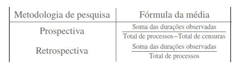
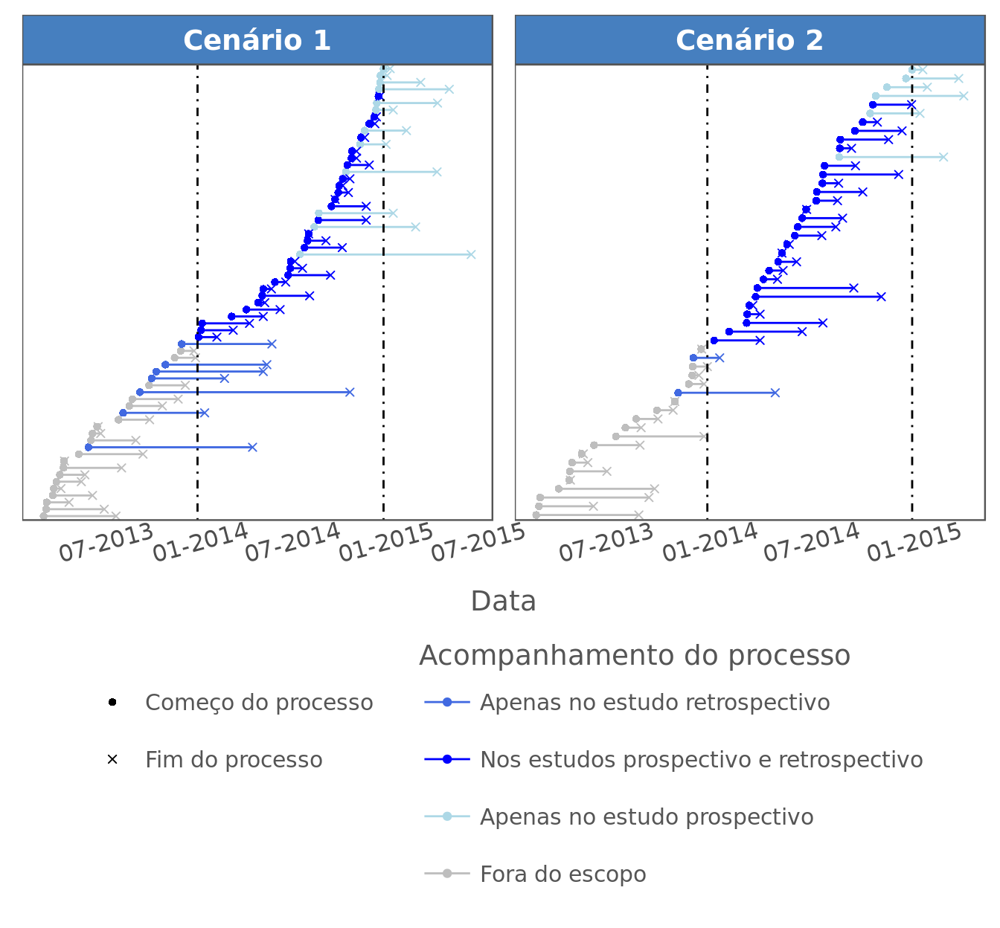
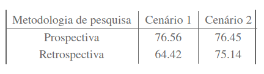

Caracterizar a duração de processos judiciais é um problema relevante
para o Direito. Em Jurimetria, isso normalmente é feito utilizando
Análise de Sobrevivência^[Análise de Sobrevivência é a área da Estatística
historicamente associada ao cálculo de tempos de duração de eventos, com 
uma ampla gama de aplicações.], mas os textos desse assunto não costumam
mencionar a diferença qualitativa entre as estimativas de duração
produzidas por estudos prospectivos e retrospectivos^[Nos estudos de 
duração de processos existem dois eventos importantes: a data de 
distribuição e a data de encerramento. A diferença entre estudos 
retrospectivos e prospectivos é a forma com que escolhem quais processos
observar. Estudos restropectivos são aqueles em que os processos são 
escolhidos pela data de encerramento. Um estudo cujo escopo é "o 
conjunto de processos terminados no ano de 2015" é retrospectivo, pois 
filtra os processos apenas pela data de término. Estudos prospectivos 
são aqueles em que a seleção de processos é feita pela data de 
distribuição. Um estudo com escopo "processos distribuídos no ano de 
2015" é prospectivo.].

A diferença entre as duas metodologias consiste no fato de estudos
retrospecivos observarem processos que **terminaram em um determinado
período**, enquanto estudos prospectivos observam
processos **distribuídos em um determinado período**. Por isso, as
populações estudadas em cada uma das propostas são diferentes, e isso
impacta a forma com que os resultados devem ser interpretados.

Neste texto, vamos ilustrar o desempenho e as diferenças dos tipos de
estudo através de uma simulação. Durações processuais hipotéticas serão
geradas considerando dois cenários, e as estatísticas produzidas por
cada metodologia serão comparadas.

**Metodologia 1** (retrospectiva):\
-- Analisa todos os processos encerrados entre 01/01/2014 e 01/01/2015.\
-- O estudo termina em 01/01/2015.

**Metodologia 2** (prospectiva):\
-- Analisa todos os processos distribuídos entre 01/01/2014 e
01/01/2015.\
-- O estudo termina em 01/01/2015.

O desempenho dessas pesquisas será estudado nos cenários:\
Cenário 1:

-   **Distribuição**: A probabilidade de distribuição de um processo em
    um determinado dia é [[[[[7]{#MathJax-Span-3 .mn}]{#MathJax-Span-2
    .mrow}]{#MathJax-Span-1 .math}[7]{.MJX_Assistive_MathML
    role="presentation"}]{#MathJax-Element-1-Frame .MathJax
    style="box-sizing: border-box; display: inline; font-style: normal; font-weight: normal; line-height: normal; font-size: 16px; text-indent: 0px; text-align: left; text-transform: none; letter-spacing: normal; word-spacing: normal; word-wrap: normal; white-space: nowrap; float: none; direction: ltr; max-width: none; max-height: none; min-width: 0px; min-height: 0px; border: 0px; padding: 0px; margin: 0px; position: relative;"
    tabindex="0" role="presentation"
    mathml="<math xmlns=\"https://www.w3.org/1998/Math/MathML\"><mn>7</mn></math>"}]{.math
    .inline}%.
-   **Duração**: A quantidade de dias entre a data de distribuição e a
    data de encerramento dos litígios tem distribuição geométrica de
    parâmetro [[[[[1]{#MathJax-Span-6 .mn}]{#MathJax-Span-5
    .mrow}]{#MathJax-Span-4 .math}[1]{.MJX_Assistive_MathML
    role="presentation"}]{#MathJax-Element-2-Frame .MathJax
    style="box-sizing: border-box; display: inline; font-style: normal; font-weight: normal; line-height: normal; font-size: 16px; text-indent: 0px; text-align: left; text-transform: none; letter-spacing: normal; word-spacing: normal; word-wrap: normal; white-space: nowrap; float: none; direction: ltr; max-width: none; max-height: none; min-width: 0px; min-height: 0px; border: 0px; padding: 0px; margin: 0px; position: relative;"
    tabindex="0" role="presentation"
    mathml="<math xmlns=\"https://www.w3.org/1998/Math/MathML\"><mn>1</mn></math>"}]{.math
    .inline}%.

Cenário 2:

-   **Distribuição**: Antes do dia 01/08/2014, a probabilidade de
    distribuição de um processo em um determinado dia
    é [[[[[7]{#MathJax-Span-9 .mn}]{#MathJax-Span-8
    .mrow}]{#MathJax-Span-7 .math}[7]{.MJX_Assistive_MathML
    role="presentation"}]{#MathJax-Element-3-Frame .MathJax
    style="box-sizing: border-box; display: inline; font-style: normal; font-weight: normal; line-height: normal; font-size: 16px; text-indent: 0px; text-align: left; text-transform: none; letter-spacing: normal; word-spacing: normal; word-wrap: normal; white-space: nowrap; float: none; direction: ltr; max-width: none; max-height: none; min-width: 0px; min-height: 0px; border: 0px; padding: 0px; margin: 0px; position: relative;"
    tabindex="0" role="presentation"
    mathml="<math xmlns=\"https://www.w3.org/1998/Math/MathML\"><mn>7</mn></math>"}]{.math
    .inline}%. Após esse dia, a probabilidade de distribuição de um
    processo em um determinado dia é [[[[[17]{#MathJax-Span-12
    .mn}]{#MathJax-Span-11 .mrow}]{#MathJax-Span-10
    .math}[17]{.MJX_Assistive_MathML
    role="presentation"}]{#MathJax-Element-4-Frame .MathJax
    style="box-sizing: border-box; display: inline; font-style: normal; font-weight: normal; line-height: normal; font-size: 16px; text-indent: 0px; text-align: left; text-transform: none; letter-spacing: normal; word-spacing: normal; word-wrap: normal; white-space: nowrap; float: none; direction: ltr; max-width: none; max-height: none; min-width: 0px; min-height: 0px; border: 0px; padding: 0px; margin: 0px; position: relative;"
    tabindex="0" role="presentation"
    mathml="<math xmlns=\"https://www.w3.org/1998/Math/MathML\"><mn>17</mn></math>"}]{.math
    .inline}%.
-   **Duração**: A quantidade de dias entre a data de distribuição e a
    data de encerramento dos litígios tem distribuição geométrica de
    parâmetro [[[[[1]{#MathJax-Span-15 .mn}]{#MathJax-Span-14
    .mrow}]{#MathJax-Span-13 .math}[1%]{.MJX_Assistive_MathML
    role="presentation"}]{#MathJax-Element-5-Frame .MathJax
    style="box-sizing: border-box; display: inline; font-style: normal; font-weight: normal; line-height: normal; font-size: 16px; text-indent: 0px; text-align: left; text-transform: none; letter-spacing: normal; word-spacing: normal; word-wrap: normal; white-space: nowrap; float: none; direction: ltr; max-width: none; max-height: none; min-width: 0px; min-height: 0px; border: 0px; padding: 0px; margin: 0px; position: relative;"
    tabindex="0" role="presentation"
    mathml="<math xmlns=\"https://www.w3.org/1998/Math/MathML\"><mn>1</mn></math>"}]{.math
    .inline}.

## Cálculos

No que segue, vamos comparar as médias de duração estimadas por cada
estudo e a verdadeira média dos processos: 77 dias. Como as duas
metodologias possuem características diferentes, nesta sessão vamos
explicitar cada procedimento de cálculo.

A propriedade dos estudos que causa a divergência nos cálculos é a
presença ou ausência de censuras^[Em Jurimetria, censura é o nome 
dado à duração que é observada antes da ocorrência de um evento de 
interesse. No nosso exemplo, isso corresponde às durações de 
processos que ainda não chegaram ao fim.] nas observações. Em estudos
retrospectivos é impossível que haja censuras, pois os processos
analisados são apenas aqueles em que já houve o encerramento. Estudos
prospectivos, por outro lado, levam em conta processos que ainda não
acabaram, mas não levam em conta processos que acabaram há muito tempo.

Para proceder com a derivação das fórmulas de cálculo e garantir a mesma
base de comparação, admitimos que nos dois estudos as seguintes
suposições foram utilizadas:

-- As durações de dois processos distintos são independentes.\
-- As durações dos processos seguem a distribuição geométrica de
probabilidades.\
-- A probabilidade de distribuição de processos é constante ao longo do
tempo.

Considerando essas hipóteses, o tratamento das censuras será feito
utilizando procedimentos usuais de Análise de Sobrevivência. Nesse
contexto, as fórmulas associadas ao cálculo da média de cada metodologia
encontram-se na tabela abaixo. É importante notar que o numerador é
composto pela soma de todas as durações. Isso quer dizer que, no caso de
estudos prospectivos, o numerador inclui a duração observada em
processos que ainda não acabaram.

## Resultados

Uma realização da nossa simulação está ilustrada na figura abaixo. As
linhas representam o ciclo de vida dos processos sob estudo e as cores
representam a presença ou ausência nos planos amostrais que utilizam
cada uma das metodologias. As linhas tracejadas delimitam o escopo
temporal dos estudos.

É importante notar que a curva que representa a distribuição dos
processos no cenário 1 é mais íngreme após agosto de 2014. Isso ocorre
porque nesse cenário a taxa de distribuição de processos aumentou
de [[[[[7]{#MathJax-Span-48 .mn}]{#MathJax-Span-47
.mrow}]{#MathJax-Span-46 .math}[7]{.MJX_Assistive_MathML
role="presentation"}]{#MathJax-Element-7-Frame .MathJax
style="box-sizing: border-box; display: inline; font-style: normal; font-weight: normal; line-height: normal; font-size: 16px; text-indent: 0px; text-align: left; text-transform: none; letter-spacing: normal; word-spacing: normal; word-wrap: normal; white-space: nowrap; float: none; direction: ltr; max-width: none; max-height: none; min-width: 0px; min-height: 0px; border: 0px; padding: 0px; margin: 0px; position: relative;"
tabindex="0" role="presentation"
mathml="<math xmlns=\"https://www.w3.org/1998/Math/MathML\"><mn>7</mn></math>"}]{.math
.inline}% para [[[[[17]{#MathJax-Span-51 .mn}]{#MathJax-Span-50
.mrow}]{#MathJax-Span-49 .math}[17]{.MJX_Assistive_MathML
role="presentation"}]{#MathJax-Element-8-Frame .MathJax
style="box-sizing: border-box; display: inline; font-style: normal; font-weight: normal; line-height: normal; font-size: 16px; text-indent: 0px; text-align: left; text-transform: none; letter-spacing: normal; word-spacing: normal; word-wrap: normal; white-space: nowrap; float: none; direction: ltr; max-width: none; max-height: none; min-width: 0px; min-height: 0px; border: 0px; padding: 0px; margin: 0px; position: relative;"
tabindex="0" role="presentation"
mathml="<math xmlns=\"https://www.w3.org/1998/Math/MathML\"><mn>17</mn></math>"}]{.math
.inline}%. Por conta desse fato, existe uma maior quantidade de
processos com baixa duração sendo analisada pelo estudo retrospectivo.

Realizando 1.000 simulações, resumimos o desempenho das metodologias
como a média das estimativas para a duração média produzidas em cada
cenário.

## Conclusão

Nossas simulações forneceram evidências de que a medição de tempos
processuais selecionando observações de maneira retrospectiva estima
incorretamente a duração média quando há violação da suposição de
estabilidade da distribuição dos processos. Isso ocorreu pois estudos
retrospectivos medem a duração dos processos que terminam em um
determinado período. Por conta disso, no caso de um evento em que o
número de distribuições aumenta, o estudo retrospectivo analisou uma
quantidade desproporcional de processos com duração pequena.

Também constatamos que estudos prospectivos protegeram-se melhor contra
a instabilidade da distribuição de processos. Mesmo havendo flutuações
na taxa diária de processos distribuídos, as estimativas ficaram
próximas dos valores verdadeiros. Isso correu pois a média da
distribuição da duração processual não mudou ao longo do tempo.

Por fim, ressaltamos que os resultados obtidos neste texto não buscam
desacreditar estudos retrospectivos. O objetivo da nossa argumentação é
chamar a atenção para dois pontos: (i) a importância das suposições na
modelagem e (ii) riscos que se corre quando se opta por certos
delineamentos de estudo. Toda ferramenta quantitativa é adequada quando
as suas hipóteses estão satisfeitas. Em particular, estudos
retrospectivos podem ser conduzidos com maior facilidade e eficiência do
que estudos prospectivos, e isso é uma grande vantagem. Mas isso não
pode nos cegar com relação às suas limitações.

