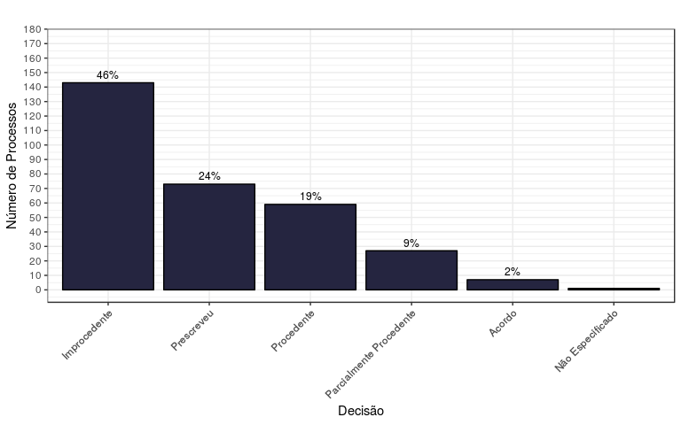
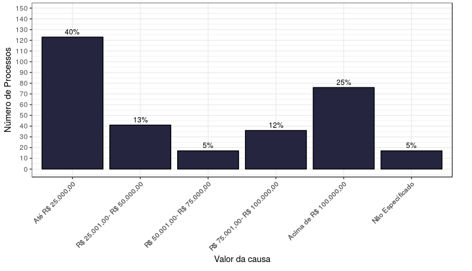
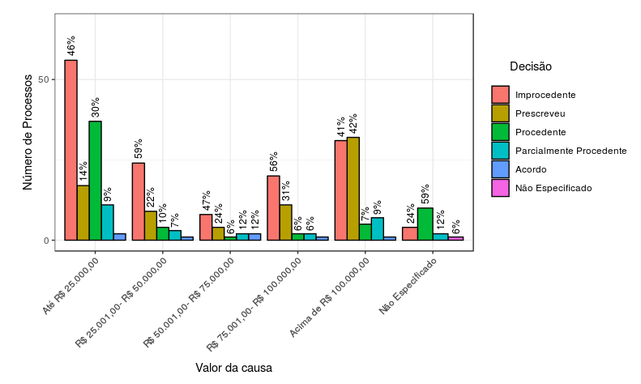

O abandono afetivo é um tema que vem ganhando cada vez mais destaque no
Brasil. Nas palavras de Grace Costa, autora do livro *Abandono afetivo:
indenização por dano moral,* "O abandono afetivo consiste na omissão de
cuidado, de criação, de educação, de companhia e de assistência moral,
psíquica e social que o pai e a mãe devem ao filho quando criança ou
adolescente".

A busca por soluções para este problema leva à necessidade da
indenização por danos morais, pois o dano à integridade psicofísica dos
filhos, bem como o princípio da solidariedade familiar, são valores
protegidos pela constituição.

Mas o que efetivamente acontece quando essa discussão chega à justiça?

Neste texto vamos descobrir os padrões de julgamento dos processos
referentes a esse assunto -- no estado de São Paulo -- e verificar se
informações complementares dos requerentes podem afetar a decisão final
do processo. Para isso, foram coletados 310 processos da plataforma do
Tribunal de Justiça de São Paulo referente ao tema e métodos
computacionais extraíram de suas respectivas movimentações as principais
informações sobre cada ação, bem como seus resultados finais.

**Descrição do estudo**

Em outubro de 2018, um levantamento feito na plataforma do Tribunal de
Justiça de São Paulo, na consulta de julgados de primeiro grau
(<https://esaj.tjsp.jus.br/cjpg/>), retornou 310 processos atinentes ao
tema "abandono afetivo" (frase chave utilizada na consulta). Todas as
movimentações de cada um dos processos foram armazenadas, inclusive o
texto da decisão final. As movimentações foram analisadas
computacionalmente e, através de metodologias de mineração de
texto^[Mineração de texto, conhecida também como mineração de dados 
textuais e semelhante à análise textual, refere-se ao processo de 
obtenção de informações importantes de um texto. Informações importantes
são obtidas normalmente pela elaboração de padrões e tendências através 
de meios como o padrão estatístico de aprendizagem.], foram extraídas
informações do resultado final, o qual, por sua vez, permitiu que 
fossem reproduzidas análises comportamentais dos processos.

O levantamento teve como objetivo auxiliar na obtenção de um padrão de
julgamento de processos referentes ao assunto "abandono afetivo" no
estado de São Paulo e verificar se outras informações como o valor da
causa ou a gratuidade judiciária, comprovada pela hipossuficiência do
requerente, podem afetar a decisão final do processo.

**Resultados**

Os dados levantados possibilitam vários achados. Um deles é a alta
frequência com que os requerentes acabam por não receber a indenização,
seja por prescrição do direito ou por improcedência da ação. Juntos
esses dois desfechos acumulam aproximadamente 70% dos processos.

Além disso, também se verificou uma distribuição bimodal nas
indenizações pedidas. Uma grande parte das ações pedem indenizações de
até R\$ 25.000,00, mas também existe uma outra parte das ações que pedem
indenizações iguais ou superiores a R\$ 100.000,00. Essas ações --
indenizações iguais ou superiores a R\$ 100.000,00 -- representam cerca
de 25% dos processos e o perfil das decisões proferidas difere do que
acontece em casos de menor valor.

A relação entre o valor da indenização e a decisão do processo chamou a
atenção em dois principais pontos; o primeiro é que a ações com o
direito prescrito é mais frequente para casos com maior valor, o segundo
é que a chance de procedência é maior para ações com menor valor.

Outro resultado interessante foi a relação entre a decisão proferida e a
gratuidade judiciaria. O estudo mostrou que ações cuja gratuidade é
ausente possui maior chance de serem procedentes, isto é, se as regras
da permissão de gratuidade judiciária forem verificadas e justas, então
o julgamento é diferente para pessoas com menor poder econômico.

Abaixo listamos, em tópicos, os principais resultados que surgiram da
análise:

**Highlights principais**

-   O volume de processos referente ao tema passou a ser mais
    significante após julho de 2012.
-   25% das ações pedem indenizações acima de R\$ 100.000,00.
-   Na maior parte (64%) das ações foi concedida a gratuidade
    judiciária.
-   A maior parte (70%) dos processos sobre abandono afetivo foram
    julgadas improcedentes ou prescritos.
-   A proporção de prescrições aumenta conforme o valor da ação aumenta.
-   A proporção de procedência diminui conforme o valor da ação aumenta.
-   Ações julgadas procedentes são mais frequentes em processos onde não
    há gratuidade judiciária.