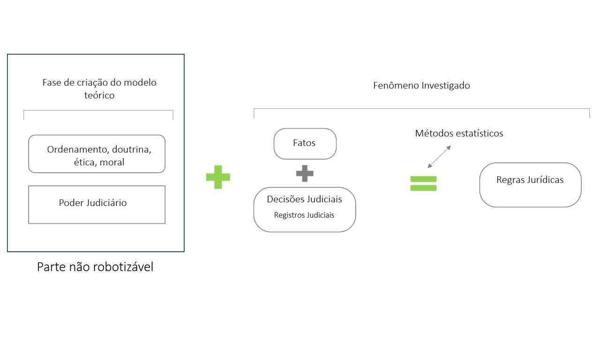

Por vezes, vimos que uma confusão entre conceitos chegou na distinção
entre Jurimetria e Inteligência Artificial (IA). E por isso, explicamos
neste texto qual é a diferença desses conceitos e como a Jurimetria
utiliza a IA em seu processo prático.

A Estatística aplicada ao Direito possui exemplos que remetem ao ano
1713, com a obra Ars Conjectandi, de Jacob Bernoulli. Já o termo
Jurimetria surgiu oficialmente na obra Lee Loevinger Jurimetrics: The
Next Step Forward, no ano de 1949.

Quando falamos em Jurimetria, falamos de uma disciplina do Direito, uma
forma de que utiliza a metodologia Estatística para compreender
fenômenos jurídicos. Nesse sentido, a utilização de tecnologia não é
indispensável, mas é extremamente útil em aplicações práticas.

A área de pesquisa da Inteligência Artificial surgiu oficialmente num
workshop em Dartmouth, no ano 1956.

E quando falamos em Inteligência Artificial, falamos de uma disciplina
da Ciência da Computação, que utiliza diversas metodologias para
compreender e replicar os diferentes significados que a palavra
inteligência pode ter. Dentre as metodologias existentes, a mais
importante nos dias de hoje é a estatística, que está por trás das
sub-áreas de aprendizado de máquina e, por consequência, das redes
neurais. Nesse sentido, a utilização da estatística não é indispensável,
mas é extremamente útil nas aplicações práticos.

Às vezes a Jurimetria é colocada como se fosse o mesmo que Inteligência
Artificial, e outras como se fosse algo completamente diferente. Quando
na verdade, o que essencialmente temos, são disciplinas com propósitos
diferentes, mas que se alimentam da mesma forma.

Pensar em números, ciências exatas, ou tarefas absolutas, facilitam o
processo de automação de um objeto. Agora, como automatizar uma área
abstrata, como o Direito? Como utilizar os mesmos parâmetros de análise
para todas as circunstâncias criadas neste universo? Essas aplicações
devem ser feitas com muita consciência para que tenham sentido e
eficácia na execução. Para isso, o método científico deve ser aplicado
com muito cuidado e, portanto, deve ter uma base estatística sólida.

Para clarear ainda mais a diferença, é importante ressaltarmos que na
Jurimetria existe uma parte que não é robotizável. Essa parte está na
etapa de criação do modelo teórico, que antecede o fenômeno investigado.

A construção de um modelo teórico consiste em encontrar elementos que
descrevem e/ou interferem na análise do fenômeno que está sendo
observado. A inteligência artificial entra depois que as decisões são
tomadas auxiliando na coleta, processamento e análise dos dados.

Com isso, entendemos que a inteligência artificial se torna útil quando
a tarefa já está bem definida e existe uma base de dados disponível,
podendo ser aplicada de duas maneiras principais: no processamento de
dados para posterior análise e na descoberta de regras jurídicas a
partir dos dados.

Com relação ao processamento de dados, uma possibilidade é transformar
documentos brutos em bases organizadas. Os documentos podem ser arquivos
de texto ou mesmo arquivos PDF digitalizados. Os modelos podem ser
utilizados para extrair automaticamente os assuntos e o endereço da
parte em petições iniciais, por exemplo, com o objetivo de otimizar os
fluxos internos de um tribunal ou de um escritório de advocacia. Nesse
sentido, os modelos de redes neurais vêm se destacando cada vez mais,
por apresentarem altas taxas de acurácia e serem capazes de lidar com
grandes volumes de dados.

Para descobrir regras jurídicas a partir dos dados, uma aplicação de
interesse é predizer automaticamente o resultado ou o tempo dos
processos, e compreender quais são as condicionantes que importam para
realizar essas predições. Para isso, existem diversos modelos
disponíveis, desde aqueles tipicamente chamados de estatísticos, como
análise de sobrevivência, até aqueles tipicamente denominados como
aprendizado de máquina, como florestas aleatórias e redes neurais.

Claro que os exemplos não esgotam as aplicações de automatização no
contexto da jurimetria. São muitas possibilidades! O ponto principal é
que todos esses modelos só são aplicáveis depois que todas as decisões
sobre objetivo do estudo, suposições e forma coleta já foram tomadas.

Tentamos aqui, mostrar um pouco sobre o funcionamento da jurimetria e
qual sua relação com a inteligência artificial. E, como vimos, somente a
tecnologia aplicada ao Direito não deve ser considerada Jurimetria, pois
não contém a parte mais essencial, que é o processo de transformar
questões abstratas em problemas concretos.

Por isso, não se engane. Na hora de iniciar seus estudos e análises,
certifique-se sobre o modelo teórico que foi escolhido, a metodologia
que será utilizada, e leve sempre em consideração a qualidade de sua
base de dados. Caso tenha interesse em adquirir esse serviço de
terceiros, verifique sempre se o processo perpassa, de alguma forma,
pelas etapas necessárias.

Ainda que os grandes bancos de dados e a computação sejam muito
importantes, não podemos reduzir a Jurimetria a um software que
instalamos em nosso computador. A Jurimetria é uma disciplina que ajuda
a estudar o Direito empiricamente. E que para realizar algumas etapas
desses estudos, utiliza a tecnologia como aliada.
