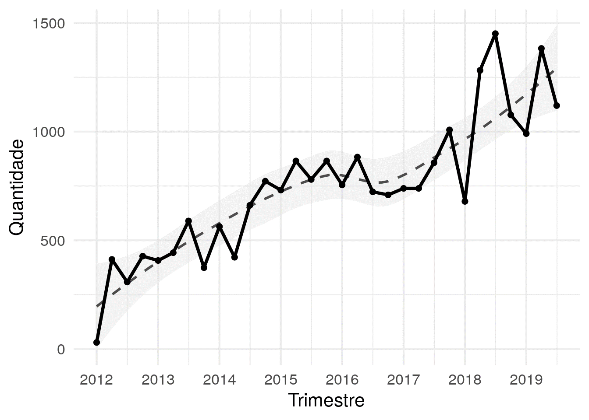
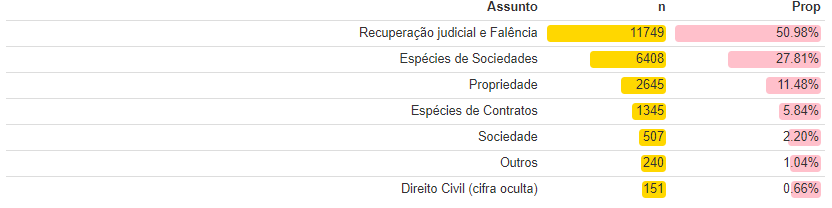
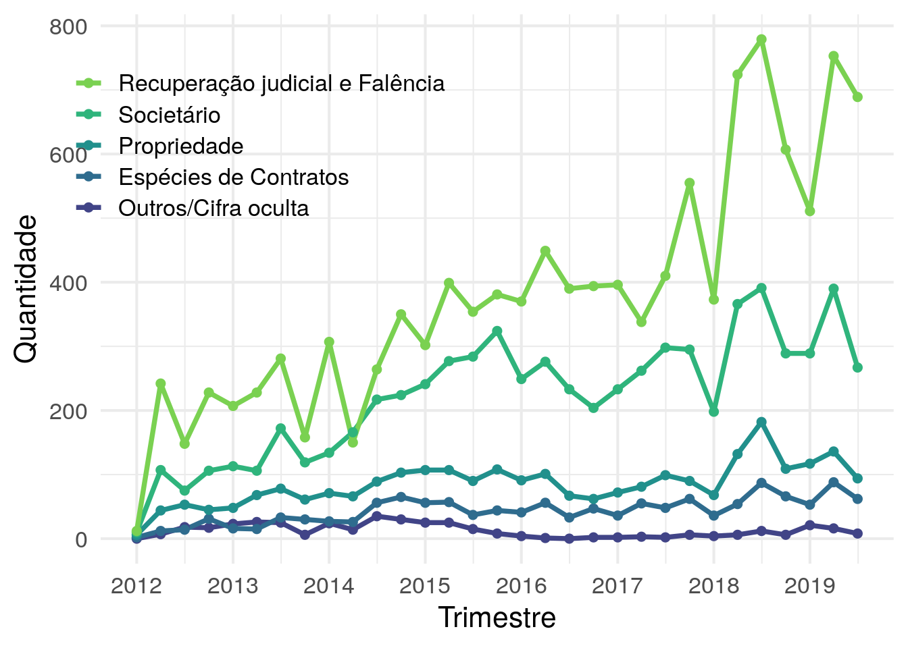
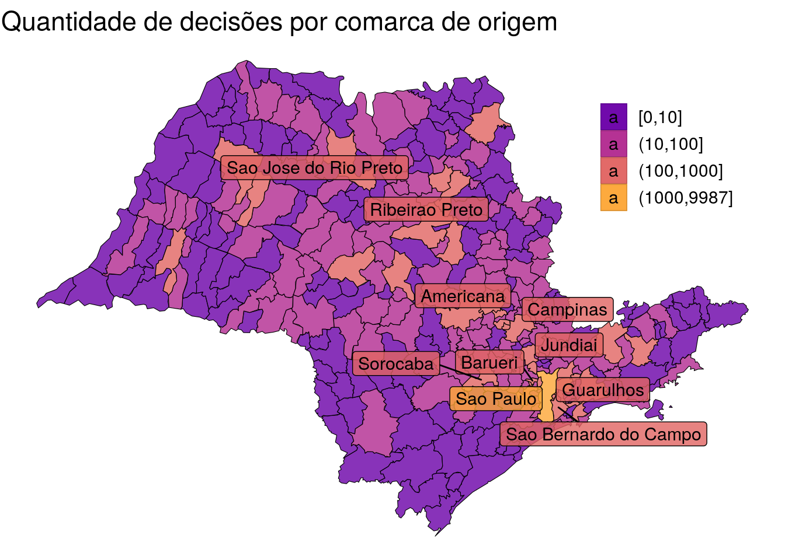
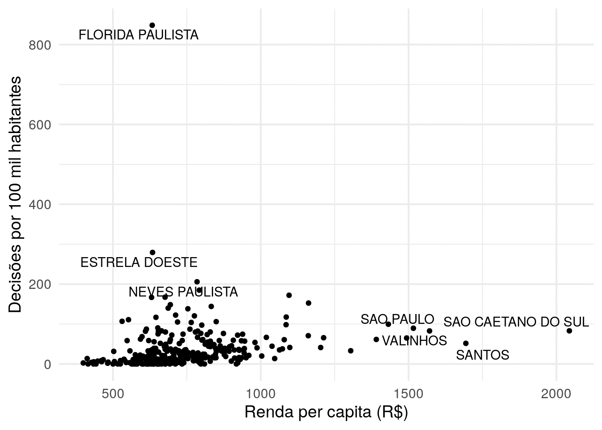
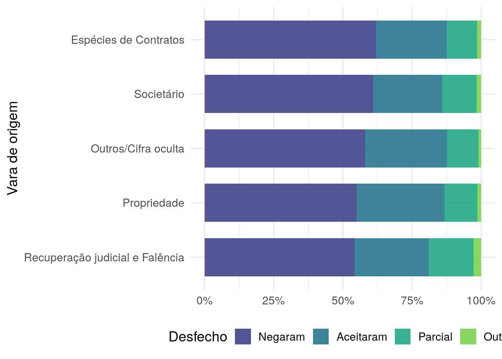
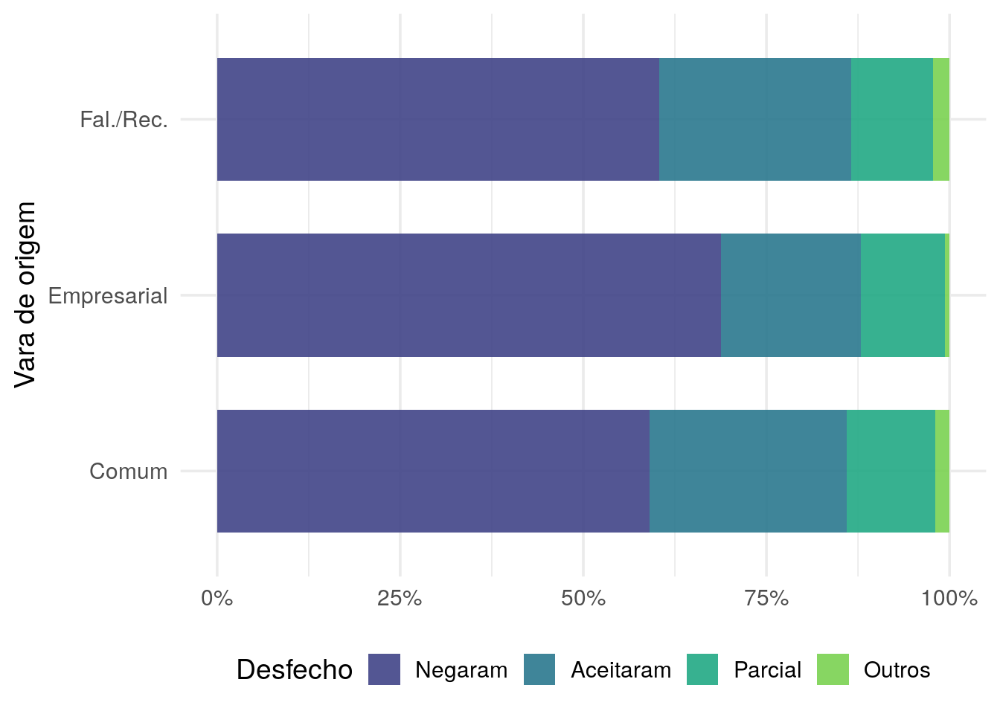

As Câmaras Reservadas de Direito Empresarial tratam de casos
empresariais de forma especializada desde dezembro de 2017.\
Neste breve estudo, vamos analisar as principais características e a
evolução das decisões dessas câmaras por assunto e comarca de origem.

## Metodologia

Nesse estudo, extraímos dados da consulta de jurisprudência disponível
no site do Tribunal de Justiça de São Paulo, e consideramos apenas
agravos de instrumento na análise. Após a limpeza, a base de ficou com
23.151 decisões entre 2012 e 2019.

## Volume mensal
A Figura 1 mostra o volume trimestral de decisões nas câmaras
reservadas. É possível notar um aumento quase linear no volume
trimestral de decisões, e que em 2018 houve um aumento atípico nos dois
primeiros trimestres. Isso não significa que foram distribuídos mais
agravos nessa época, apenas que foram decididos mais casos.

Uma possível explicação para esse aumento é a crise econômica, que
aumentaria casos relacionados a recuperações judiciais e falências.
Outra possível explicação seria um aumento na produtividade dos
magistrados em 2018.

## Assuntos

Os dez assuntos mais comuns dos agravos são dados na Tabela 1, que
utiliza o Nível 2 da Tabela Processual Unificada.

Podemos notar que um pouco mais da metade dos agravos se referem à
insolvência e outros 30% ao direito societário, incluindo Sociedade e
Espécies de Sociedades, sendo o restante destinado a propriedades,
envolvendo Marcas/Patentes e espécies de contratos. A cifra oculta, ou
seja, casos classificados genericamente, corresponde a menos de 1% dos
casos.

A Figura 2 mostra o volume trimestral de decisões nas câmaras por grupo
de assuntos. É possível notar que o aumento de 2018 ocorreu em todos os
grupos, mas foi maior em decisões relacionadas a casos de insolvência.

## Comarca de origem

Outra análise interessante que podemos fazer é a distribuição das
comarcas de origem dos agravos.

A Figura 3 mostra quantidade de agravos por comarca de origem, e é
possível notar uma concentração nos grandes polos econômicos. No
entanto, isso pode estar confundido com o tamanho da população.

A Figura 4 mostra um gráfico de dispersão da quantidade de decisões por
cem mil habitantes de comarca de origem dos agravos e a renda per capita
média da comarca (dados do PNUD, 2010).

É interessante notar que as variáveis não são correlacionadas, diferente
do que observamos normalmente na relação entre litigiosidade e
desenvolvimento, considerando todos os tipos de processo.

Ao analisar o gráfico, vemos em destaque a comarca de Flórida Paulista,
que tem menos de 20 mil habitantes e apresentou 98 agravos. Taxas como
essa ocorrem porque apenas um caso de recuperação judicial enseja
diversos agravos, fazendo com que as taxas de comarcas pequenas fiquem
elevadas.

## Desfechos

A Tabela 2 mostra o percentual de unanimidade nas decisões do colegiado.
A taxa é altíssima, chegando a mais de 98% das decisões.

A Tabela 3 mostra o percentual de cada possível desfecho dos agravos. Os
1.385 casos não conhecidos foram retirados da tabela. A proporção de
decisões desfavoráveis é de quase 57%, que é um pouco acima dos 50% que
geralmente observamos nas decisões em geral.

A Figura 5 mostra a proporção de cada desfecho na comarca de São Paulo
para cada assunto. É possível notar que as taxas não variam muito por
assunto, mas espécies de contratos é o grupo de assuntos com maior taxa
de casos negados.

A Figura 6 mostra a proporção de cada desfecho na comarca de São Paulo,
considerando a vara de origem. É possível notar que os agravos advindos
das novas varas empresariais possuem uma taxa maior de casos negados.

## Comentários finais**

Este breve estudo buscou analisar as principais características de
agravos decididos nas Câmaras Reservadas de Direito Empresarial do TJSP.

Através dele, descobrimos que o volume de decisões está aumentando e que
a taxa de negados está na ordem de 57%. Em São Paulo, os agravos
advindos das varas empresariais apresentam maior taxa de negados que os
casos que vieram das varas comuns, antes da criação das varas
especializadas.

É relevante enfatizar a importância das análises sobre as decisões das
câmaras, principalmente para verificar o efeito da instalação das varas
empresariais na comarca de São Paulo. Essas informações auxiliam a
compreender se o modelo foi efetivo, e se seria viável expandi-lo para
outras regiões.