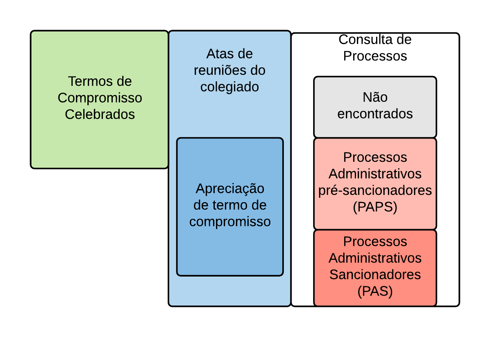

```{r setup, include=FALSE}
knitr::opts_chunk$set(echo=FALSE)
library(magrittr)
```

Uma análise de interesse da pesquisa envolve acordos firmados em Processos Administrativos Pré-Sancionadores (PAPS). Tratam-se de processos que podem ou não ensejar um Processo Administrativo Sancionador (PAS), seja por conta da natureza da discussão ou mesmo por serem encerrados através da celebração de Termos de Compromisso (TC).

O objetivo principal da análise é conhecer a proporção de TCs celebrados durante a fase pré-sancionadora. Essa informação é útil para comparar a eficácia dos TCs na fase pré-sancionadora e sancionadora, auxiliando na tomada de decisões estratégicas dos escritórios de advocacia e empresas envolvidas nos processos.

No entanto, para realizar a análise, precisamos integrar as informações dos processos com dados de apreciação de termos de compromisso. Infelizmente, isso não está disponível de maneira simples nos sistemas da CVM, sendo necessário utilizar técnicas de raspagem de dados e mineração de texto para obter a base de dados final. Descrevemos os passos a seguir.

# Obtenção dos PAPS

A obtenção dos PAPS foi feita através da consulta de processos diretamente do [site da CVM](http://sistemas.cvm.gov.br/asp/cvmwww/processos/formproc_.asp). A consulta pode ser realizada pelo número do processo ou pelo nome da parte. Como não temos os números do processo a priori e não sabemos todos os possíveis números de processo, nossa estratégia foi montar um rol de possíveis nomes para baixar todos os processos. A consulta permite a pesquisa por nome da parte desde que esse nome tenha no mínimo 2 caracteres. O que fizemos foi montar uma lista com todas as combinações: "aa", "ab", ... "zz" e obter o resultado dessas pesquisas.

Surpreendentemente, o número de resultados foi alto. Após download e arrumação dos dados, ficamos com 232.527 números únicos de processos, dos quais 200.906 são físicos e 31.621 são eletrônicos. Claro que nem todos esses processos podem ensejar PAS, já que a discussão do processo pode ser diversa.

# Padronização das atas

A partir de técnicas de raspagem de dados, obtivemos uma lista de 9.800 decisões. Utilizando expressões regulares, identificamos que 1.236 se referem a apreciações de termos de compromisso, seja em PAS ou em PAPS. 

Em seguida, procuramos padronizar os números de processos a partir dos textos das decisões. Existem dois formatos possíveis para identificar os processos: o Número Único do Processo (NUP) e o número do Sistema Eletrônico de Informações (SEI), que passou a ser utilizado a partir de 2014.

O NUP possui três componentes: a unidade de origem (que pode ser RJ, SP ou IA), o ano (que pode estar com dois ou quatro dígitos) e o número (provavelmente sequencial). Quando o processo é de SP ou RJ, a estrutura é UFAAAA/NNNN, sendo UF a unidade federativa, AAAA o ano e NNNN o número identificador, com número de caracteres variável, podendo ou não ter zeros à esquerda. Já quando o processo é do tipo IA, a estrutura é IANNNN/AAAA, sendo que IA pode estar ausente, NNNN o número identificador e AAAA o ano, que pode ter dois ou quatro caracteres.

Já o SEI possui uma estrutura mais padronizada: DDDDD.NNNNNN/AAAA-XX, sendo DDDDD um número identificador da origem (no caso da CVM, a grande maioria é 19957), NNNNNN o número identificador com seis dígitos, AAAA o ano com quatro dígitos e XX os dois dígitos verificadores.

Por conta da estrutura variável da numeração, é natural que apareçam inconsistências ao extrair os dados das atas. No entanto, temos uma vantagem que é a estrutura dos links de consulta processual de PAS e PAPS. Quando o número está no padrão NUP, os links de acesso ao processo contêm sempre a UF, o ano com quatro dígitos e o número identificador sem zeros a esquerda. Dessa forma, se os números forem padronizados, é possível checar todos esses casos nas bases de PAS e PAPS.

A partir das atas, fizemos máximo para padronizar os textos, obtendo o número, ano e UF para os números do tipo NUP e a numeração completa para os números do tipo SEI. A única restrição do levantamento foi que, nos casos em que a mesma decisão menciona mais de um processo, coletamos apenas o primeiro número. No final, obtivemos uma lista de 1.007 processos distintos, sendo 835 no padrão NUP e 172 no padrão SEI. Essa é a população considerada na análise.

# Cruzamento com PAPS, PAS e TCC

A partir das atas padronizadas, pudemos fazer o cruzamento com as bases de PAS, PAPS e TCC. As bases de PAPS e PAS precisaram de pouco processamento, já que a estrutura dos links de acesso aos sites já permite a extração dos números no formato padronizado. Já a lista de processos proveniente dos Termos de Compromisso Celebrados (TCC) precisou passar pela mesma padronização das atas, já que a página não disponibiliza os links de acesso aos processos.

O resumo da organização das bases foi incluído na Figura \@ref(fig:estrutura). Ao todo, foram consultadas 4 fontes de dados distintas para realização das análises.

```{r estrutura, out.width="60%", fig.cap="Estrutura simplificada das bases de dados coletadas. Os tamanhos das caixas não são proporcionais à quantidade de observações em cada base.", fig.align='center'}

```

Como resultados, dos 1.007 casos, obtivemos as contagens da Tabela \@ref(tab:cruzamento). Pela tabela, é possível observar que nao encontramos a origem de 80 (8%) dos casos. Inspecionando esses casos por amostragem, verificamos que i) de fato, não fomos capazes de encontrar esses casos na consulta de processos de PAS nem PAPS e ii) aproximadamente 90% desses casos são PAPS, enquanto apenas um décimo dos casos são PAS.

```{r cruzamento}
tibble::tribble(
  ~toupper.tipo_processo., ~tem_tcc,    ~n,    ~prop,
  "PAPS",    "Não",  130L,  "12.9%",
  "PAPS",    "Sim",   73L,   "7.2%",
  "PAS",    "Não",  387L,  "38.4%",
  "PAS",    "Sim",  337L,  "33.5%",
  "<vazio>",    "Não",   29L,   "2.9%",
  "<vazio>",    "Sim",   51L,   "5.1%",
  "Total",      "-", 1007L, "100.0%"
) %>% 
  purrr::set_names(c("Base encontrada", "TCC encontrado", "N", "%")) %>% 
  knitr::kable(caption = "Resultados do cruzamento.")
```

# Resultados

A análise de interesse do levantamento é verificar a proporção de PAPS que tiveram TCC, comparando com a proporção de PAS que tiveram TCC. A Tabela \@ref(tab:results) mostra os resultados da análise. Pela tabela, é possível observar que a proporção de termos de compromisso celebrados na fase pré-sancionadora é menor que na fase sancionadora. Além disso, é possível observar que os casos com informação faltante no tipo de processo possuem uma proporção maior de TCC que os demais. Juntando esse resultado com o fato de que aproximadamente a grande maioria dos casos que não foram encontrados são PAPS, é possível que existe um viés na probabilidade de celebração do termo de compromisso e o fato do processo ser encontrável ou não na consulta de processos.

```{r results}
tibble::tribble(
   ~tipo,   ~n,   ~prop,
  "PAPS", 203L, "36.0%",
   "PAS", 724L, "46.5%",
      "Não encontrado",  80L, "63.7%"
  ) %>% 
  purrr::set_names(c("Tipo de processo", "Quantidade", "% TCC")) %>% 
  knitr::kable(caption = "Resultados da análise.")
```

