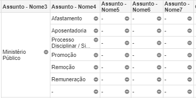

```{r setup, include=FALSE}
knitr::opts_chunk$set(
  echo = FALSE, 
  message = FALSE, 
  warning = FALSE,
  fig.align = "center"
)
# carrega pacotes necessários
library(ggplot2)
library(magrittr)
library(tidyverse)
library(patchwork)

```

```{r}
# carrega base `assuntos` disponivel
load("assuntos.rda")

```

## Introdução

Este texto se propõe a discutir o problema da _cifra oculta_ nos assuntos processuais e os impactos que isso pode ter para a pesquisa em jurimetria.

A cifra oculta é a quantidade não observada de determinado dado. Esse problema surge, quando falamos dos Assuntos processuais, por causa da forma como esses dados são gerados. Para entendermos isso, precisamos nos voltar para a Resolução 46/2007 do CNJ. Essa norma criou as chamadas Tabelas Processuais Unificadas (TPUs), as quais tentam unificar dados relativos a todos os processos, em todas as esferas, em todos os tribunais brasileiros, classificando-os por classe e assunto. A classe está ligada ao rito processual (rito ordinário, extraordinário, etc). Já o assunto se liga às causas de pedir, isto é, qual é o conflito gerador do processo judicial.

Para reportar o Assunto dos processos, o CNJ criou uma árvore de classificação que começa do gênero do Assunto (e.g., Direito do Consumidor) e se ramifica até chegar na sua espécie (e.g., Produto Impróprio, Venda Casa, Indenização por Dano Material). Via de regra, existem várias classificações intermediárias entre o assunto mais genérico possível e o assunto mais específico possível. Cada uma dessas classificações está em um “nível” diferente. Os níveis do CNJ vão do 1 (o mais genérico, como Direito do Consumidor), até o 7 (o mais específico), mas não necessariamente um processo deve chegar até o nível 7 para ser o nível mais específico possível. Tem vezes em que o nível 2 já é a espécie daquele Assunto, mas tem outras vezes em que o nível 2 se ramifica em um ou mais níveis posteriores. E o mais importante desta classificação é que quem preenche tal informação é o próprio advogado que peticionou.

Quando o próprio advogado preenche o assunto, o dado fica sujeito a erros humanos. Temos dois tipos de erros possíveis aqui. Em primeiro lugar, o advogado pode realizar classificações equivocadas, por exemplo, ao classificar determinado processo de Venda Casada, como Indenização por Danos Materiais. 

Em segundo lugar, o advogado pode realizar a classificação de forma imprecisa e genérica. Este caso é mais difícil de compreender. Ele ocorre sempre que o advogado poderia ter preenchido um nível mais específico do assunto processual, mas não o fez. Por exemplo, dentro de Direito do Consumidor (nível 1), existe uma subclassificação que se chama Contratos de Consumo (nível 2). Esta subclassificação, por sua vez, se ramifica em mais 5 assuntos, estes sim, os assuntos mais específicos possível, a saber, (1) Dever de informação, (2) Irregularidade no atendimento, (3) Jogos / sorteios / promoções comerciais, (4) Oferta e publicidade e (5) Práticas abusivas (todos de nível 3). 

Idealmente, os processos deveriam ser classificados até este último nível de assunto. Entretanto, o que ocorre muitas vezes é que o advogado não chega até este nível de especificidade na hora de peticionar e acaba classificando o processo genericamente como "Contratos de Consumo" (nível 2 apenas). A consequência dessa classificação genérica é que não conseguimos saber qual é a quantidade real de casos de determinado assunto, o que gera uma incerteza inerente a esse dado. 

Ambos os problemas (tanto de classificação equivocada, como de classificação genérica) geram a chamada cifra oculta, isto é, uma parcela da realidade que não pode ser observada pelo nosso dado. A cifra oculta que decorre de equívocos é difícil de ser medida, porque ela pressupõe que nós saibamos qual é a classificação correta daquele caso e, para ser medida, exigiria que nós olhássemos cada caso e checássemos se a classificação está correta ou não. Nossa análise, então irá pressupor que o advogado classificou corretamente casos e olhar, então, somente para o problema da classificação imprecisa. Este segundo problema pode ser mensurado com mais facilidade, porque, sempre que ele ocorrer, teremos um descompasso entre a quantidade de casos de determinado gênero e a soma total de suas espécies. 

A análise que se segue, então, irá olhar para este problema específico da classificação imprecisa, a fim de quantificá-la.


## Descrição da base de dados

Para realizar essa análise, usamos os dados do Painel do CNJ em Números. O CNJ em Número nos fornece a quantidade de casos de cada assunto por jurisdição.

### Sobre os assuntos {#sobre-os-assuntos}

Há 7 colunas de assuntos, uma para cada nível, conforme podemos observar na Figura 1.

{#id .class width=100% height=100%}

A coluna "Assunto - Nome1" indica o assunto em nível mais genérico. Já o "Assunto - Nome7" indica o assunto em nível mais específico. As colunas intermediárias indicam as subclassificações de cada processo. Raramente os processos chegam no nível 7. O nível mais específico costuma estar no 4 ou no 5. 

Quando o processo não chega a determinado nível, a coluna fica marcada com "-". Ao que devemos ficar atento é se a casa marcada com "-" possui "irmãos" que possuam alguma outra resposta. 

Por exemplo: o assunto "Direito Administrativo" (nível 1) se ramifica em "Agentes Políticos" e "Atos Administrativos" (nível 2). Seguindo a árvore dos "Agentes Políticos", ela se ramifica em "Governador", "Magistratura", "Ministério Público", entre outros (nível 3). A título de exemplo, seguindo o ramo da Magistratura, ela se ramifica em "Afastamento", "Aposentadoria", "Processo Disciplinar", "Promoção", "Quinto Constitucional", "Remoção", "Remuneração" e "-" (nível 4). Neste caso "-" possui irmãos, que são as outras casas de mesmo nível (nível 4) dentro de Magistratura, isto é, "Afastamento", "Aposentadoria", "Processo Disciplinar", "Promoção", "Quinto Constitucional", "Remoção" e "Remuneração". Nenhuma dessas casas possui subdivisões posteriores, então para cada linha, os níveis 5, 6 e 7 estão preenchidos com "-". 

O que devemos perceber é que os traços dos níveis 5 a 7 *não* indicam cifra oculta, mas simplesmente a ausência de classificação naquele nível. Entretanto, o traço no nível 4, porque possui irmãos preenchidos, indica cifra oculta. Vemos esses dois tipos de traços (traços com irmãos e traços sem irmãos) na Figura 2. O traço da coluna "Assunto - Nome4" indica cifra oculta, enquando os demais traços não. 

{#id .class width=65% height=65%}

### Sobre o território e o ano

Esses dados sobre o Assunto dos processos do CNJ estão disponíveis para todos os Estado, ao longo de vários anos. Assim, para cada um dos tribunais, em cada uma das instâncias, há um base diferente para baixar. 

Escolhemos pegar os dados do TJSP, TJRJ, TJAM e TJPE, nos anos de 2014 a 2019. São Paulo e Rio de Janeiro foram escolhidos por serem grandes tribunais, com um alto número de processos. O TJAM foi escolhido por ser um representante do Norte. E o TJPE, por ser um representante do Nordeste. 

Como são 4 Tribunais, ao longo de 6 anos, baixamos 24 bases de dados. Essas bases foram empilhadas e formaram um arquivo único. 

### Visualização da base de dados

#### Processos por assunto

Com os dados de assuntos para o TJSP, TJRJ, TJAM e TJPE, entre os anos de 2014 e 2019, formamos uma base com 37.006 processos, que se distribuem entre 18 assuntos genéricos, ao todo, conforme a Tabela 1

```{r}
assuntos %>%
  select(assunto_nome1, x1_grau) %>%
  group_by(assunto_nome1) %>%
  mutate(assunto_nome1 = toupper(assunto_nome1)) %>%
  filter(assunto_nome1 != "TOTAL") %>% 
  count() %>%
  arrange(desc(n)) %>% 
  knitr::kable(caption = "Quantidade de observações por assunto genérico")
```

Podemos ver que a distribuição de casos não é homogênea por assunto. Há uma concentração muito maior em Direito Administrativo, Direito Penal e Direito Civil, em comparação com Direito Eleitoral, Direito da Saúde, Direito Processual Penal Militar, Direito Internacional e Direito do Trabalho. É possível visualizar com mais facilidade essa distribuição assimétrica por meio de um gráfico. 

```{r}
assuntos %>%
  select(assunto_nome1, x1_grau) %>%
  group_by(assunto_nome1) %>%
  count() %>%
  arrange(desc(n)) %>%
  head(15) %>%
  ggplot() +
  geom_col(mapping = aes(x = n,  y = fct_reorder(assunto_nome1, n, .desc = FALSE)),
           fill = viridisLite::viridis(1, 1, .2, .8)) +
  plot_annotation("Gráfico 1: Contagem de Assuntos de forma geral",
                  theme = theme(plot.title = element_text(size = rel(1.5)))) +
  labs(x = "Quantidade",
       y = "Assuntos Recorrentes") +
  theme_minimal(8)
```

#### Processos por ano

Se olhamos para a distribuição ao longo dos anos, ela fica bem mais homogênea. Por mais que haja um pouco mais de casos em 2014 e 2015, essa diferença não é muito relevante.

```{r}
assuntos %>%
  group_by(ano) %>%
  count() %>%
  arrange(desc(n)) %>%
  ggplot() +
  geom_col(aes(x = ano, y = n), fill = viridisLite::viridis(1, 1, .2, .8)) +
  labs(title = "Gráfico 2: Contagem de casos por Ano",
       x = "Anos",
       y = "Tribunais") +
  theme_minimal(12) +
  scale_y_continuous(name = "Numero de casos", breaks = seq(0, 7000, 2000))
```

#### Processos por tribunal 

Ainda podemos ver a distribuição dos casos por tribunal. Dos 4 tribunais que selecionamos (TJSP, TJAM, TJRJ e TJPE), TJSP foi o Estado com mais processos ao longo destes 6 anos, o que é esperado, uma vez que ele é o maior tribunal brasileiro. A seguir, TJAM e TJRJ possuem quantidades muito similares de processos. E por fim, está o TJPE como menor número de casos.  

```{r n-tribunal}
assuntos %>%
  select(tribunal, x1_grau) %>%
  group_by(tribunal) %>%
  count() %>%
  arrange(desc(n)) %>%
  ggplot() +
  geom_col(aes(x = n,  y = fct_reorder(tribunal, n, .desc = FALSE)) , fill = viridisLite::viridis(1, 1, .2, .8)) +
  labs(title = "Gráfico 3: Contagem de casos por Tribunal",
       x = "Quantidade",
       y = "Tribunais") +
  theme_minimal(12)
```

### A taxa de cifra oculta

Uma vez que sabemos como identificar as cifras ocultas e temos os dados em mãos, podemos calcular uma taxa para esta cifra. Essa taxa é, simplesmente, uma razão entre a quantidade de "-" com irmãos (conforme vimos em ["Sobre os assuntos"](#sobre-os-assuntos)), sobre a quantidade total de casos. Em outras palavras, o que essa taxa indica é, de todos os processos, quantos porcento deles poderiam ter recebido alguma classificação mais específica, mas não o receberam. 

Calculamos, então, essa taxa para cada um dos 18 assuntos genéricos, bem como para cada um dos 4 tribunais. 

## Resultados

### Taxa de cifra oculta por assunto 

```{r assuntos}
assuntos %>%
  group_by(assunto_nome1) %>%
  summarise(taxa = sum(x1_grau[generico == "Sim"]) / sum(x1_grau), .groups = "drop") %>%
  filter(assunto_nome1 != "Total") %>%
  mutate(assunto_nome1 = toupper(assunto_nome1)) %>% 
  ggplot() +
  geom_col(mapping = aes(x = taxa, y = fct_reorder(assunto_nome1, taxa, .desc = FALSE)),
           fill = viridis::viridis(1, 1, .2, .8)) +
  scale_x_continuous(labels = scales::percent) +
  theme_minimal(9.5) +
  plot_annotation("Gráfico 4: Taxa de cifra oculta por Assunto",
                  theme = theme(plot.title = element_text(size = rel(1.5)))) +
  labs(x = "Taxa de cifra genérica",
       y = "Assuntos")
```

Quando comparamos a taxa de cifra oculta por assunto, vemos, de cara, que alguns assuntos possuem taxas muito altas de cifra oculta, a saber, Direito do Trabalho, Direito Eleitoral, Direito Processual Penal e Direito Penal Militar. Respectivamente, cada uma dessas  

Temos de tomar cuidado com estes dados, porque, se olharmos novamente para a Tabela 1, veremos que os três assuntos com maior taxa de cifra oculta são justamente alguns dos assuntos com menos observações. Então, por exemplo, Direito do Trabalho possui uma taxa de 85% de cifra oculta, ou seja, a cada 100 processos, 85 são classificados com um assunto mais genérico do que poderia ser. Mas, ao mesmo tempo, Direito do Trabalho possui apenas 106 observações ao todo. O segundo assunto com mais cifra oculta é o Direito Eleitoral, que possui uma taxa de 75% de cifra oculta, mas apenas 8 observações. 

No eixo inferior, temos de tomar igual cuidado, porque, por exemplo, Direito Internacional, com uma taxa de 0.78% de cifra oculta, possui apenas 70 observações.

Olhando, agora, para os Assuntos em que podemos tirar conclusões mais seguras (porque são assuntos com o maior número de observações), temos Direito Penal, Direito Administrativo e Direito Civil.

Dentre esses três assuntos, Direito Administrativo possui a maior taxa de cifra oculta, de 43%. Em seguida, está o Direito Civil, com 26% dos casos. E por fim, com a menor taxa de cifra oculta de todos os assuntos (sem contar com Direito Internacional, que, como vimos, possui poucas observações), est´´a o Direito Penal, com uma taxa de apenas 9%. Isso pode se explicar pelo fato de que o "advogado" que peticiona os casos de Direito Penal são, na verdade, promotores públicos, agentes do próprio Estado. 

### Taxa de cifra oculta por tribunal

```{r tribunal}
assuntos %>%
  group_by(tribunal) %>%
  summarise(taxa = sum(x1_grau[generico == "Sim"]) / sum(x1_grau), .groups = "drop") %>%
  ggplot() +
  geom_col(mapping = aes(x = taxa, y = fct_reorder(tribunal, taxa, .desc = FALSE)),
           fill = viridis::viridis(1, 1, .2, .8)) +
  scale_x_continuous(labels = scales::percent) +
  theme_minimal(12) +
  labs(title = "Gráfico 5: Taxa de cifra oculta por tribunal",
       x = "Tribunal",
       y = "Taxa de cifra genérica")
```

Já quando analisamos a taxa de cifra oculta por tribunal, observamos que há uma concentração ligeiramente maior no TJPE, em comparação aos demais tribunais, mas, em geral, a diferença entre eles é baixa. Com isso, podemos concluir que os tribunais possuem, em geral, uma taxa de cifra oculta que fica em torno de de 10% a 20% dos casos. Este número é baixo.

## Comentários finais 

A cifra oculta é um problema que decorre do processo através do qual os dados foram gerados. Esse processo é sempre importante de ser reportado, a fim que as incertezas inerentes aos dados sejam explicitadas. No caso dos tribunais brasileiros, o dado de "Assunto" do processo contém, em si, uma incerteza: será que o peticionante classificou corretamente o caso ou não? Para lidar melhor com este problema, quantificamos a cifra oculta de 4 tribunais brasileiros, TJSP, TJRJ, TJAM e TJPE. 

Como resultado, percebemos, de um lado, que não há grande diferença na cifra oculta entre os tribunais, uma vez que as taxas de cifra oculta de cada tribunal eram muito parecidas (giravam em torno de 10% a 20% dos casos totais). Por outro lado, observamos que havia uma diferença considerável na taxa de cifra oculta por assunto. Tomados os devidos cuidados (de não concluir de forma muito taxativa sobre a taxa de cifra oculta dos assuntos com poucas observações), observamos que direito penal possui uma taxa baixíssima de cifra oculta, o que pode ser explicado pelo fato de que são agentes do Estado (promotores e procuradores públicos) que peticionam cada processo e, consequentemente, classificam o Assunto de cada caso. Já no Direito Civil e no Direito Administrativo, as taxas de cifra oculta são bem maiores (respectivamente, de 26% e 43%). 

Estes resultados tentam explicitar, de alguma forma, as incertezas inerentes aos dados dos tribunais, deixando claro que existem erros consideráveis nos dados disponibilizados pelos tribunais. Isso é importante na medida em que essa incerteza deve ser reportada e considerada ao se realizar pesquisas com estes dados. 


