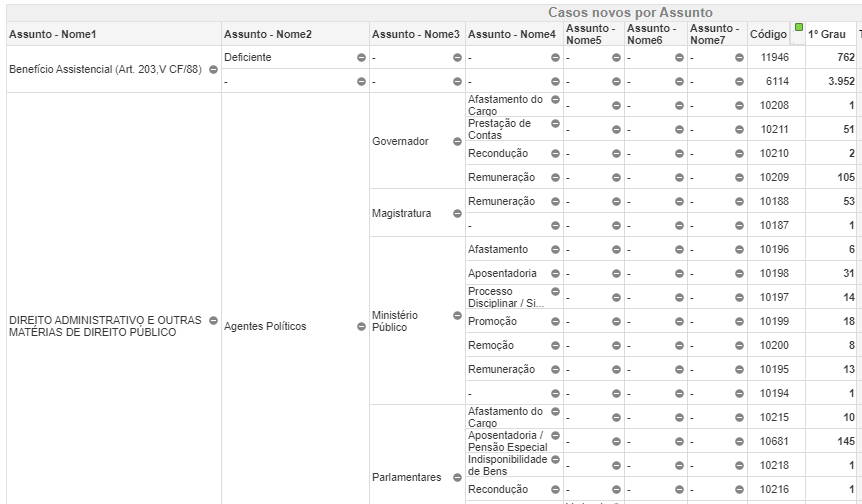

## Introdução
Este texto se propõe a discutir o problema da _cifra oculta_ nos assuntos processuais e os impactos que isso pode ter para a pesquisa em jurimetria.

A cifra oculta é a quantidade não observada de determinado dado. Esse problema surge, quando falamos dos Assuntos processuais, por causa da forma como esses dados são gerados. Para entendermos isso, precisamos nos voltar para a Resolução 46/2007 do CNJ. Essa norma criou as chamadas Tabelas Processuais Unificadas (TPUs), as quais tentam unificar dados relativos a todos os processos, em todas as esferas, em todos os tribunais brasileiros, classificando-os por classe e assunto. A classe está ligada ao rito processual (rito ordinário, extraordinário, etc). Já o assunto se liga às causas de pedir, isto é, qual é o conflito gerador do processo judicial.

Para reportar o Assunto dos processos, o CNJ criou uma árvore de classificação que começa do gênero do Assunto (e.g., Direito do Consumidor) e se ramifica até chegar na sua espécie (e.g., Produto Impróprio, Venda Casa, Indenização por Dano Material). Via de regra, existem várias classificações intermediárias entre o assunto mais genérico possível e o assunto mais específico possível. Cada uma dessas classificações está em um “nível” diferente. Os níveis do CNJ vão do 1 (o mais genérico, como Direito do Consumidor), até o 7 (o mais específico), mas não necessariamente um processo deve chegar até o nível 7 para ser o nível mais específico possível. Tem vezes em que o nível 2 já é a espécie daquele Assunto, mas tem outras vezes em que o nível 2 se ramifica em um ou mais níveis posteriores. E o mais importante desta classificação é que quem preenche tal informação é o próprio advogado que peticionou.

Quando o próprio advogado preenche o assunto, o dado fica sujeito a erros humanos. Temos dois tipos de erros possíveis aqui. Em primeiro lugar, o advogado pode realizar classificações equivocadas, por exemplo, ao classificar determinado processo de Venda Casada, como Indenização por Danos Materiais. 

Em segundo lugar, o advogado pode realizar a classificação de forma imprecisa. Este caso é mais difícil de compreender. Ele ocorre sempre que o advogado poderia ter preenchido um nível mais específico do assunto processual, mas não o fez. Por exemplo, dentro de Direito do Consumidor, existe uma subclassificação que se chama Contratos de Consumo. Esta subclassificação, por sua vez, se ramifica em mais 5 assuntos, estes sim, os assuntos mais específicos possível, a saber, (1) Dever de informação, (2) Irregularidade no atendimento, (3) Jogos / sorteios / promoções comerciais, (4) Oferta e publicidade e (5) Práticas abusivas. O que acontece é que alguns advogados de fato classificam seus processos até o nível mais específico, escolhendo um desses cinco assuntos. Entretanto, outros não chegam até o fim e classificam o processo somente como "Contratos de Consumo". O problema que surge, então, é saber a qual assunto esse processo classificado genericamente como "Contratos de Consumo" deveria pertencer? Quando vemos, por exemplo, que existem 5000 processos classificados como "Dever de informação" (este sim, um nível específico de classificação), não temos como saber se este número é o número real ou não, porque como existe uma série de processos que ficaram com uma classificação mais genérica, pode ser que, caso eles eles fossem devidamente categorizado, eles fossem classificados como "Dever de informação". 

Ambos os problemas (tanto de classificação equivocada, como de classificação imprecisa) geram a chamada cifra oculta, isto é, uma parcela da realidade que não pode ser observada pelo nosso dado. A cifra oculta que decorre de equívocos é difícil de ser medida, porque ela pressupõe que nós saibamos qual é a classificação correta daquele caso e, para ser medida, exigiria que nós olhássemos cada caso e checássemos se a classificação está correta ou não. Nossa análise, então irá pressupor que o advogado classificou corretamente casos e olhar, então, somente para o problema da classificação imprecisa. Este segundo problema pode ser mensurado com mais facilidade, porque, sempre que ele ocorrer, teremos um descompasso entre a quantidade de casos de determinado gênero e a soma total de suas espécies. 

A análise que se segue, então, irá olhar para este problema específico da classificação imprecisa, a fim de quantificá-la. 

## Descrição da base de dados

Para realizar essa análise, usamos os dados do Painel do CNJ em Números. O CNJ em Número nos fornece a quantidade de casos de cada assunto por jurisdição.

### Sobre os assuntos

Há 7 colunas de assuntos, uma para cada nível.




A coluna "Assunto - Nome1" indica o assunto em nível mais genérico. Já o "Assunto - Nome7" indica o assunto em nível mais específico. As colunas intermediárias indicam as subclassificações de cada processo. Raramente os processos chegam no nível 7. O nível mais específico costuma estar no nível 4 ou nível 5. 

Quando o processo não chega a determinado nível, a coluna fica marcada com "-". O que devemos ficar atento é se a casa marcada com "-" tiver "irmãos" que possuam alguma outra resposta. Por exemplo: o assunto "Direito Administrativo" (nível 1) se ramifica em "Agentes Políticos" e "Atos Administrativos" (nível 2). Seguindo a árvore dos "Agentes Políticos", ela se ramifica em "Governador", "Magistratura", "Ministério Público", entre outros (nível 3). A título de exemplo, seguindo o ramo da Magistratura, ela se ramifica em "Afastamento", "Aposentadoria", "Processo Disciplinar", "Promoção", "Quinto Constitucional", "Remoção", "Remuneração" e "-" (nível 4). Neste caso "-" possui irmãos, que são as outras casas de mesmo nível (nível 4) dentro de Magistratura, isto é, "Afastamento", "Aposentadoria", "Processo Disciplinar", "Promoção", "Quinto Constitucional", "Remoção" e "Remuneração". Nenhuma dessas casas possui subdivisões posteriores, então para cada linha, os níveis 5, 6 e 7 estão preenchidos com "-". 

```{r layout="l-body-outset", echo=FALSE}

knitr::include_graphics("img/traco_com_irmaos.PNG")

```

<!-- {width=50%, height=50%} -->

Ao que devemos nos atentar é que os traços dos níveis 5 a 7 *não* indicam cifra oculta, mas simplesmente a ausência de classificação naquele nível. Entretanto, o traço no nível 4, porque possui irmãos preenchidos, indica cifra oculta. 

```{r layout="l-body-outset", echo=FALSE}


```

<!--  -->

### Sobre o território e o ano

Esses dados (de assunto e jurisdição) do CNJ estão disponíveis por Estado e Ano. Assim, para cada um dos tribunais, em cada uma das instâncias, há um base diferente para baixar. 

Escolhemos pegar os dados do TJSP, TJRJ, TJAM e TJPE, nos anos de 2014 a 2019. São Paulo e Rio de Janeiro foram escolhidos por serem grandes tribunais, com um alto número de processos. O TJAM foi escolhido por ser um representante do Norte. E o TJPE, por ser um representante do Nordeste. 

Como são 4 Tribunais, ao longo de 6 anos, baixamos 24 bases de dados. Essas bases foram empilhadas, a fim de formar um arquivo único. E, então, arrumamos a base única.

## Resultados

### Taxa de cifra oculta 

```{r, fig.align='center'}
library(ggplot2)
library(magrittr)
library(tidyverse)

assuntos %>%
  group_by(assunto_nome1) %>%
  summarise(taxa = sum(x1_grau[generico == "Sim"]) / sum(x1_grau), .groups = "drop") %>%
  filter(assunto_nome1 != "Total") %>%
  ggplot() +
  geom_col(mapping = aes(x = taxa, y = fct_reorder(assunto_nome1, taxa, .desc = FALSE)), fill = viridis::viridis(1, 1, .2, .8)) +
  scale_x_continuous(labels = scales::percent) + 
  theme_minimal(14)+
  labs(
    title = "Taxa de cifra oculta por assuntos genéricos", 
       x = "Assuntos", 
       y = "Taxa de cifra genérica")

```
## Comentários finais 


