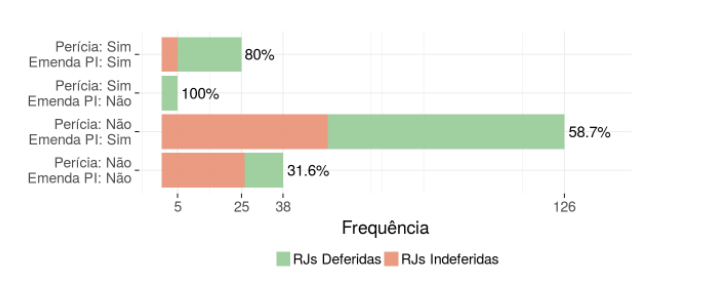

```{r setup, include=FALSE}
knitr::opts_chunk$set(echo = FALSE)
```

O presente texto tem por objetivo abordar a aplicação da perícia prévia e a emenda à petição inicial no processo de recuperação judicial (a "RJ") e seus impactos nas decisões de deferimento do processamento da RJ.

Os dados a serem apresentados neste texto são resultado de pesquisa realizada pelo NEPI/PUC-SP (Núcleo de Estudo e Pesquisa de Insolvência da PUC/SP) e pela ABJ (Associação Brasileira de Jurimetria), os quais foram extraídos do livro "Direito Comercial, Falências e Recuperação de Empresas – Temas" [@sacramoneal2019], coordenado por Ivo Waisberg, José Horácio H. R. Ribeiro e Marcelo Barbosa Sacramone. 

Os dados foram obtidos através de análise empírica de 194 recuperações judiciais distribuídas entre 01/09/2013 e 30/06/2016 nas duas Varas de Falências e Recuperações Judiciais do Foro Central da Comarca de São Paulo/SP.

Inicialmente, cabe destacar que no momento em que a pesquisa foi realizada, a perícia prévia ainda não possuía uma previsão legal, sendo utilizada pelos juízes como um instrumento para verificação das reais condições de funcionamento da empresa devedora, tendo a finalidade de garantir a efetividade da recuperação judicial e evitar o deferimento do processamento de recuperação judicial de empresa irrecuperável.

Com base nos dados obtidos, dos 194 processos analisados, a perícia prévia ocorreu em apenas 30 deles, isto é, em 15% por cento dos processos analisados. Sendo que, dos 30 processos, em 25 houve emenda à petição inicial e em 05 houve apenas perícia prévia, sem emenda.

Quanto ao deferimento do processamento da recuperação judicial, dos 30 processos em que houve perícia prévia, em 25 deles o processamento foi deferido, representando uma frequência de deferimento de cerca de 80%. Enquanto que, nos processos em que não houve perícia prévia ou emenda à petição inicial foi observada uma frequência de deferimento de 31,6%.

Sendo assim, analisando os números obtidos pela pesquisa, verifica-se que nos processos em que houve a realização da perícia prévia, a proporção de deferimento do processamento da recuperação judicial foi de aproximadamente 50% maior do que nos processos que não houve perícia prévia ou emenda à inicial.

De outro lado, nos casos em que houve somente a emenda à petição inicial, a proporção de deferimento foi de aproximadamente 30% maior, conforme se verifica na Figura \@ref(fig:figura):

```{r figura, fig.cap="Quantidade de RJs deferidas e indeferidas para cada combinação de perícia prévia e emenda à inicial.", message=FALSE, layout="l-body-outset"}

```


Em relação ao tempo de deferimento do processamento da recuperação judicial, os dados demonstraram que os processos em que há perícia prévia levam aproximadamente 18 dias a mais que os processos em que não há perícia prévia para obter o deferimento do processamento da recuperação judicial.  

Considerando que no momento da pesquisa não havia uma previsão legal acerca da perícia prévia, os magistrados poderiam conceder o prazo que entendessem necessário para a entrega do laudo pelo perito. Todavia, a recém sancionada Lei nº 14.112/2020, passou a regular a perícia prévia na recuperação judicial, permitindo que o juiz conceda o prazo máximo de 05 dias para que o perito apresente laudo de constatação das reais condições de funcionamento do devedor e da regularidade documental[^art].

[^art]: "Art. 51-A. Após a distribuição do pedido de recuperação judicial, poderá o juiz, quando reputar necessário, nomear profissional de sua confiança, com capacidade técnica e idoneidade, para promover a constatação exclusivamente das reais condições de funcionamento da requerente e da regularidade e da completude da documentação apresentada com a petição inicial. § 2º O juiz deverá conceder o prazo máximo de 5 (cinco) dias para que o profissional nomeado apresente laudo de constatação das reais condições de funcionamento do devedor e da regularidade documental".

Por fim, através da pesquisa foi possível concluir que a perícia prévia e a emenda à petição inicial não são obstáculos para o deferimento do processamento da recuperação judicial. Pelo contrário, os dados demonstraram que ambas aumentam a proporção de deferimento do processamento da recuperação judicial. 