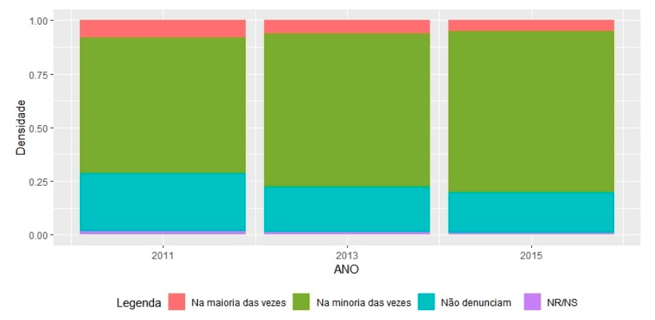
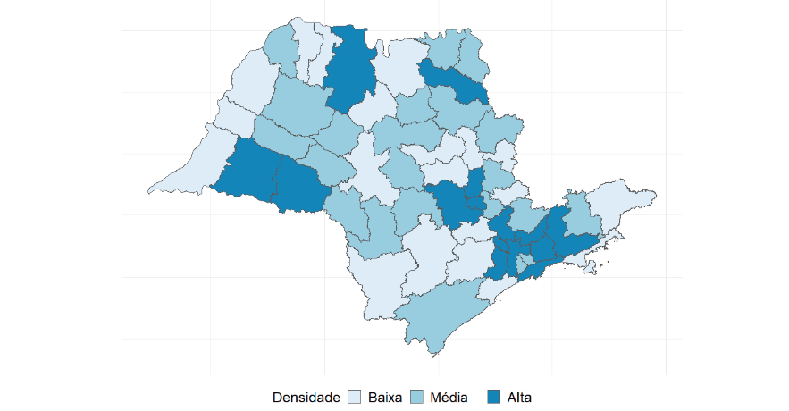
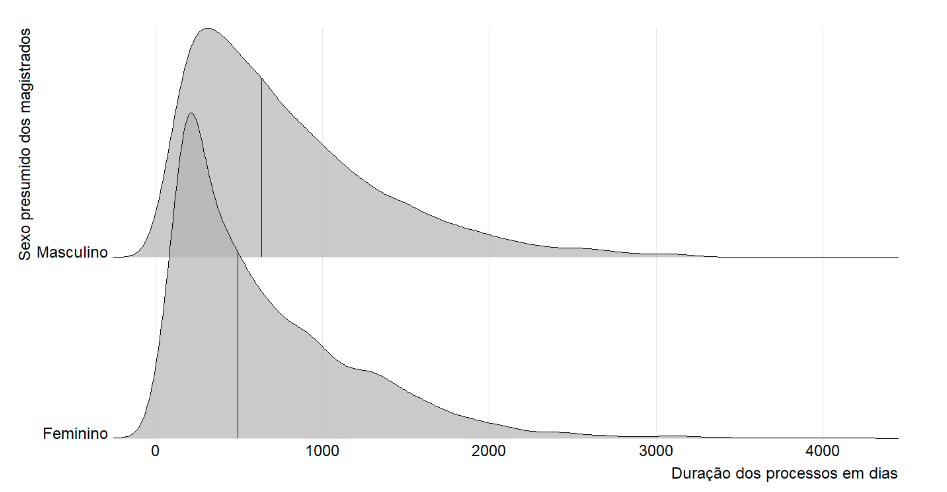

```{r setup, include=FALSE}
knitr::opts_chunk$set(echo = FALSE)
```

A Lei Maria da Penha (Lei 11.340/2006) foi um importante marco no combate à violência doméstica contra a mulher. Ela trouxe à tona um problema endêmico, vivenciado pelo país há tempos, bem como deslocou a violência contra a mulher do núcleo particular para a esfera pública, tornando-a, não mais um problema individual de cada mulher, mas um problema social, cuja prevenção e punição devem constar na agenda pública. Tal pretensão encontra possíveis caminhos para o enfrentamento da violência doméstica nas inovações trazidas pela Lei Maria da Penha, tais como as varas especializadas, e as medidas protetivas.

Dentre os diversos fatores que podem afetar a efetividade dessa lei, nosso grupo, através deste trabalho, propõe estudar se a percepção popular da Lei Maria da Penha pode ser um desses fatores. Assim, sob a luz da jurimetria, isto é, da estatística aplicada ao direito, analisamos dois bancos de dados. O primeiro deles foi um banco de dados proporcionado pelo Senado Federal, em uma pesquisa feita por eles sobre a percepção popular da Lei Maria da Penha. Já o outro foi extraído do banco de sentenças do Tribunal de Justiça de São Paulo (TJSP), dos processos relativos à temática da violência doméstica e familiar contra a mulher.

## Objetivo

O objetivo geral do trabalho desenvolvido é analisar a percepção popular acerca da eficácia da Lei Maria da Penha, a partir de uma pesquisa comparativa entre dados obtidos no DataSenado e na jurisprudência do Tribunal de Justiça de São Paulo.

Com os dados obtidos, foi possível elaborar gráficos que permitem melhor visualização dessa problemática social enfrentada pela Justiça e pela sociedade como um todo. 

## Metodologia

A metodologia utilizada considerou um desenho misto para compreender as atividades realizadas. Especificamente, utilizamos a técnica de métodos convergentes em paralelo. Coletamos e analisamos dados qualitativos e quantitativos em paralelo confrontando os resultados para gerar as interpretações e conclusões.

Na parte qualitativa, foram realizadas 4 (quatro) entrevistas com especialistas. As entrevistas foram realizadas pelos próprios pesquisadores, por meio de plataforma virtual, através de um roteiro controlado. 

Já em relação ao estudo quantitativo, foram consideradas duas bases de dados. A primera é Tribunal de Justiça de São Paulo, fornecida pela [ABJ](https://abj.org.br) e a outra é do [Senado Nacional](https://www12.senado.leg.br/institucional/datasenado).

As bases com decisões de primeiro e segundo grau trazem dados básicos dos processos, como o número do processo, comarca, assunto, classe, vara, juiz e texto da decisão. As informações foram obtidas por meio da consulta de julgado de primeiro e segundo grau do Tribunal de Justiça do Estado de São Paulo, utilizando assuntos relevantes ao tema, considerando as tabelas processuais unificadas de classes e assuntos. Os assuntos buscados foram: Decorrente de Violência Doméstica, Lesão Corporal, Ameaça, Violência Doméstica Contra a Mulher, Homicídio Qualificado, Injúria, Contra a Mulher.

A base provinda do Senado traz uma tabela com as respostas dadas por entrevistados acerca do tema da violência contra a mulher, além de suas informações socioeconômicas, de gênero, raça, idade e unidade federativa em que vive. Dentre as perguntas observam-se questionamentos sobre o reconhecimento da dificuldade que é a violência contra a mulher no Brasil, conhecimento ou não dos tipos de violência possíveis, compreensão da amplitude da Lei Maria da Penha e dos seus objetivos, entre outros.

## Resultados

Dentro das respostas dadas pelas entrevistadas, pode ser constatado um alinhamento em relação a efetividade da lei dentro da sociedade brasileira. Para elas, a lei cumpre com sua finalidade, embora não solucione o problema. O problema, em si, não está no conteúdo da lei, mas em sua aplicação.

Com relação aos dados do Senado, a quantidade das pessoas que afirmaram desconhecer a lei foi extremamente baixa. A partir da análise de dados do período entre 2011 e 2015, foi identificado que a taxa de desconhecimento mais baixa apresentada em 2011, contando com apenas 2%.
 
```{r senado, fig.cap="Percepção sobre a denúncia das agressões às autoridades ao longo do tempo."}

```

O mapa demonstra a densidade de violência doméstica contra a mulher a partir de uma divisão do Estado de São Paulo em Circunscrições Judiciárias[^circ]. De sua análise, é possível identificar uma alta densidade nas circunscrições da grande São Paulo. As outras circunscrições que apresentam uma densidade alta estão isoladas em regiões distintas, com exceção das 26ª, 27ª, 10ª, 34ª e 53ª, que estão agrupadas na 4ª e na 5ª Região.

[^circ]: Circunscrição judiciária é uma divisão administrativa do TJSP que contempla um conjunto de comarcas contíguo. Ao todo, o estado conta com 56 circunscrições distintas, agrupadas em 10 Regiões Administrativas Judiciárias.

```{r mapa, fig.cap="Densidade de violência doméstica contra a mulher nas Circunscrições Judiciárias."}

```

Com relação à duração dos processos, foi identificado que processos julgados por juízas mulheres são em média mais céleres do que processos julgados por homens. O sexo foi presumido a partir dos nomes dos juízes, utilizando [dados do IBGE como base](https://github.com/meirelesff/genderBR).

```{r tempo, fig.cap="Duração dos processos de violência doméstica contra a mulher por sexo presumido do magistrado ou magistrada."}

```

## Considerações finais

A pesquisa buscou compreender se a efetividade da Lei Maria da Penha na redução da violência contra a mulher possui relação com a percepção social da referida legislação. Para tanto, adotou-se uma metodologia mista e a técnica dos métodos convergentes em paralelo, de forma a permitir a comparação entre dados qualitativos e quantitativos, confrontando os resultados. 

O estudo gerou mais questionamentos e hipóteses do que conclusões fixas e imutáveis. Algumas perguntas podem ser feitas a partir dos dados coletados e melhor elaboradas teoricamente. Destacam-se alguns questionamentos principais: como aperfeiçoar a relação entre lei, políticas públicas e profissionais, a fim de que cumpram o papel de conscientização e prevenção sobre a violência contra a mulher? Como mitigar o racismo institucional, que gera menor quantidade de denúncias de mulheres negras do que brancas, embora as primeiras estejam mais sujeitas à violência e hiperssexualização de seus corpos? Como conscientizar mulheres sobre a violência psicológica, emocional e financeira da qual são vítimas? 

Tais questionamentos não são simples e demandam pesquisas de fôlego, produzidas coletivamente por pesquisadores interessados em ir além da letra fria da lei e compreender as complexidades envolvidas na distância entre a soberania da Lei Maria da Penha e a realidade enfrentada pelas mulheres em um país no qual ainda vigora a percepção de que violência de gênero não existe.   

## Estudo completo

O texto acima é apenas um extrato do estudo completo, que pode ser encontrado [neste link]().