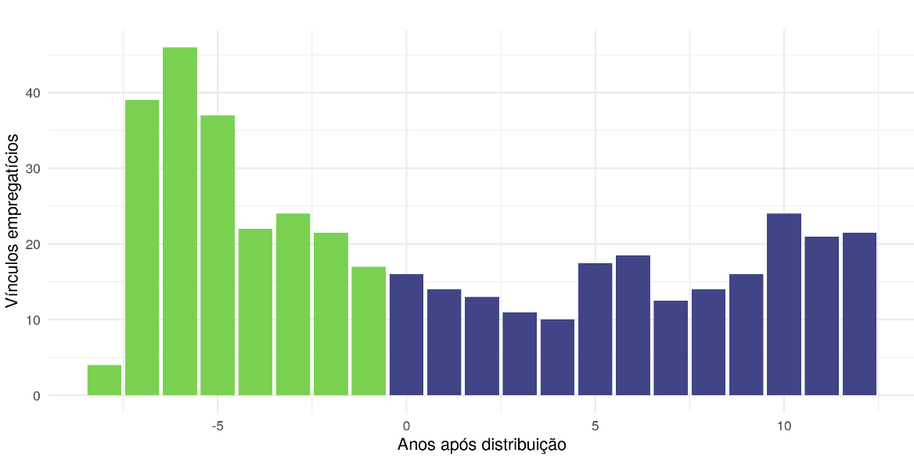
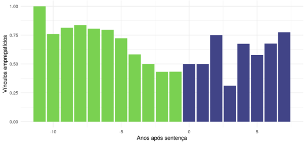
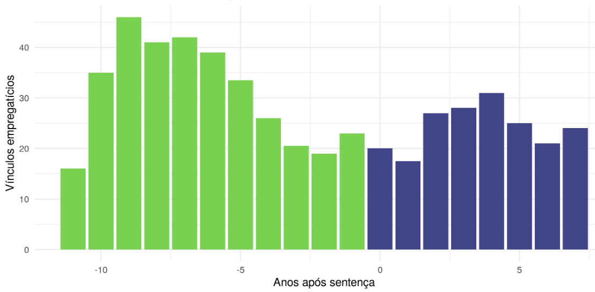
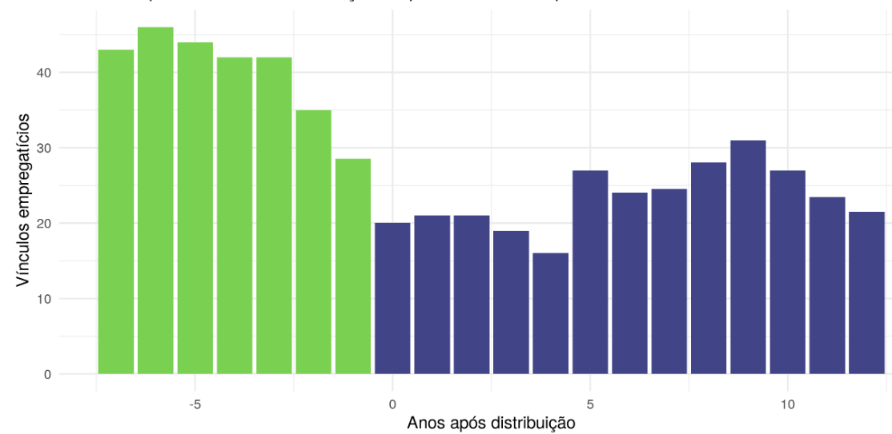
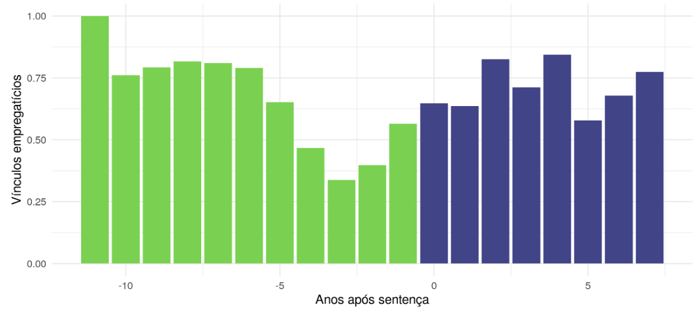
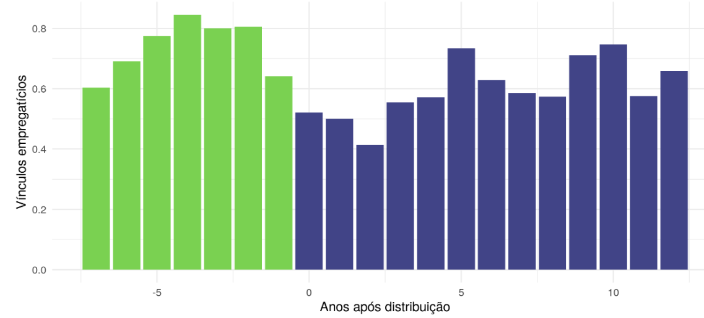

O ambiente de negócios e o desenvolvimento econômico de um país sofre grande 
influência pelos resultados que a regulação da insolvência entrega na realidade 
prática. No Brasil, a lei 11.101/2005, que regula a recuperação judicial, 
extrajudicial e falência da sociedade empresária e do empresário,^[Não se ignora
a existência de decisões judiciais autorizando o processamento de ações de 
Recuperação Judicial em favor de agentes econômicos que não estão 
necessariamente inseridos na moldura da sociedade empresária/empresário, tal 
como ocorre no processo n.º 0093754-90.2020.8.19.0001, em curso na 5ª Vara 
empresarial do Rio de Janeiro, em que figura como recuperandas a Associação 
Sociedade Brasileira de Instrução (ASBI) e o Instituto Cândido Mendes.] está na
ordem do dia das discussões.

Os números evidenciam essa constatação. Foram 7.365 pedidos de recuperação 
judicial entre 2015 a 2019, ultrapassando-se assim, os 5.062 pedidos formulados 
ao longo dos dez anos anteriores à vigência da lei (2005 a 2014).^[SERASA 
EXPERIAN. Indicadores econômicos. Disponível em: 
[https://www.serasaexperian.com.br/amplie-seus-conhecimentos/indicadores-economicos](https://www.serasaexperian.com.br/amplie-seus-conhecimentos/indicadores-economicos). Acesso em: 30 mar. 2020.]

A Lei 11.101/2005 sofreu recentemente alterações e incrementos com a edição da 
lei 14.112/2020. Contudo, o seu artigo 47 que define como um dos objetivos da 
recuperação judicial a manutenção dos empregos restou intacto.^[Dentro desse 
objetivo mais amplo, estão contidos os objetivos específicos do artigo 47, a 
saber: (a) manutenção da fonte produtora; (b) manutenção dos empregos; (c)
preservação dos interesses dos credores. Sobre o tema, ver GOMES, Tadeu Alves 
Sena. A Atividade empresarial após a sentença da recuperação judicial: A 
concretização da manutenção da fonte produtora, dos empregos e dos interesses
dos credores. 2020. Dissertação (Mestrado) – Instituto Brasileiro de Ensino, 
Desenvolvimento e Pesquisa (IDP), Distrito Federal, 2020.]

Preservado que foi o referido objetivo de manter os empregados dos trabalhadores
através do instrumento processual da ação de recuperação judicial, seria 
coerente dizer que a não alteração do referido dispositivo significaria dizer 
que o legislador estaria satisfeito com os resultados obtidos na realidade 
empírica. Será?

O método científico da observação, do teste, da reunião e da manipulação de 
dados permite um exame da realidade de determinado fenômeno. Isso acontece por
intermédio de evidências que confirmem ou refutem uma teoria, ainda que haja
discordância sobre o valor dos resultados específicos encontrados.^[ULEN, Thomas 
S. Um prêmio Nobel para a ciência jurídica: teoria, trabalho empírico e o método
científico no estudo do direito. In: PORTO, Antonio Maristrello; SAMPAIO, 
Patrícia (org.). Direito e economia em dois mundos: doutrina jurídica e pesquisa
empírica. Rio de Janeiro: FGV, 2014, p. 54.]

A preocupação em revelar os dados da realidade empírica^["Se eu estiver correto 
ao afirmar que a teorização de um tipo em particular está se tornando cada vez
mais comum entre os estudiosos do direito, então também acredito que haja outra
consequência importante para o futuro da ciência do direito: o aumento do uso de 
métodos empíricos e experimentais para examinar fenômenos jurídicos. De um modo 
geral, esta seria uma consequência perfeitamente trivial da teorização do 
conhecimento jurídico: todas as ciências possuem um componente teórico e 
empírico central, e se o direito está se tornando cada vez mais teórico, no 
sentido que aqui proponho, inevitavelmente também se mostrará mais empírico" 
ULEN, Thomas S. Um prêmio Nobel para a ciência jurídica: teoria, trabalho 
empírico e o método científico no estudo do direito. In: PORTO, Antonio 
Maristrello; SAMPAIO, Patrícia (org.). Direito e economia em dois mundos: 
doutrina jurídica e pesquisa empírica. Rio de Janeiro: FGV, 2014, p. 80.] pela 
ciência do Direito busca facilitar a compreensão do problema^["Assim como o erro
de diagnóstico de um médico, também o equívoco do jurista pode fazer piorar o
quadro do paciente. Quando a intuição conduz o analista a caminhos equivocados, 
deve-se procurar a tábua de salvação proporcionada pela metodologia confiável. 
Com teorias caracterizadas pelo pragmatismo, além da ênfase na pesquisa 
empírica, a análise econômica do Direito pode proporcionar uma visão mais clara 
sobre a temática dos acordos". FUX, Luiz. Bodart, Bruno. Processo civil &amp; 
análise econômica. Rio de Janeiro: Forense, 2019, p. 52.] e tornar a solução de 
uma eventual legislativa mais racional^["O jurista, por mais respeitado e 
competente que seja em seu mister, não reúne necessariamente condições para 
contribuir, de modo satisfatório, na elaboração de projetos de lei, de minuta de
normas infralegais, na melhoria da gestão da Justiça, na organização de 
movimentos acadêmicos, no aperfeiçoamento do ensino jurídico ou em qualquer 
outra política pública de natureza jurídica. Isso porque são saberes distintos. 
De um lado, os que precisam ser dominados pelo competente profissional do 
Direito para atuar como advogado, juiz, promotor etc.: e de outro, os 
necessários aos que se envolvem em mudanças mais amplas do sistema jurídico. É
inapropriado, e, em geral, conduz a resultados desastrosos, tentar atuar em 
política pública jurídica valendo-se apenas dos conhecimentos empregados na 
aplicação do Direito." Préfacio de Fábio Ulhoa Coelho em NUNES, Marcelo Guedes. 
Jurimetria: como aestatística pode reinventar o direito. São Paulo: Editora 
Revista dos Tribunais, 2016, p. 15-16.] e aderente a dinâmica da vida real.

A econometria e as teorias econométricas, das quais a Jurimetria^["A Jurimetria 
é a aproximação de dois conhecimentos, o jurídico e o estatístico." Préfacio de 
Fábio Ulhoa Coelho em NUNES, Marcelo Guedes. Jurimetria: como a estatística pode
reinventar o direito. São Paulo: Editora Revista dos Tribunais, 2016, p. 15.] é 
apenas espécie do gênero, colabora nesse processo de transição do direito de uma
ciência meramente dogmática para um conhecimento que busca ser científico. É 
preciso ressalvar ainda, com Marcelo Guedes Nunes, que conhecimento científico 
não significa dizer determinismo.^["O determinismo científico consiste na crença 
de que o universo é um sistema governado por leis absolutas, que permitem a 
previsão racional de qualquer evento futuro com qualquer grau de precisão." 
NUNES, Marcelo Guedes. Jurimetria: como a estatística pode reinventar o direito.
São Paulo: Editora Revista dos Tribunais, 2016, p. 37.] O conhecimento 
científico não signfica conhecimento absoluto.^["(...) é inegável a conclusão de
que conhecimento científico não é conhecimento provado, mas representa 
conhecimento provavelmente verdadeiro que pode se revelar inadequado com o 
passar do tempo, pela continuidade das observações ou em vista do 
desenvolvimento de sistemas mais refinados de medição etc." NUNES, Marcelo 
Guedes. O direito comporta testes empíricos? In: PORTO, Antonio Maristrello; 
SAMPAIO, Patrícia (org.). Direito e economia em dois mundos: doutrina jurídica e
pesquisa empírica. Rio de Janeiro: FGV, 2014, p. 218.]

O que vamos tratar brevemente nessa passagem é de um conhecimento por 
aproximação,^["Nem sempre (para não dizer nunca) conseguimos construir uma 
teoria certa, exata e exaustiva a respeito do que observamos, porém a medida que
estudamos nosso objeto e reunimos sucessivas informações a seu respeito, temos a
consciência nítida de que nos encontramos mais próximos de nossos objetivos do 
que estávamos no início, e de que, apesar de não determos um domínio completo,
compreendemos mais. Cultivamos um ideal de saber exato e absoluto, no entanto, 
na prática, lidamos com um conhecimento por aproximação, circunstancial, 
limitado, e essencialmente precário" NUNES, Marcelo Guedes. Jurimetria: como a 
estatística pode reinventar o direito. São Paulo: Editora Revista dos Tribunais,
2016, p. 49.] mas nem por isso de menor importância. E é um tipo de conhecimento
que está em toda parte a nossa volta.

É só observar o que acontece com o exame de DNA (com 99,9% de "certeza") tão 
utilizado pelos Tribunais para resolver as lides de reconhecimento de 
paternidade. Verifica-se também na engenharia para construções de edifícios e 
pontes que até então eram inimagináveis. De igual modo, o conhecimento por 
aproximação subsidia estudos econômico-financeiros para fins de concessão de 
empréstimo para a casa própria de muitas famílias. O que falar, então, dos 
cálculos atuariais dos contratos de seguro e plano de saúde, sem os quais a 
qualidade de vida, tal como tida atualmente, estaria severamente comprometida.
^[Todas essas reflexões são extraídas do livro de Marcelo Guedes Nunes.]

Portanto, empregando a metodologia empírica ao Direito, é necessário ir a campo 
para buscar evidencias para responder se a ação de recuperação judicial alcança
o objetivo de permitir a manutenção dos empregos dos trabalhadores na realidade
empírica. É isso que se passa a expor através da metodologia estatística.^["a 
estatística é uma disciplina definida por sua metodologia e que pode ser 
aplicada a qualquer objeto passível de experimentação e observação. Na definição
de Stephen Stigler: “A estatística moderna oferece tecnologia quantitativa para 
a ciência empírica” NUNES, Marcelo Guedes. Jurimetria: como a estatística pode 
reinventar o direito. São Paulo: Editora Revista dos Tribunais, 2016, p. 55.]

A busca^[Trabalho este que recebeu fundamental ajuda da Associação Brasileira de
Jurimetria na pessoa do seu secretário geral Julio Trecenti. O Relatório 
contendo os números do processo foram extraídos do site 
[http://esaj.tjsp.jus.br/cjpg/](http://esaj.tjsp.jus.br/cjpg/)] no espaço 
reservado ao banco de sentenças do site do Tribunal de Justiça do Estado de São 
Paulo permitiu localizar 98 (noventa e oito) processos que tiveram sentença 
extintiva por cumprimento do plano de recuperação judicial oriundos dos 
critérios de pesquisa “sentença” da classe “recuperação” das 1ª e 2ª Varas de
Falências e Recuperação Judicial da comarca de São Paulo, entre 28 de maio de 
2010 e 6 de março de 2020.

Nessa amostragem^["A amostra corresponde a uma subconjunto de indivíduos de uma 
população separados para análise através de uma determinada metodologia”. NUNES,
Marcelo Guedes. Jurimetria: como a estatística pode reinventar o direito. São 
Paulo: Editora Revista dos Tribunais, 2016, p. 62.], obteve-se 148 CNPJs 
(considerando os litisconsórcios ativos) que serviram de base para pesquisar o 
objetivo específico da lei de manutenção dos empregos dos trabalhadores.

Através da Lei de Acesso à Informação (Lei 12.527/2011)^[O pedido de informação 
foi destinado ao Ministério da Economia, através do portal 
[https://www.gov.br/acessoainformacao/pt-br](https://www.gov.br/acessoainformacao/pt-br).
O protocolado foi tombado sob o número 03006.015242/2002-98 em 17/08/2020 e 
respondido pelo agente administrativo do gabinete da subsecretaria de políticas 
públicas de trabalho – SPPT/STRAB em 04.09.2020] foi pedido ao Ministério da 
Economia a quantidade de vínculos empregatícios informados por cada um dos 148 
CNPJs indicados na listagem extraída dos processos de recuperação judicial que 
tiveram a sentença extintiva. 

Em 4.9.2020, a resposta encaminhada pelo Ministério da Economia contemplava uma 
planilha Excel contendo as informações prestadas pelas empresas através da RAIS 
– Relatório Anual de Informações Sociais. O documento contempla o total de 
vínculos empregatícios entre 2009 e 2018, haja vista que ainda não havia sido 
consolidada a RAIS de competência 2019. 

A análise dos dados disponibilizados evidenciou que 122 (cento e vinte e dois)
CNPJs possuíam a informação de vínculos empregatícios ao menos em algum ano, 
entre 2009 e 2018. Já 26 (vinte e seis) CNPJs não possuíam qualquer informação 
de vínculos empregatícios entre 2009 e 2018.

De posse dos CNPJs que efetivamente possuíam informação na RAIS declarada ao 
governo, elaborou-se as seguintes análises de estatística descritiva com base na
técnica de alinhamento de eixos,^[Trabalho este que só foi possível ser 
realizado com a fundamental colaboração da Renata Hirota, integrante da 
Associação Brasileira de Jurimetria.] para fins de ilustrar a existência ou não 
de uma tendência.

A mediana^["a mediana indica o valor central quando os resultados de todos os 
processos são listados em ordem crescente. Por tal razão, ela é menos afetada 
por resultados extremados.” NUNES, Marcelo Guedes. Jurimetria: como a 
estatística pode reinventar o direito. São Paulo: Editora Revista dos Tribunais,
2016, p. 61.] extraída dos dados colhidos permite evidenciar que a quantidade de
vínculos empregatícios das atividades empresariais é influenciada 
significativamente pelo evento da sentença extintiva da recuperação judicial. A 
partir desse referencial, a tendência volta a ser de crescimento ainda que não 
uniforme, conforme Gráfico 1 a seguir:

{width=100%}

Se observado o ano da distribuição do processo, também se observará que a 
mediana dos resultados obtidos indica a redução dos vínculos empregatícios no 
curso do processo de recuperação judicial e, posteriormente, indica a tendência 
de subida com a obtenção da sentença, conforme Gráfico 2 a seguir: 

{width=100%}

A mediana padronizada pelo máximo de cada empresa colabora para esclarecer o que
ocorreu com a quantidade de vínculos empregatícios formais informados anualmente
pelas recuperandas através da RAIS. Reforça a conclusão de uma tendência de 
queda seguida por uma tendência de crescimento não uniforme, conforme Gráfico 3 
a seguir:  

{width=100%}

O valor da mediana se mostra mais próximo de identificar uma tendência da 
realidade na medida em que ela é menos suscetível de ser influenciada por casos 
extremos, como pode vir a ocorrer na média aritmética. Marcelo Guedes Nunes 
exemplifica: "Quando digo que a média entre dois números é igual a 50, esses 
dois números podem ser 49 e 51, resultados muitos próximos, ou podem ser 1 e 99,
resultados mais distantes".^[NUNES, Marcelo Guedes. Jurimetria: como a 
estatística pode reinventar o direito. São Paulo: Editora Revista dos Tribunais,
2016, p. 59.]

A despeito da evidência da tendência de crescimento dos vínculos empregatícios 
após a ocorrência da sentença da recuperação judicial, o que reforçaria a 
conclusão sobre a concretização do programa normativo da manutenção dos empregos
dos trabalhadores, relevante se faz destacar que somente 45 (quarenta e cinco) 
CNPJs possuíam informação de dados de vínculos empregatícios em todos os anos
compreendidos entre 2009 e 2018. 

Esse dado da realidade permite afirmar que tão somente 30% das "empresas" 
(leia-se CNPJs) que chegaram ao final de uma recuperação judicial com extinção 
por sentença de cumprimento do plano permaneceram informando a quantidade de 
vínculos empregatícios anuais ao governo. 

Caso recortada a análise apenas para esses casos que forneceram os dados anuais 
por todo o período, também se verifica a tendência crescimento após a sentença, 
como demonstrado nos Gráficos 4 e 5 a seguir:

{width=100%}

{width=100%}

A mediana padronizada pelo dado máximo de cada empresa deixa o cenário mais 
evidente de recuperação dos vínculos de empregos formais após o processo de 
recuperação judicial. A análise dos Gráficos 5 e 7 a seguir indica a menor 
quantidade de dados de vínculos empregatícios formais entre a distribuição da 
ação e a obtenção da sentença:

{width=100%}

{width=100%}

A realidade empírica revela que o instrumento da ação de recuperação judicial é 
capaz de permitir a manutenção e até mesmo o soerguimento dos empregos dos 
trabalhadores. O cenário é o da hipótese de que o objetivo do art. 47 da lei foi
alcançado na amostragem da pesquisa no que se refere a manutenção dos empregos 
dos trabalhadores.

Todavia, cabe a advertência de que isso se verificou de maneira estatisticamente
inferior ao pretendido pelo programa normativo da legislação, considerando a 
amostragem das empresas que chegaram ao fim do processo com a sentença 
extintiva.

Envolver os dados extralinguísticos do âmbito da norma é essencial para conhecer
a realidade empírica e assim permitir a concretização do direito. O direito em 
movimento impõe que o Estado, na perspectiva a longo prazo, acompanhe a 
realidade empírica para subsidiar de meios e ferramentas a legislação 
recuperacional para permitir com que o Estado-Juiz e, sobretudo, a sociedade 
acompanhe com números a eficiência da manutenção dos empregos em uma sociedade 
empresária em recuperação judicial, o que poderia ser feito quando da introdução
da lei 14.112/2020 caso fosse utilizado o parâmetro da RAIS para acompanhar os 
vínculos formais constituídos pela sociedade que pede os benefícios da 
legislação de recuperação judicial.

