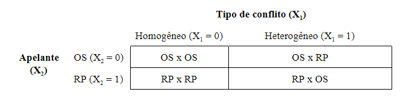
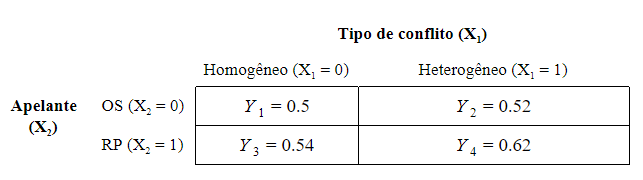

# Introdução

Existe uma lacuna entre os conflitos que acontecem no mundo real e os conflitos que chegam até a arena judicial, pois, é claro, nem todos os conflitos do mundo ganham dimensões jurídicas. Entretanto, poderíamos pensar que, por mais óbvio que seja que nem todos os conflitos estão no Judiciário, pelo menos os processos que encontramos nos tribunais são representativos do mundo real; poderíamos pensar que existe uma aleatoriedade de seleção entre os conflitos do mundo para os litigios. Mas essa não é bem a verdade. 

Em 1984, George Priest e Benjamin Klein elaboraram um teorma para defender a ideia de que haveria um viés de seleção nos casos que chegam ao Judiciário. Para eles, não há aleatoridade. Sendo assim, os conflitos do Judiciário não podem refletir a realidade dos conflitos. Para saber mais detalhes sobre o teorema deles, veja a nossa discussão no [fórum de Jurimetria](https://forum.abj.org.br/t/o-que-e-o-teorema-de-priest-klein/39). 

O que importa para este post é que os conflitos que são selecionados para chegar até o Judiciário são conflitos que trazem um grau de incerteza sobre quem está certo ou não. Se não houvesse essa incerteza, os conflitos seriam resolvidos por outras vias, tais como um acordo. E esse mecanismo de seleção leva a uma segunda característica dos conflitos nos tribunais: o resultado das sentenças tende a 50%. 

Em resumo, a teoria de Priest & Klein se divide em duas asserções: 

1. Os casos que chegam até o Judiciário não são aleatórios, mas eles sofrem um efeito de seleção; 
2. O mecanismo que seleciona os casos provoca uma tendência no Judiciário de que as sentenças sejam julgadas 50% a favor de cada parte. 

Assumindo o teorema do viés de seleção e a hipótese dos 50%, podemos pensar em casos em que a distribuição de vitórias se distancia dos 50%. Por que isso acontece? 

Uma possível resposta a isso pode ser pensada a partir da tipologia das partes de Marc Galanter. Dez anos antes do célebre artigo de Priest & Klein, Galanter publicou _Why The Haves Come Out Ahead (1974)_. Neste artigo, ele tenta entender por que algumas pessoas "começam na frente" em relação a outras nos processos judiciais. Para responder a isso, Galanter desenvolveu uma tipologia de partes. Existem dois tipos ideais de tipos de partes. De um lado, existem os **One-Shooter Players** (ou só OS); do outro lado, podemos ter **Repetitive Players** (ou só RP). 

Um _OS_ é aquele tipo de parte que está indo para a arena judicial pela primeira vez (é o "primeiro tiro" dele no mundo jurídico). Assim sendo, ele não possui familiaridade com as regras jurídicas, com as leis, as normas, os princípios e regulamentos. Mesmo sem esse conhecimento, ele acaba, por algum infortúnio, tendo que resolver seus problemas judicialmente. Tanto o requerente quanto o requerido podem assumir a tipologia do OS. 

Já o _RP_ é o exato oposto do _OS_, ele é aquele tipo de parte que está reiteradamente envolvido em algum conflito judicial. Isso lhe garante maior expertise nos embates jurídicos. Outras características importantes dos _RPs_ são que, por estarem constantemente na frente dos juízes, eles acabam desenvolvendo relacionamentos informais com as autoridades do mundo do direito. Esses relacionamentos podem lhe conferir fama e _status_ dentro dos tribunais, bem como lhe possibilitam tornar-se amigos íntimos ou, na pior das hipóteses, rivais dos juízes. Isso também é um fator que acaba influenciando a capacidade desses agentes em ganhar uma disputa. Outro elemento importante na caracterização dos RPs é que, além de relacionamentos com o Poder Judiciário e expertise técnica, eles dispõem de recursos que são inimagináveis, muitas vezes, para os _OSs_. É claro que pessoas ricas podem ser one-shooters, mas mesmo as pessoas ricas não se comparam com a quantidade de recursos que grandes agentes jurídicos possuem. 

Mas de todas as diferenças entre _OS_ e _RP_, existe um fator decisivo para distinguí-los, que é a questão do *interesse*. Sempre que os one-shooters se apresentam no Judiciário, eles possuem um único interesse: ganhar o máximo possível de um processo que eles começaram, ou perder o mínimo possível de um processo no qual eles estão sendo acusados. No fim, o que essa estratégia está buscando é resguardar os _interesses materiais_ da parte, seja o de maximizar os ganhos (no caso de o _OS_ ser parte autora), seja minimizar suas perdas (no case de o _OS_ ser parte réu). Isso é o que caracteriza o interesse dos _OSs_ nas disputas judiciais. 

Os _RPs_, por outro lado, possuem um outro interesse. É claro que eles buscam também proteger seus interesses materiais, mas, justamente por estarem envolvidos na mesma disputa judicial repetidas vezes, eles acabam desenvolvendo um segundo tipo de interesse: o _interesse normativo_. A ideia é que, como esses agentes sabem que eles vão voltar para o Judiciário outras vezes, então, a fim de otimizar os seus ganhos e perdas materiais no longo prazo, eles buscam criar decisões jurídicas favoráveis a eles, isto é, criar uma jurisprudência favroável a eles. No curto prazo, isso pode dar a impressão de que os _RPs_ estão realizando uma estratégia irracional. Mas, no longo prazo, isso não se mostra verdadeiro. A fim de evitar decisões contrárias aos RPs, esses agentes evadem do Judiciário às vezes, comprometendo-se até com acordos extrajudiciais que são mais custosos do que os danos, sanções ou reparações que eles seriam condenados a pagar se realizassem aquela disputa na frente do juiz. Esses esforços evitam que se consolidem entendimentos jurisprudenciais contrários aos interesses dos _RPs_. 

Então, de um lado, temos _OSs_ caracterizados por um desconhecimento e falta de familiaridade com o Judiciário, que entra nele somente para maximizar seus ganhos ou minimizar suas perdas; e, do outro, temos _RPs_, caracterizados por um relacionamento íntimo e prolongado com os agentes do sistema jurídico, que buscam, além de satisfazer seus interesses materiais, proteger também seus interesses normativos. 

Usando essa tipologia de partes, podemos pensar que existem, então 4 tipos de conflitos na arena judicial: OS x OS, RP x RP, OS x RP e RP x OS. Voltando, então, à pergunta: "Por que alguns conflitos se distanciam da distribuição 50-50?" Uma possível resposta é a de que em conflitos com assimetria de interesses (como nos conflitos OS x RP e RP x OS), o mecanismo de seleção dos litigios irá mudar e, assim, a proporção 50-50 irá se modificar também. 

O objetivo deste artigo é, portanto, analisar se a assimetria de interesse entre as partes modifica a distribuição de vitórias, ou seja, queremos avaliar se um _Repeated Player_ modifica a chance de vitória. 

# Metodologia

Para testar essa hipótese, utilizei uma base de dados que continha as colunas de tipo de partes (classificado em PF e nPF) e de quem ganhou o caso em segunda instância, isto é, se a sentença foi reformada ou não. A base foi extraída pela Associação Brasileira de Jurimetria sobre os processos de segundo grau no TJ/SP, no ano de 2010. Essa base contém 245570 linhas e 15 colunas. Cada linha é uma observação diferente, no caso, um processo diferente. E cada coluna representa uma informação diferente sobre este processo. 

A partir da informação de tipo de partes, eu criei a tipologia do Galanter, fazendo a operacionalização de PF e nPF em one-shooter e repeated player, em que **toda pessoa física se tornou one-shooter e toda pessoa jurídica se tornou repetitive player**. Esse pressuposto se divide em duas afirmações.

a. **toda pessoa física é um one-shooter**. Este é um pressuposto fraco, porque, de fato, poucas pessoas físicas são atores reiterados no Judiciário. Mesmo advogados e promotores públicos - que de certa forma trabalham nos tribunais e, portanto, estão acostumados com este ambiente -, eles raramente participam dos processos representando a si mesmo, eles não atuam no judiciário enquanto pessoas físicas, mas somente enquanto representantes legais de outrem. Por isso que é razoável esperar que toda pessoa física seja um one-shooter. 

b. **toda pessoa não física é um repetitive player**. Este, por outro lado, é um pressuposto forte, porque uma grande parte das pessoas jurídicas são apenas micro empreendendor individual (MEIs) ou empresas de pequeno porte (EPPs). Quem seriam os repetitive players, na verdade, são grandes empresas, tais como empresas de telefonia (Oi, Tim, Claro, etc.) e de venda de produtos (Mercado Livre, Ebay, Amazon). Mesmo assim, sustento esse pressuposto porque em casos de MEIs ou EPPs contra uma pessoa física, a empresa ainda terá uma vantagem processual. MEIs e EPPS não conseguem desenvolver interesses normativos, porque isso exige uma atuação recorrente no Judiciário. Entretanto, eles estarão em vantagem, pelo menos, de recursos em relação às pessoas físicas. A grande falha desse pressuposto ocorre na tipologia de conflito de nPF-nPF, pois esses conflitos são considerados, neste trabalho, como um conflito homogêneo (sem interesses assimétricos entre as partes), enquanto, na verdade, pode estar escondido dentro dessa classificação, um conflito entre uma grande empresa, como a Oi, e uma pequena empresa, como um fornecedor. Neste caso, existiria sim uma grande assimetria. Entretanto, teremos de assumir que todos os casos de nPF-nPF são simétricos.

Com essa transformação da variável, foi possível operacionalizar a tipologia do conflito em duas variáveis: (1) o tipo de conflito, isto é, se ele é homogêneo (OS x OS; RP x RP) ou heterogêneo (OS x RP; RP x OS); e (2) tipologia do apelante (OS ou RP). Podemos observar como os tipos de conflitos são operacionalizados nessas duas variáveis pela tabela abaixo

 

A minha hipótese é a de que os conflitos heterogêneos, isto é, aqueles que possuem assimetria de partes, aumentam a chance do RP ganhar. Há uma ressalva muito importante dessa hipótese quando falamos sobre o conflito de tipologia OS x RP. Neste tipo de conflito, como o RP está atuando de uma forma apenas reativa e passiva, não está em suas mãos iniciar ou não os conflitos. O iniciador do caso é sempre um OS, que possui menos expertise e que não possui interesses normativos. Sendo assim, imagino que neste conflito assimétrico, não haverá diferença significativa em relação aos conflitos homogêneos. Poderei verificar a minha hipótese, portanto, olhando somente para o conflito RP x OS, pois é neste tipo de conflito que o RP pode utilizar da sua posição como uma vantagem no processo, entrando ou deixando de entrar em processos que lhe interessem mais. 

# Resultados e discussões

Após rodar uma série de modelos, cheguei aos seguintes ajustes da regressão. 

 

Se olharmos para os conflitos homogêneos, veremos que, em média, a distribuição de vitórias para cada uma das partes é de 0.52, isto é, em média, 52% dos conflitos são resolvidos a favor do requerente e 48% são resolvidos a favor do requerido. Vemos estes valores calculando a média entre *Y1* e *Y3*. Com isso, observamos que a distribuição de sentenças é totalmente simétrica quando os conflitos são homogêneos. Mais especificamente, conflitos OS x OS possuem uma taxa de vitória de 50% para cada parte; enquanto conflito RP x RP possuem uma taxa de vitória de 54% para os requerentes e 46% para os requeridos.

De igual modo, olhando para o conflito OS x RP, a proporção se mantém. Como eu havia levantado, nos conflitos iniciados por um OS, o RP atua somente de forma reativa. Não há um interesse normativo por parte dos OS que possa alterar a distribuição de sentenças a seu favor; e não há nada que o RP possa fazer para impedir que os OS entrem com uma apelação em segundo grau. O resultado disso é que *Y2* possui o mesmo valor dos conflitos homogêneos, ou seja, as vitórias a favor do requerente e do requerido se distribuem simetricamente.  

Por fim, olhando para *Y4*, os valores que obtivemos representam um aumento significativo da vitória dos RPs em relação aos OSs. Ao invés de o conflito se dividir entre  Obtivemos um aumento significativo da proporção de sentenças julgadas em favor do RP. Se "em condições normais" (isto é, em conflitos OS x OS), as sentenças se distrubem 50% a favor do requerente e 50% a favor do requerido, neste caso, 62% das sentenças são julgadas em favor do requerente e apenas 38%, a favor do requerido. Houve um incremento de 12% nas vitórias dos RPs. Este aumento, entretanto, tem uma ressalva importante a se fazer. Dele, devemos retirar os efeitos de *Y2* e de *Y3*. Se *Y3* é 0.04 maior que *Y1*, e se *Y2* é 0.02 maior que *Y1*, então devemos retirar desses 12% de aumento 0.06. Nos resta, portanto, um aumento de 0.6, ou **6%**. Este é o efeito que conseguimos observar da assimetria de partes sobre a chance de vitória. 