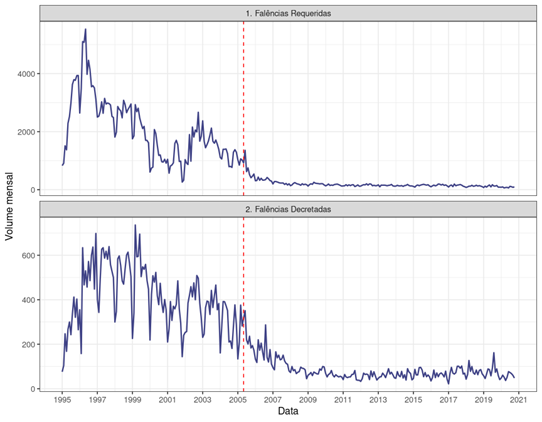

```{r setup, include=FALSE}
knitr::opts_chunk$set(
  echo = FALSE,
  message = FALSE,
  warning = FALSE,
  fig.align = "center"
)
blue_abj <- viridis::viridis(1, 1, .2, .8)
```


### 1. As reformas legislativas 

A receita é simples. Pelo menos, parece simples. Qualquer reforma legislativa deve ser precedida de um acurado diagnóstico que identifique os aspectos em que a lei não atende às suas finalidades. Na sequências, pensam-se as mudanças que poderiam corrigir essa deficiência da ordem legal. No primeiro e no segundo momento, é preciso adotar as cautelas destinadas a evitar a contaminação (do diagnóstico e das propostas de alterações) pelos vieses atiçados pelas experiências individuais dos envolvidos nessas tarefas.  

 Na fase do diagnóstico, dados quantitativos devem ser buscados com o máximo empenho. É certo que nem sempre se poderá contar com os dados tratados devidamente pela jurimetria. Em primeiro lugar, pode ocorrer de até existirem pesquisas empíricas, mas elas não são confiáveis, tendo em vista o escrutínio a que se submete o método utilizado. Em segundo lugar, porque haverá casos em que a pesquisa jurimétrica demandaria recursos (financeiros, materiais ou humanos) ou mesmo tempo de que não se dispõe. Mas não é só isso. Há situações incomensuráveis mesmo, por envolverem valores que transcendem os limites da lei de cuja alteração se trata. O quanto tem sido benéfica ou prejudicial a participação do Ministério Público nos processos de recuperação judicial, por exemplo, é uma dessas questões. Uma eventual reforma legislativa visando suprimir ou limitar essa participação será avaliada por ponderações em torno da relevância do órgão para o Estado Democrático de Direito e não por quantificações de sua eficiência.   
 
Onde dados empíricos confiáveis não estiverem disponíveis ou nas situações incomensuráveis, os profissionais encarregados de identificarem as falhas na lei precisam acionar a autocontenção, triando as ideias que lhe ocorrem de modo a neutralizar honestamente as idiossincrasias. _"O objetivo não é ter um preceito legal para chamar de seu"_: os profissionais escalados para o diagnóstico e elaboração de propostas de alteração legislativa devem repetir a si mesmo continuamente esse mantra. 
   
Ao avaliarmos, a partir dessa receita, as alterações que a Lei n. 11.101/05 introduziu na Lei n. 14.112/20, concluímos que a Reforma de 2020 foi desequilibrada. De um lado, há pontos positivos, em que o diagnóstico foi acurado e a alteração adequada; de outro, há os negativos, distribuídos entre os feitos sem a devida preocupação com o diagnóstico quantitativo e os que se mostram contraditórios com o que os dados empíricos revelam. 
   
Neste artigo, a avaliação da Reforma de 2020 é feita tomando-se por referência essa “receita”, que deveria ser empregada em todas as reformas legislativas. Começamos por um diagnóstico de como a crise das empresas tem sido efetivamente tratada no Brasil. Há duas grandes soluções para o seu tratamento: a _liquidação_ (falência) e a _resolução_ (recuperação).  Quando se compara a razão (matemática) entre as quantidades para cada uma dessas variáveis no Brasil e em outros países, salta aos olhos uma diferença. Os autores deste artigo consideram que essa diferença aponta para a principal falha do nosso sistema. Deste modo, as alterações promovidas pela Reforma de 2020 que se mostram aptas a reduzir essa diferença (tornando o tratamento da questão no Brasil mais próximo ao de outras jurisdições) são os pontos positivos; ao contrário, as que não promovem a equalização da razão nacional entre liquidação e resolução com a de outras jurisdições apenas introduzem complicações desnecessárias na lei ou, pior, tendem a ampliar aquela diferença. 
   
O artigo está dividido em cinco seções, incluindo esta introdução, numerada como primeira. A segunda seção abriga os dados empíricos que demonstram o distanciamento entre a razão resolução/liquidação no Brasil e em dois outros países (Estados Unidos e Reino Unido). Na terceira seção, apresentam-se os pontos positivos da Reforma de 2020. A quarta é dedicada ao exame dos pontos negativos. Uma breve conclusão é apresentada na quinta seção.
   
Ressaltamos, por fim, que as análises apresentadas aqui foram realizadas em caráter exploratório, como forma de levantar indícios que nos levem a formular hipóteses de trabalho a serem ou não confirmadas por estudos mais robustos no futuro. Mais do que apresentar conclusões peremptórias, o objetivo deste breve artigo é provocar uma reflexão sobre o panorama da insolvência, levantar suspeitas e articular análises iniciais, que motivem o aprofundamento dessas discussões por meio de outras pesquisas.
   
### 2. O desmanche das empresas no Brasil
   
Os mercados são sistemas econômicos que têm como principal função estabelecer um ambiente de competição apto a selecionar empresários. Todos os anos empresas iniciam atividades nos mais diversos ramos, porém apenas uma fração delas é selecionada para sobreviver, de acordo com sua capacidade de prover serviços e produtos com vantajosa relação custo-benefício para os consumidores. Por essa razão, todos os anos o ciclo de vida empresarial se repete: empresas nascem, crescem e morrem. De acordo com o Mapa de Empresas do Ministério da Economia, o Brasil tinha em fevereiro de 2021 o total de 19.353.877 empresários (dos quais 4.421.995 de sociedades empresárias)[^gov], operando em uma economia cujo produto interno bruto monta aproximadamente US$ 1,434 trilhăo. [^wold]  Trata-se de um dos maiores mercados capitalistas da atualidade, posicionando-se como a 12ª economia do mundo.[^mundo]
   
   [^gov]:  [Mapa de empresas](https://www.gov.br/governodigital/pt-br/mapa-de-empresas), acesso em 11 de abril de 2021. Dados incluem todos os empresários, inclusive empresários individuais.
   [^wold]: [World Economic Outlook Database](https://www.imf.org/en/Publications/WEO/weo-database/2021/April), April 2021".Acesso em 11 de abril de 2021. Dados relativos ao ano de 2020. A queda da 9ª para a 12ª posição decorreu da retração do PIB em razão da crise do COVID-19 e também da apreciação do câmbio e consequente desvalorização do Real perante o Dólar norte-americano.
   [^mundo]: Para confirmação dos dados, basta acessar a o painel principal da plataforma do Mapa de Empresas e selecionar pelo ano de interesse.
   
Entre 2016 e 2020, ainda de acordo com o Mapa de Empresas, 6.506.599 empresas foram encerradas no Brasil. Como nos mercados cabe ao empresário a produção de bens e serviços, o fechamento de empresas é intuitivamente associado ao encolhimento da economia. [^doing] A associação entre quantidade de empresas abertas e crescimento econômico está na base de diversas políticas públicas nacionais e internacionais, como por exemplo o Doing Business do Banco Mundial. O relatório de 2020 reafirma a premissa de que a facilidade da abertura de empresas está relacionada com boa performance econômica: _"The difference in an entrepreneur's experience in top- and bottom performing economies is discernible in almost all Doing Business topics. For example, it takes nearly six times longer on average to start a business in the economies ranked in the bottom 50 than it does in the top 20"_ (p. 5). E que essa facilidade caracterizaria uma relação causal, na qual a liberdade econômica, em especial a liberdade de constituir um novo negócio, implicaria em melhor desempenho econômico: _"Research demonstrates a causal relationship between economic freedom and gross domestic product (GDP) growth, where freedom regarding wages and prices, property rights, and licensing requirements leads to economic development"_ (p. 2).

[^doing]: [Dados em Doing Business 2020](http://documents1.worldbank.org/curated/en/688761571934946384/pdf/Doing-Business-2020-Comparing-Business-Regulation-in-190-Economies.pdf). Acesso em 11 de abril de 2021.

No entanto, ao observarmos o comportamento do PIB e o número de empresas encerradas entre 2016 e 2019 não é possível identificar uma associação entre a retração da economia e uma diminuição na quantidade de encerramentos. Na verdade, observa-se o oposto. [^opost]  Por exemplo, 2018 foi o ano com maior quantidade de encerramentos (2.419.233 empresas extintas, quase o triplo do ano anterior) e foi ao mesmo tempo o ano de melhor desempenho do PIB nessa meia década, com crescimento de 1,8%. Também o ano 2020, quando em decorrência da retração de 4,1% no PIB [^pib] era esperado um severo aumento na quantidade de empresas encerradas, observou-se o contrário: uma significativa diminuição na quantidade de então em relação à 2019[^dimi]
  
  [^opost]: As análises aqui apresentadas são meramente exploratórias e restritas a um lapso temporal curto. Estudos mais amplos com base na abertura e fechamento de empresas nos últimos 50 anos estão em andamento e apresentará resultados mais robustos.
  [^pib]: Em 2020, o [PIB](https://www.ibge.gov.br/explica/pib.php) brasileiro retraiu 4,1%. Acesso em 11 de abril de 2021.
  [^dimi]: Essa inversão é também observada na abertura de empresas. Entre 2016 e 2020, 13.480.709 novas empresas iniciaram atividade no país. A cada ano a quantidade de novas empresas aumenta independentemente do comportamento da economia. Em 2020, mesmo com a pandemia e a forte retração do PIB, foram abertas 3.361.159 empresas, mais do que as 3.168.317 de 2019. O crescimento na abertura de limitadas foi ainda maior: 403.748 constituídas em 2020 contra 289.929 em 2019.

|  Ano  |  PIB  | Empresas encerradas  | Ltda encerradas |
|:-----:|:-----:|:--------------------:|:---------------:|
|  2016 | -3,3% |        893.640       |     197.355     |
|  2017 |  1,3% |        968.802       |     195.756     |
|  2018 |  1,8% |       2.419.233      |     212.692     |
|  2019 |  1,1% |       1.177.981      |     212.796     |
|  2020 | -4,1% |       1.045.943      |     198.545     |
| Total |   -   |       6.506.599      |    1.017.144    |

<font size="2"> Tabela 1: Série com o total de empresas encerradas e o subtotal de limitadas encerradas entre 2016 e 2020 com a variação percentual do PIB em reais para cada ano. </font>

  
Apesar da grande variabilidade observada, a série sugere a ocorrência de um aumento na quantidade de empresas encerradas quando há crescimento no PIB e uma redução nos encerramentos quando há retração. A mesma ocorrência é observada apenas na subpopulação de sociedades limitadas, forma societária mais frequente, que apresenta maior complexidade e porte econômico quando comparada à atividade do empresário individual. O resultado é profundamente contraintuitivo e pode decorrer de fatores diversos como, por exemplo, dos custos necessários ao encerramento formal da empresa, que demanda a apresentação de certidões negativas tributárias e diversas baixas administrativas.[^adm]  Em uma crise severa, o empresário não tem condições financeiras para sequer encerrar formalmente sua atividade e opta por abandoná-la, liquidando os bens integrantes do estabelecimento e pagando aos credores de acordo com sua conveniência. 

  [^adm]: Há uma série de despesas e atos atrelados ao encerramento e baixa de registro e do CNPJ de uma empresa, que incluem : certificado de Regularidade do Fundo de Garantia por Tempo de Serviço (FGTS), Certidão Negativa Conjunta, que une a Certidão Negativa de Inscrição de Dívida Ativa da União, emitida pela Procuradoria da Fazenda Nacional, e a Certidão de Quitação de Tributos e Contribuições Federais, concedida pela Receita Federal (necessidade de recolhimento de todos os tributos de âmbito federal, como o Imposto de Renda, o PIS, a COFINS e a CSLL - Contribuição Social sobre o Lucro Líquido), recolhimento das guias de custas da JUCESP e apresentação dos formulários e documentos pessoais dos sócios e liquidante nomeado. O artigo 9º da Lei nº 123/2006 dispensa as Microempresa ou Empresa de Pequeno Porte da apresentação das certidões acima listadas.
  
Outra possível explicação (ligada a esta primeira) está na grave e severa disfunção de nosso sistema falimentar, que redunda em uma reduzida documentação do encerramento das empresas no País. As causas para o ostracismo da falência residem na incapacidade crônica desse procedimento em atender aos interesses de seu principal propulsor: o credor. Como o processo no Brasil é entrópico (consome ele próprio os parcos recursos financeiros que restaram da atividade) e não apresenta retorno nem de perto proporcional ao esforço que demanda, apenas algumas centenas de poucos e incautos credores fazem uso do instituto a cada ano. A legislação falimentar brasileira é tão inefetiva que os credores (maiores prejudicados pela liquidação irregular) optam por não iniciar o procedimento de execução concursal porque os custos relacionados ao processo excedem o benefício esperado.

Os gráficos abaixo indicam as quantidades de falências requeridas e decretadas no Brasil entre 1995 até 2021. [^sera]  A linha tracejada em vermelho é o início da vigência da Lei 11.101/2005, que apresentou profundo impacto na quantidade de pedidos de falência. A redução se deve provavelmente à inclusão no art. 94 do limite de 40 salários-mínimos para fundamentação do pedido falimentar. A queda na quantidade de requerimentos e decretações é concomitante à vigência da Lei n. 11.101/05. A redução nos pedidos é mais abrupta, sendo que a de decretações se estende pelos três anos seguintes, por conta da persistência de processos distribuídos sob a vigência da lei antiga.

  [^sera]: Dados do [SERASA](https://www.serasaexperian.com.br/conteudos/indicadores-economicos/). Acesso em análise em 11 de abril de 2021.


 

Quando, por outro lado, observamos a quantidade de pedidos de recuperação no mesmo período, detectamos uma série que cresce de maneira consistente, com poucas inflexões de queda, desde a sua introdução no sistema jurídico brasileiro até hoje. Para comparar a trajetória dos dois processos de insolvência, a tabela abaixo apresenta a quantidade de pedidos de falência e de recuperação judicial no Brasil entre 2005 e 2020.[^sera2] 
  
  [^sera2]: Dados do [SERASA](https://www.serasaexperian.com.br/conteudos/indicadores-economicos/). Acesso em análise em 11 de abril de 2021.

|      Ano    |     Falências    |      RJs    |
|:-----------:|:----------------:|:-----------:|
|     2005    |        9548      |      110    |
|     2006    |        4192      |      252    |
|     2007    |        2721      |      269    |
|     2008    |        2243      |      312    |
|     2009    |        2371      |      670    |
|     2010    |        1939      |      475    |
|     2011    |        1737      |      515    |
|     2012    |        1929      |      757    |
|     2013    |        1758      |      874    |
|     2014    |        1661      |      828    |
|     2015    |        1783      |     1287    |
|     2016    |        1852      |     1863    |
|     2017    |        1708      |     1420    |
|     2018    |        1459      |     1408    |
|     2019    |        1417      |     1387    |
|     2020    |        972       |     1179    |

<font size="2"> Tabela 2. Quantidades de pedidos de falência e recuperação judicial no Brasil de 2005 a 2020 </font>
  
As falências descrevem uma trajetória de queda, descendo de 9.548 em 2005 para 972 requerimentos em 2020. As recuperações judiciais saltaram de 110 em 2005 para 1.179 em 2020. A tendência à inversão atingiu seu ápice em 2016, quando o Brasil apresentou pela primeira vez mais pedidos de recuperação judicial (1.863 casos) do que falências (1.852 casos). Do total de pedidos de falência, apenas uma parcela é deferida pelos juízes. De acordo com os dados do Serasa, a taxa de deferimento varia a depender do ano, desde 30% em 2005 (ano com a maior quantidade de requerimentos da série) até 71% em 2020 (ano com a menor quantidade de requerimentos). Entre 2015 e 2019, ainda segundo o Serasa, houve 4.327 decretações, o que implica em uma média de 72,11 quebras por mês, quantidade reduzida quando ponderada com o tamanho da economia nacional e com a quantidade de empresários registrados no país. [^país]  A baixa incidência de pedidos e decretações de falência é mais um indício da ocorrência em larga escala de liquidações irregulares.

 [^país]:  Em recente estudo, o Observatório de Falências da ABJ sobre falências no estado de São Paulo constatou uma taxa de deferimento de 18,72%, sendo o maior motivo de não decretação o acordo extrajudicial e o abandono do processo. A diferença entre as taxas pode ser explicada pelo Serasa não computar esses casos, considerando apenas decisões que decretam ou rejeitam a quebra. No entanto, como a metodologia do estudo do Serasa não é aberta, não é possível replicar o cálculo e verificar as razões dessas diferenças.

Uma outra maneira de verificar a subnotificação de liquidações empresariais é pela comparação da relação entre a quantidade de falências e de recuperações judiciais no Brasil com outras jurisdições, ponderada pela quantidade de empresários. A comparação não é simples por conta das distinções e peculiaridades de cada sistema jurídico, porém os resultados, ainda que relativizados, apontam para o mesmo sentido. Para que tenhamos uma referência de comparação, no Reino Unido, com PIB de  US$ 2,829 trilhões, para 2.970 compulsory liquidations (CL) houve 351 voluntary arrangements (VA) em 2019. [^liquidations]  Os EUA, com PIB de US$ 21,43 trilhőes e 32,5 milhőes de empresas (10 milhőes de sociedades), teve 22.910 casos de chapter 7 (liquidação) e 7.105 casos de chapter 11 (resolução) em 2019 (incluídos _non employer businesses_). [^nonemployerbusinesses]  Ao compararmos a proporção de pedidos de quebra com os requerimentos de reorganização,  temos uma enorme defasagem na quantidade de falęncias no país. 
  
 
  [^liquidations]: Dados disponíveis em [Company Insolvency Statistics](https://assets.publishing.service.gov.uk/government/uploads/system/uploads/attachment_data/file/863243/Data_Tables_in_Excel__xlsx__Format_-_Company_Insolvency_Statistics_Q4_2019_-_Updated.xlsx.). Acesso em 11 de abril de 2021. Diferentemente do Brasil, em que há pouca ou nenhuma aderência da autofalência, sistema inglês apresenta uma larga utilização de creditors voluntary liquidations (CVL).
  
  [^nonemployerbusinesses]: Dados em [U.S. Bankruptcy — Judicial Business 2019 Courts](https://www.uscourts.gov/statistics-reports/us-bankruptcy-courts-judicial-business-2019. ) Para uma definição dos processos de insolvência. [United States Bankruptcy Courts](https://www.canb.uscourts.gov/faq/general-bankruptcy/what-difference-between-bankruptcy-cases-filed-under-chapters-7-11-12-and-13.). Acesso em 11 de abril de 2021
  

|     Jurisdição    |     Resoluções    |     Liquidações    |     R/L    |
|:-----------------:|:-----------------:|:------------------:|:----------:|
|         USA       |        7.105      |        22.910      |      31    |
|         UK        |         351       |        2.970       |      12    |
|       Brasil      |        1.387      |        1.417       |      98    |

<font size="2"> Tabela 3. Tabela comparativa	de resoluções e liquidações em três jurisdições </font>

Enquanto na Inglaterra as VAs correspondem a 12% das falências (CLs) e nos EUA os chapter 11 correspondem a 31% dos chapter 7, no Brasil caminhamos para uma bizarra inversão. O Brasil teve 1.387 pedidos de recuperação judicial e 1.417 pedidos de falência, culminando em uma relação de quase um para um. Em 2016, como visto acima, essa relação de fato se inverteu, com pedidos de recuperação em maior quantidade que os de falência. Um sistema que deveria ter a preponderante função de liquidação está se tornando um sistema essencialmente recuperacional, como se toda empresa em crise merecesse ser resgatada e a falência fosse sempre um mal a ser banido. Hoje temos 19 milhões de empresas e menos de 70 falências decretadas por mês, um número irrisório. Mas queremos ainda menos: 25, 15, 10 ou por que não zero?
  
Para os fins desta avaliação, parte-se do diagnóstico de que, em comparação com as taxas relativas a duas outras jurisdições (USA e UK), a razão resolução/liquidação no Brasil é muito alta.
  
A disparidade sugere fortemente que estamos caminhando na direção oposta à das economias tomadas por paradigma e a existência de um mercado paralelo de liquidações irregulares no país, que pode montar de 4 a 10 vezes a quantidade de liquidações formais e regulares. Claro que a ampliação do número de jurisdições e dos diferentes anos em que se poderia calcular a razão resolução/liquidação poderia confirmar, ou não, esse diagnóstico. As limitações deste artigo induzem à presunção de que ela iria confirmar o distanciamento da nossa R/L frente à da economia global.

### 3. Pontos positivos da Reforma de 2020: a nova realizaçăo do ativo na falência
    
Atualmente, ao ser confrontado com o plano de recuperação apresentado pelo devedor, o credor vê reduzidas as suas alternativas para uma negociação racional. Como a perspectiva realista é a de não receber nada em caso de falência do devedor em recuperação judicial, ele acaba tendo que ceder aos deságios, prorrogações de vencimento e supressões de garantia previstos no plano. Há uma margem para negociações, comprimindo um pouco os descontos e prazos, mas a novação recuperacional aprovada na Assembleia Geral dos Credores não será muito diferente da proposta pelo devedor. 

Para que a negociação no âmbito da recuperação judicial tenha a racionalidade indispensável ao adequado funcionamento desse mecanismo de resolução da empresa em crise, é necessário alterar radicalmente a perspectiva do credor em relação à falência do devedor. Em outros termos, enquanto uma possível liquidação da empresa em crise não assegurar aos credores a perspectiva do recebimento de parcela não-desprezível de seu crédito, eles não terão as condições objetivas para participar de uma negociação racional com o devedor, em torno do plano de recuperação. 
    
Os credores já entram nessas negociações em desvantagem. A exigibilidade de seu crédito está suspensa e essa situação perdurará por tempo indefinido, a despeito do que diz expressamente a lei. Mais que isso, só os devedores possuem todas as informações da empresa em crise e administram o acesso a elas por credores, administrador judicial, Ministério Público e juízo recuperacional. Procurar neutralizar essa assimetria é extremamente arriscado, porque uma maior transparência das informações centrais da empresa em dificuldade pode até mesmo comprometer a sua capacidade de concorrer, acelerando a crise ao invés de a deter. 

A desvantagem do credor é acentuada quando ele é informado por seu advogado que votar pela falência do devedor é delicado porque pode caracterizar o exercício abusivo do voto. Quando indaga sobre o critério que delimite com precisão e clareza as hipóteses em que o abuso de direito se manifestaria, o credor percebe a sua fragilidade na mesa de negociação: não há tal critério. 

Em vista desse quadro, os pontos positivos da Reforma de 2020 são os que alteraram as regras de realização do ativo em caso de falência, visando aumentar o percentual de satisfação dos créditos da massa falida. Merecem destaque os seguintes pontos:

1. Prazo para a _realização do ativo_. Até 2005, a lei proibia o início da realização do ativo enquanto não estivessem concluídas duas investigações no âmbito do processo falimentar: de um lado, a identificação dos credores e dos créditos; de outro, a ocorrência de crime falimentar. Enquanto essas providências se alongavam, os bens do falido se deterioravam, os recursos da massa eram consumidos com a sua guarda e conservação e as inovações tecnológicas os tornavam obsoletos. Os credores nada recebiam na falência por conta da regra de proibição da realização do ativo antes do fim da fase de conhecimento do processo falimentar. 
  
Em 2005, um dos avanços da lei saudados pela doutrina foi a supressão dessa proibição. O legislador, aliás, se preocupou até mesmo em ser expresso, esclarecendo que a realização do ativo não precisa aguardar o quadro geral de credores. O art. 139 estabelece: _"logo após a arrecadação dos bens, com a juntada do respectivo auto ao processo de falência, será iniciada a realização do ativo"._

O processo de verificação dos créditos, contudo, parece exercer um certo magnetismo sobre os atores da falência. O administrador judicial, mesmo tendo a indicação da lei de que deveria conduzir a realização do ativo concomitantemente às providências relativas à identificação dos credores e dos créditos, fica de tal modo absorvido com a verificação de crédito, que posterga a venda dos bens do falido.

Antes da Reforma de 2020, a lei fixava prazos para a verificação dos créditos, mas não para a realização do ativo. A mera supressão da proibição de se iniciar esta enquanto não concluída aquela mostrou-se uma medida legislativa tímida para garantir aos credores, na falência, a perspectiva de recebimento de parcela não-desprezível de seu crédito. Com a reforma, fixa-se prazo também para o administrador judicial concluir a realização do ativo, sob pena de destituição. A regra é tão importante para a Reforma de 2020 que ela foi replicada em três dispositivos: art. 22, III, j, art. 99, § 3º, e art. 142, § 2º-A, IV. Fixa-se, com ela, o prazo máximo de 180 dias (prorrogável pelo juiz), a contar do auto de arrecadação.

Se o Poder Judiciário aplicar com rigor a sanção pelo descumprimento do prazo, há chances de a Reforma de 2020 contribuir para a maior efetividade da liquidação falimentar. Claro, se os juízes não assimilarem a importância dessa mudança legislativa e forem generosos na prorrogação do prazo de 180 dias, interpretando “impossibilidade fundamentada” de modo demasiadamente aberto, os objetivos da Reforma de 2020 talvez não se atinjam por completo. 

A eficácia desse importante ponto positivo da Reforma de 2020 depende também do maior rigor do Poder Judiciário quanto ao tempo que o administrador judicial leva para assinar o termo de compromisso e proceder à arrecadação. Para essas medidas, não há prazo legal peremptório, mas é delas que se conta o de realização do ativo. O ideal seria a inversão da regra que vigorou até 2005: o prazo para as habilitações e impugnações teria por termo inicial o término da realização do ativo (ou de parte substancial dela).[^dela]
 
  [^dela]: Um de nós chegou até mesmo a propor que a lei postergasse o prazo para início da verificação dos créditos para depois da conclusão da realização do ativo, na tramitação do projeto de lei. 
  
2. _Plano de realização do ativo_. Em consonância com a fixação de prazo máximo para a realização do ativo, a Reforma de 2020 também prevê que o administrador judicial deve apresentar, nos 60 dias seguintes à sua investidura, o Plano de Realização do ativo (PRA). Trata-se de um instrumento que detalhará como o administrador propõe que se proceda à realização do ativo. A diligência em apresentar o PRA antes do prazo final da lei, bem como em vender os bens da massa também antes do respectivo prazo, deve refletir na remuneração do administrador judicial fixada pelo juiz, para estimular sua adesão aos propósitos da Reforma de 2020. [@fabio]
       
3. _Processo competitivo organizado_. O administrador judicial pode, no PRA, propor modos de realização do ativo por processos competitivos diferentes do leilão. Para conduzir o processo, será indicado um agente especializado ou os critérios para a sua escolha. A hipótese, prevista no inciso IV do art. 142, abre um amplo leque de possibilidades para acelerar e otimizar a venda dos bens da massa. 
       
4. _Venda por valor inferior ao da avaliação_. Na terceira chamada do leilão, os bens da massa podem ser vendidos por qualquer preço, ainda que inferior ao da avaliação feita pelo administrador judicial, quando os arrecadou (art. 142, 3º-A, III). A frustração da venda nas duas tentativas anteriores é forte indício de que o mercado não dá ao bem em questão o mesmo valor atribuído pelo administrador judicial. Não adianta, pois, insistir na perspectiva irrealista associada à avaliação feita quando da arrecadação. 
       
45. _Conjuntura desfavorável e caráter forçado da venda_. Inovação de grande importância se encontra também nos critérios fixados no art. 142, § 2º-A, I, vale dizer, a constatação de que não se deve postergar a venda no pressuposto de que, no futuro, poderá existir uma conjuntura mais favorável, nem se deve esquecer a natureza de venda forçada ínsita à realização de qualquer ativo falimentar. Não se deve, em outros termos, abstrair as reais condições em que tem lugar a liquidação da massa falida, tomando-se idealisticamente como parâmetro a negociação racional do mesmo bem no mercado. A idealização apenas prejudica os interesses dos credores. 
       
6. _Admissibilidade de venda por preço vil_.  Outra medida, em que a Reforma de 2020 sabiamente privilegiou a celeridade em detrimento da avaliação se encontra no afastamento do conceito de “preço vil” da liquidação falimentar (art. 142, § 2º-A, V). Com esta disposição da lei, desde que observado os procedimentos legais de realização do ativo, qualquer que tenha sido o preço dado pelos bens do falido, ele será tido juridicamente como justo. 
       
7.  _Sinceridade da impugnação_. De fundamental importância, também, para a finalidade de ampliar a eficácia da realização do ativo é o requisito de legitimação, para a impugnação da venda baseada no valor, consistente na oferta de aquisição por preço superior ao obtido e no depósito caucionário de 10% do proposto (art. 143, § 1º).

### 4. Pontos negativos da Reforma de 2020: o aumento da complexidade da recuperaçăo judicial
    
 As alterações introduzidas pela Reforma de 2020 na disciplina da recuperação judicial foram, em sua maioria, desconectadas do diagnóstico da disparidade da razão resolução/liquidação (R/L) brasileira e alienígena. São medidas contraditórias com a acertada mudança na realização do ativo falimentar, quando aumentam desnecessariamente a complexidade da recuperação judicial. 
 
A maior complexidade no processo de recuperação judicial vai na contramão do que aponta o diagnóstico fundado em evidências porque importa o adiamento da liquidação, com o alongamento não justificável da resolução das empresas em crise. Não está demonstrado quantitativamente o proveito que estas mudanças poderiam proporcionar. Teria sido melhor, para o aprimoramento do instituto da recuperação judicial, se elas não tivessem acontecido e que a Reforma de 2020 se limitasse ao aceleramento da realização do ativo na falência.
    
  Destacam-se os seguintes pontos negativos:
      
1. _Conciliação e mediação_. Não se justifica a sobreposição de medidas destinadas à criação de ambientes de negociação racionais. A recuperação judicial nada mais é do que uma medida desta natureza; conciliação e mediação, também. Outras questões de difícil compreensão na inovação legislativa também podem ser levantadas, no questionamento da pertinência da reforma: empresários naturalmente desenvolvem habilidades como negociadores, não precisando de ninguém que lhes informe da importância e dos meios de negociação; o verdadeiro papel que cabe ao mediador está indefinido, já que cabe ao próprio devedor negociar e, para isso, ele conta com o assessoramento dos especialistas que contrata; um agente nomeado pelo juiz, mesmo como conciliador ou mediador, será sempre um agente nomeado pelo juiz, na presença de quem as partes tendem a adotar as cautelas recomendadas pela estratégia do caso; a mediação obrigatória é um contrassenso; a confidencialidade é incompatível com a transparência da recuperação judicial; negociações em separado obtidas pelo conciliador ou pelo mediador são incompatíveis com o princípio do tratamento igualitário dos credores...

Mas, para além desses vários questionamentos, o mais prejudicial à finalidade de equalização da nossa razão resolução/liquidação aos parâmetros globais está na questão especificamente processual do instituto. Referimo-nos ao art. 20-B, § 1º, que possibilita ao devedor que atende aos requisitos para a obtenção da recuperação judicial o pedido de uma tutela de urgência cautelar para suspender as execuções por até 60 dias, sob a alegação de que irá tentar se compor com os credores por meio de conciliação ou mediação judicial. Há o risco de esse dispositivo se tornar a regra: toda recuperação judicial passaria a contar com essa fase cautelar apenas para fins de alongamento do stay period, porque a regra do desconto tende a não ter efetividade. Neste cenário, ver-se-á um aumento de complexidade (e, portanto, da duração) do processo de recuperação judicial sem nenhuma justificativa ou proveito. 

2. _Constatação prévia_. O art. 51-A faculta ao juiz a nomeação de um profissional para realizar a constatação das condições de funcionamento da empresa do devedor que requereu a recuperação judicial. A medida já estava prevista na Recomendação do CNJ nº 57/19 e, na verdade, reflete uma prática adotada em muitos processos de recuperação judicial, originariamente designada de “perícia prévia”. Dados jurimétricos revelam que a constatação prévia aumenta substancialmente a taxa de deferimento dos pedidos de recuperação judicial, ao contrário do que seria o seu objetivo (filtrar os pedidos para impedir processos infundados). [^Ref] A explicação para isso parece ser a de que o profissional nomeado para realizar a constatação prévia tem inevitavelmente o interesse em ver o pedido de recuperação judicial processado. Ser nomeado administrador judicial naquele caso é a condição para que ele seja remunerado pelo trabalho dispendido na diligência preambular. 

  [^Ref]: Em pesquisa jurimétrica feita sob a coordenação de Ivo Waisberg. Marcelo Guedes Nunes e Marcelo Sacramone, constatou-se que “a presença de perícia aumenta a taxa de deferimento tanto na presença quanto na ausência de emendas à petição inicial. Cabe ressaltar que o aumento é ainda maior nas varas especializadas. Enquanto nas varas comuns as perícias aumentam as taxas de deferimento de processos com e sem emenda de 73, 6¨e 65,8%, respectivamente, para 83,9% e 84,2%, nas varas especializadas o aumento é de 48,3% e 54,1% para 80% e 75%. Ou seja, enquanto o aumento é de 10% a 15% nas comuns, nas especializadas esse aumento chega a ficar entre 20% e 30%” (www.abj.org.br).

A circunstância de ser a medida uma faculdade do juiz não é motivo para tranquilizar os preocupados com o alongamento demasiado da duração da recuperação judicial. A regra compatível com a necessidade de equalização da razão resolução/liquidação brasileira com a global seria a proibição de qualquer verificação, constatação, perícia ou diligência. Se o devedor está ou não em condições de se recuperar é assunto para os credores resolverem na Assembleia Geral e não para o juiz. E, se ele não demonstra ter meios para uma resolução viável, o melhor para a economia é que o juiz decrete a falência dele o mais rapidamente possível. 

3. _Venda de ativos não circulantes_. Antes da Reforma de 2020, quando o devedor em recuperação judicial precisava vender um bem de seu ativo não circulante, ele pedia a autorização do juiz. Se o Comitê de Credores existisse, devia ser consultado. Se não existisse, como acontecia e tende a continuar a acontecer na grande maioria das recuperações judiciais, o juiz ouvia o administrador judicial e, em seguida, decidia. 

A partir da Reforma de 2020, a venda de ativos não circulantes se tornou um assunto bem mais complexo (art. 66, §§ 1º a 4º). Isso porque, relativizando o princípio debtor-in-possession, a lei agora prevê a possibilidade de interferência dos credores. Quer dizer, depois de obter a autorização do juiz, o devedor não pode vender o ativo não circulante antes de transcorridos 5 dias. Este é o prazo que qualquer credor titular de 15% do valor total dos créditos tem para dificultar as coisas (rectius, para manifestar o interesse na convocação de uma assembleia de credores). 
O aumento da complexidade é exponencial: o devedor em recuperação judicial deve ter enorme dificuldade em encontrar qualquer interessado em negociar a compra do bem enquanto houver a possibilidade de o investimento na negociação se perder por decisão de terceiros (credores na assembleia); deste modo, o mais provável é que, no momento do requerimento da autorização judicial, o devedor só possa apresentar uma estimativa do preço da coisa a ser vendida; os credores poderão argumentar que só terão direito de manifestar o interesse na convocação da assembleia geral após uma negociação concreta chegar à precificação do ativo; se o potencial comprador com o qual o devedor em recuperação judicial se entendeu desistir do negócio em vista da interferência dos credores e esta, no final, se frustrar, o ativo acabará não sendo vendido, em prejuízo da recuperação da empresa em crise... 

4. _DIP Financing_. A interferência dos credores na administração da empresa em recuperação judicial não foi prevista, pela Reforma de 2020, apenas para o caso da alienação de bens do ativo não circulante. A relativização do debtor-in-possession e complexidade desmesurada foram também introduzidas na disciplina do financiamento da recuperação (arts. 69-A a 69-F).

5. _Planos alternativos dos credores_. Outra inovação que aumenta a complexidade e duração do processo de recuperação judicial, dificultando a equalização entre a razão resolução/liquidação brasileira e a global está na previsão do direito dos credores de apresentarem planos alternativos. Agora, sempre que os credores não  aprovarem o plano de recuperação judicial, o administrador judicial deve perguntar à assembleia se alguém deseja apresentar um plano alternativo. Se a AGC aprovar, nos 30 dias seguintes, determinada quantidade de credores podem apresentar um plano alternativo, desde que cumprida uma série de requisitos materiais de admissibilidade (art. 56, § 6º). Também será possível ao credor apresentar plano alternativo se o devedor não se esforçar para negociar o dele dentro do _stay period_ (art. 6º, § 4º-A). 

Várias questões complexas rondam essa inovação: os credores sem acesso às informações sigilosas da empresa devedora terão incontornáveis dificuldades para elaborar um plano minimamente factível; os valores investidos pelos credores na elaboração de um plano alternativo não são recuperáveis, se o plano não contemplar o seu ressarcimento ou se não for finalmente aprovado; o devedor precisará concordar com o plano alternativo, para que não se desrespeite o seu direito constitucional à propriedade; se o atraso na elaboração pelos credores do plano alternativo e em sua deliberação (ao longo de várias sessões da assembleia) afetou o valor de mercado dos bens do ativo, os credores que tomaram a iniciativa que levou ao adiamento da decretação da falência serão responsabilizáveis...

            
### 5. Conclusão
    
No plano conceitual, o distanciamento da razão resolução/liquidação (R/L) no Brasil em relação à dos países tomados para comparação deve-se ao distorcido entendimento que se dá ao _princípio da preservaçăo da empresa_.Disseminou-se no Poder Judiciário a falsa noção de que, por conta desse princípio, qualquer empresa deve ser preservada a qualquer custo. Não se assimilou, em outros termos, a noção de que a falência das empresas inviáveis é a alternativa que melhor atende aos interesses gerais da economia brasileira. Quanto mais complexa se torna a recuperação judicial, mais se retarda a decretação da falência daqueles devedores cuja empresa é irrecuperável.

A má compreensão do princípio da preservação da empresa é um problema que pode estar na raiz de várias distorções de nosso sistema legal: sonegação, inadimplemento, vulgarização da desconsideração da personalidade jurídica, voracidade da justiça do trabalho contra empregadores e informalidade empresarial. 

 Não se compreendeu, em suma, que o extermínio do processo falimentar não transformará o Brasil em um país onde todo empresário será uma Luíza Trajano nos negócios e em que toda empresa será bem-sucedida. Essa associação é falsa. Os números mostram que o país já não tem praticamente falências, a quantidade de empresas aumenta todo ano e ainda assim o PIB não cresce. 
 
A visível consequência da elevada razão resolução/liquidação no Brasil (em outras palavras, o “extermínio da falência”) é nos tornarmos um desmanche de empresas, um mercado em que a informalidade prepondera e no qual se deslocam os prejuízos do empresário inadimplente para os seus credores hipossuficientes e dependentes. 