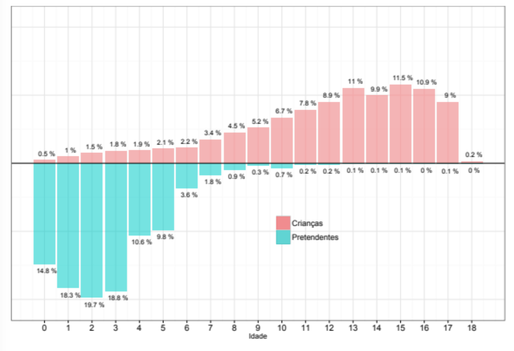
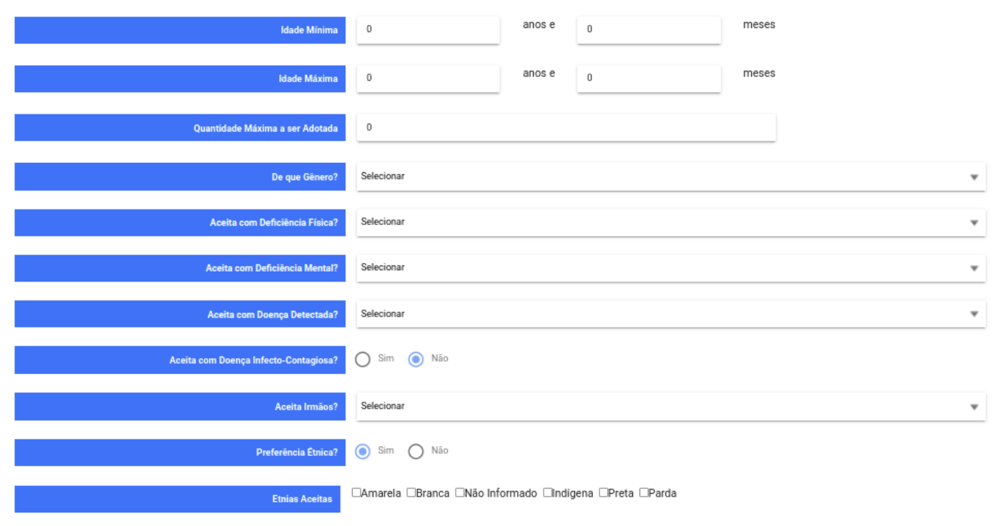

```{r setup, include=FALSE}
knitr::opts_chunk$set(
  echo = FALSE,
  message = FALSE,
  warning = FALSE,
  fig.align = "center"
)
```

### O problema
O cenário da adoção, atualmente, é marcado por uma característica um tanto triste: o perfil que os pais desejam adotar é diametralmente oposto ao perfil das crianças disponíveis. Esse resultado foi encontrado pela ABJ em um de seus primeiros estudos, junto do CNJ, finalizado em agosto de 2014, conforme a figura abaixo. 

```{r grafico, out.width="85%", fig.cap="Estudo realizado pela ABJ, junto do CNJ (2014).", fig.align='center'}

```
Dado esse desencontro entre os pretendentes e as crianças, surge um problema para o Judiciário: processos de adoção muito lentos. Em parte, a lentidão se dá por causa do tempo de processamento da demanda e, portanto, é uma causa do próprio Judiciário; por outro lado, essa lentidão se explica em larga medida justamente por esse descompasso de perfis. Uma vez que esse problema aparece, precisamos pensar em soluções para amenizar o descompasso de perfis.

### A ferramenta
É com o problema dos tempos em mente, que a ABJ está desenvolvendo uma ferramenta para ser implementada no Sistema Nacional de Adoção e Acolhimento (SNA) do CNJ. A ferramenta tem um objetivo principal: informar os pais pretendentes como que suas escolhas de perfil da criança se revertem em maiores ou menores tempos até se conseguir adotar a criança. 

No questionário de pretendentes, há as seguintes características sobre o perfil da criança disponíveis no site do SNA:[^foot1]

[^foot1]: https://www.cnj.jus.br/sna/indexPrecadastro.jsp 

```{r quastionario, out.width="85%", fig.cap="Questionário disponível no site do SNA.", fig.align='center'}

```

Em resumo, os pretendentes podem calibrar as características das crianças com base nas seguintes características:

- Idade
- Gênero
- Etnia
- Doenças
- Irmãos

Cada uma dessas características pode afetar mais ou menos o tempo de adoção, pois é variada a quantidade de crianças com cada característica. Assim, a ferramenta que estamos desenvolvendo busca estimar o tempo de adoção que cada uma dessas escolhas implicará. Basta o usuário (o pai/mãe pretendente que deseja estimar o tempo de suas escolhas) escolher perfis diferentes e verificar a estimativa de tempo relacionada a essas escolhas.

A ideia é que, com informações respeito dos tempos de adoção, os pais possam repensar critérios muito restritos em benefício de critérios mais abrangentes; ou ainda que os pais, mesmo que se decidam por manter critérios rígidos na seleção das crianças, que eles criem expectativas adequadas e ajustadas à realidade sobre o tempo que demorará para que uma criança com essas características fique disponível para adoção.

### Conclusão
Conforme vimos, um grande problema que os processos de adoção enfrentam são os elevados tempos até se concluir o processo de adoção. Em larga medida, isso se explica pelo descompasso de perfis que os pretendentes registram com as crianças disponíveis. É dentro deste contexto que se encaixa a ferramenta desenvolvida pela ABJ, cujo objetivo é  informar os futuros pais sobre a realidade das crianças disponíveis para adoção e, assim, auxiliá-los no processo de escolha do perfil.
