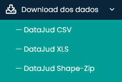
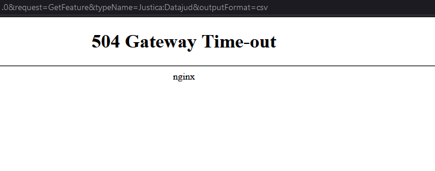
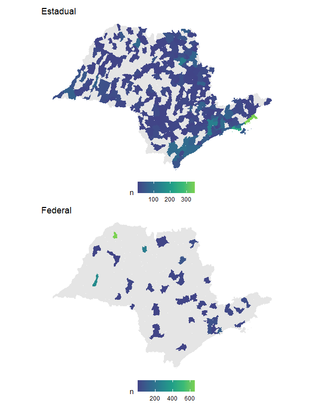

```{r setup, include=FALSE}
knitr::opts_chunk$set(echo = FALSE)
```

O tema ambiental é muito importante no Brasil, sendo a base não só para a própria saúde do planeta, mas também para diversos programas políticos e para a imagem do país no cenário internacional. Muitas entidades do terceiro setor focam em pesquisas e ações nessa área, não só por conta da importância, mas também por conta da possibilidade de conseguir investimentos de entidades de fomento no Brasil e no mundo.

Dentro do tema ambiental, uma das vertentes com maior potencial investigativo no momento são os processos judiciais. Como vimos várias vezes por aqui no laboratório de Jurimetria, o judiciário é um reflexo (com viés, claro) dos conflitos que acontecem na sociedade. Por isso, entender como funciona o judiciário nos ajuda a entender quais são e onde estão parte dos problemas sociais.

A área jurídica, no entanto, ainda sofre muito com o problema de abertura de dados. Temos dados públicos, mas não abertos, que ficam escondidos no meio de vários sites com sistemas cada vez mais difíceis de acessar. Iniciativas como o [Datajud](https://www.cnj.jus.br/sistemas/datajud/) e o [Codex](https://atos.cnj.jus.br/atos/detalhar/4417) são uma espécie de luz no fim do túnel, mas o túnel parece cada vez mais longo.

Nesse sentido, uma grata surpesa recente foi o [SireneJud](https://sirenejud.cnj.jus.br/). Trata-se de uma plataforma aberta para acesso a dados de processos envolvendo a Amazônia Legal. É uma das únicas bases disponibilizadas pelo CNJ que possui um link para download dos dados, que é o básico do básico que precisamos ter para fazer pesquisas no judiciário.

```{r}
#| dpi: 300
#| out-width: 40%
#| fig-position: "center"

```

> Vale ressaltar que disponibilizar um *dashboard* publicamente é diferente de tornar os dados abertos. Os dashboards apresentam **estatísticas dos dados**, não os dados em si. Sempre que ouvimos de alguém que "foram disponibilizados dados sobre X", o nosso interesse está em acessar a base de dados, não as estatisticas.

Quando baixamos os dados, no entanto, nos deparamos com isso aqui (tentativa realizada no dia 27/08/2022, às 11h):



Ou seja, os dados estão abertos, mas não tão abertos assim. Melhor seria se os dados fossem disponibilizados em uma plataforma própria para isso, como o [CKAN](https://ckan.org/), usados pelo [portal de dados abertos](https://dados.gov.br) do Brasil, que é referência mundial em abertura de dados, mas do poder executivo.

Vale um *disclaimer*: não estamos com isso criticando nem invalidando iniciativas como o SireneJud. Trata-se de um marco na área ambiental, que temos de comemorar. Somente abrindo os dados do judiciário teremos mais pesquisas e mais participação social, que são a base do aprimoramento do sistema.

Na falta de dados abertos, o que as entidades do terceiro setor acabam fazendo é recorrendo a robôs de busca (raspagem de dados). Esses robôs são ferramentas que acessam os dados do judiciário imitando o que um ser humano faria, mas de forma sistemática. Essa técnica está longe de ser ideal, uma vez que exige grande conhecimento específico e congestiona os sistemas dos tribunais, mas é um último recurso quando sobra vontade de fazer pesquisa e faltam dados.

É o exemplo do [JusAmbiente](https://www.jusbrasil.com.br/jusambiente), plataforma criada a partir de uma parceria do JusBrasil e várias entidades, que aproveitaram os recursos computacionais da empresa para disponibilizar alguns dados de forma aberta. Nem tudo na plataforma está disponível, infelizmente, mas pelo menos a lista dos processos por assunto e comarca está lá.

Vamos mostrar apenas um gráfico para demonstrar potencialidades de ter dados abertos. O que faremos é um mapa das comarcas dos processos que fazem parte da base de dados, separando por justiça.

```{r eval=FALSE}
dados_com_ibge <- readxl::read_excel("dados/Processos-por-Comarca.xlsx") |>
  janitor::clean_names() |>
  dplyr::mutate(
    justica = dplyr::case_when(
      stringr::str_detect(processo, "\\.8\\.") ~ "Estadual",
      stringr::str_detect(processo, "\\.4\\.") ~ "Federal"
    ),
    comarca = stringr::str_remove(comarca, stringr::regex("foro de ", TRUE)),
    comarca = stringr::str_remove(comarca, stringr::regex(" -.*", TRUE)),
    comarca = dplyr::case_when(
      comarca %in% c("Itaquera", "Santo Amaro", "Foro Central Cível",
                     "Santana", "Central") ~ "São Paulo",
      comarca == "Brás Cubas" ~ "",
      comarca == "Campos de Jordão" ~ "Campos do Jordão",
      comarca == "Embu" ~ "Embu das artes",
      comarca == "Ipauçu" ~ "ipaussu",
      comarca == "Piqueteda Comarca de Lorena" ~ "Lorena",
      comarca == "Roseira da Coamrca de Aparecida" ~ "Aparecida",
      TRUE ~ comarca
    ),
    uf = "SP"
  ) |>
  dplyr::filter(comarca != "") |>
  dplyr::count(justica, uf, comarca) |>
  munifacil::limpar_colunas(comarca, uf) |>
  munifacil::incluir_codigo_ibge(diagnostico = FALSE) |>
  dplyr::mutate(code_muni = as.numeric(id_municipio))

sao_paulo <- geobr::read_municipality(35)

grafico <- function(dados, lab) {
  dados |>
    ggplot2::ggplot() +
    ggplot2::geom_sf(
      ggplot2::aes(fill = n),
      colour = "transparent",
      size = .0001
    ) +
    ggplot2::scale_fill_viridis_c(
      begin = .2, end = .8, na.value = "gray90"
    ) +
    ggplot2::theme_void() +
    ggplot2::theme(
      legend.position = "bottom"
    ) +
    ggplot2::labs(title = lab)
}

gg_estadual <- sao_paulo |>
  dplyr::left_join(dplyr::filter(dados_com_ibge, justica == "Estadual")) |>
  grafico("Estadual")

gg_federal <- sao_paulo |>
  dplyr::left_join(dplyr::filter(dados_com_ibge, justica == "Federal")) |>
  grafico("Federal")

library(patchwork)
gg_estadual / gg_federal
```

```{r}
#| dpi: 300
#| out-width: 100%

```

O gráfico mostra como as ações estão distribuídas regionalmente. Na justiça estadual, as quantidades são mais pulverizadas, com maior concentração na comarca de Ubatuba. Já na justiça federal, os processos estão mais concentrados, com destaque à comarca de Jales.

Essa foi apenas uma pequena demonstração do poder de disponibilizar dados de forma aberta. Aproveite e explore os dados do [JusAmbiente](https://www.jusbrasil.com.br/jusambiente)! Quando o SireneJud funcionar, aproveite e baixe os dados também.
