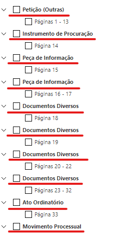

```{r setup, include=FALSE}
knitr::opts_chunk$set(
  echo = FALSE,
  message = FALSE,
  warning = FALSE,
  fig.align = "center"
)

options(scipen = 999)
```


## Estrutura

### O que são?

As Tabelas Processuais Unificadas (TPUs) buscam sistematizar uniformizar a taxonomia e terminolgia de ["classes, assuntos, movimentações e documentos processuais aplicáveis a todos os órgãos do Poder Judiciário"](https://www.cnj.jus.br/programas-e-acoes/tabela-processuais-unificadas/). 

### Desde quando elas existem?

Desde a Resolução nº 46 de 18 de dezembro de 12 de 2007.

### Órgão Competente

Quem faz a gestão das TPUs é o Conselho Nacional de Justiça (CNJ) por meio do **Comitê Gestor da Numeração Única e das Tabelas Processuais Unificadas**. Esse Comitê é composto por 15 membros (art. 1, [Portaria n. 135/2010](https://atos.cnj.jus.br/atos/detalhar/271)). Os membros são originários dos seguintes órgãos:

- 1 representante do Conselho Nacional de Justiça (CNJ)
- 1 representante do Supremo Tribunal Federal (STF)
- 1 representante do Supremo Tribunal de Justiça (STJ)
- 1 representante do Tribunal Superior do Trabalho (TST)
- 1 representante do Tribunal Superior Eleitoral (TSE)
- 1 representante do Supremo Tribunal Militar (STM)
- 5 representantes dos Tribunais de Justiça (TJs), sendo apenas um por região geográfica
- 1 representante dos Tribunais Militares Estaduais
- 1 representante do Conselho da Justiça Federal
- 1 representante do Conselho Superior da Justiça do Trabalho
- 1 representante do Conselho Nacional do Ministério Público

Esses representantes são nomeados pelo Presidente do CNJ (art. 4, Portaria n. 135/2010).

A função deste comitê é, principalmente, realizar a revisão e o aperfeiçoamento constante das TPUs.

## Funcionamento

Antes de passarmos para detalhes do funcionamento das TPUs, precisamos nos familizar com elas, para quem ainda não as conhece.

As TPUs se referem a 4 tabelas, em formato de árvore: Classe, Assunto, Movimentos e Documentos processuais. Você pode explorar as TPUs no seguinte link: [https://www.cnj.jus.br/sgt/consulta_publica_assuntos.php]

E a seguir há uma demonstração de como funciona uma das árvores, no caso, a árvore de assuntos. 

<video width="320" height="240" controls>
  <source src="img/tpu_exemplo.mp4" type="video/mp4">
</video>

### O que significa cada TPU?

Como já falamos, as TPUs se referem a 4 Tabelas: Classe, Assunto, Movimentos e Documentos processuais.

A TPU de Classe se refere à classificação de um processo quanto ao procedimento adotado, seja na esfera judicial, seja na esfera administrativa, para atender ao pedido.

A TPU de Assunto se refere à classificação de um processo quanto à matéria ou aos temas discutidos.

```{r, out.width="50%"}

```

A TPU de Movimentos se refere, não a um processo, mas uma movimentação dentro do processo. A sua ideia é resumir o tipo de movimentação de que se trata. 

```{r, out.width="80%"}
knitr::include_graphics("img/movimentos_exemplo.png")
```

Por fim, a TPU de Documentos processuais é uma Tabela que se refere, também, a movimentações. Cada movimentação traz um tipo de documento (petições iniciais, sentenças, despachos). E esses documentos estão também padronizados pelas TPUs.

```{r, out.width="40%"}

```

### Como se organizam as TPUs?

As 4 TPUs se organizam em um formato hierárquico de árvore, composto por 6 níveis de classificação. O nível 1 é sempre o nível mais genérico, que vai se especificando até chegar no nível mais detalhado. O nível mais detalhado, teoricamente é o nível 6, mas, na verdade, raramente isso acontece, pois o último nível de uma determinada ramificação pode ser o quinto nível, ou até o mesmo o segundo, terceiro ou quarto. Nas TPUs de Movimentos e de Documentos processuais, apesar de o nível 6 ser possível, não há nenhuma categoria ocupando este nível. 

### Quem registra?

Uma informação importante a respeito das TPUs é como que as Tabelas, em genérico, se materializam dentro de um processo em específico. Isso varia para cada uma das quatro TPUs. 

Quanto à Classe e ao Assunto, quem registra o tópico específico a que se refere um processo é a própria pessoa que protocola uma petição inicial.

Quanto às Movimentações, quem classifica uma movimentação de acordo com as TPUs

Quanto aos Documentos processuais, quem os classifica em um processo varia de acordo com quem produziu o documento. Basicamente, quem classifica um determinado documento é quem traz o documento ao processo. Se o documento foi protocolado por advogado (ou figuras correlatas, tais como promotores, defensores e procuradores), então é o próprio advogado quem determina o tipo de documento; se é o Cartório Judicial quem protocola um documento, então é ele mesmo que classifica o tipo de documento. E se é o juiz, então é o próprio magistrado que classifica o documento que ele está subindo. 

## Como usar