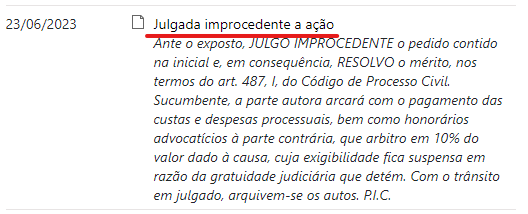
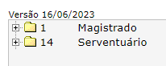
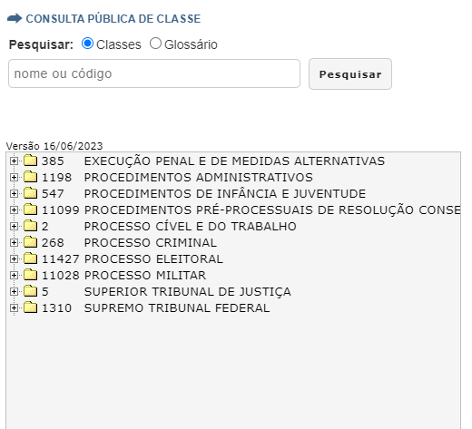
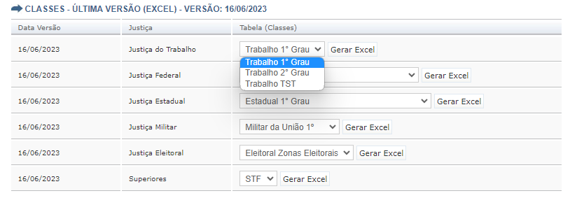

```{r setup, include=FALSE}
knitr::opts_chunk$set(
  echo = FALSE,
  message = FALSE,
  warning = FALSE,
  fig.align = "center"
)

options(scipen = 999)

cores_abj <-  viridis::viridis(2, 1, .2, .8)
```


## Estrutura

### O que são?

As Tabelas Processuais Unificadas (TPUs) buscam sistematizar uniformizar a taxonomia e terminolgia de ["classes, assuntos, movimentações e documentos processuais aplicáveis a todos os órgãos do Poder Judiciário"](https://www.cnj.jus.br/programas-e-acoes/tabela-processuais-unificadas/). 

### Desde quando elas existem?

Desde a Resolução nº 46 de 18 de dezembro de 12 de 2007.

### Órgão Competente

Quem faz a gestão das TPUs é o Conselho Nacional de Justiça (CNJ) por meio do **Comitê Gestor da Numeração Única e das Tabelas Processuais Unificadas**. Esse Comitê é composto por 15 membros (art. 1, [Portaria n. 135/2010](https://atos.cnj.jus.br/atos/detalhar/271)). Os membros são originários dos seguintes órgãos:

- 1 representante do Conselho Nacional de Justiça (CNJ)
- 1 representante do Supremo Tribunal Federal (STF)
- 1 representante do Supremo Tribunal de Justiça (STJ)
- 1 representante do Tribunal Superior do Trabalho (TST)
- 1 representante do Tribunal Superior Eleitoral (TSE)
- 1 representante do Supremo Tribunal Militar (STM)
- 5 representantes dos Tribunais de Justiça (TJs), sendo apenas um por região geográfica
- 1 representante dos Tribunais Militares Estaduais
- 1 representante do Conselho da Justiça Federal
- 1 representante do Conselho Superior da Justiça do Trabalho
- 1 representante do Conselho Nacional do Ministério Público

Esses representantes são nomeados pelo Presidente do CNJ (art. 4, Portaria n. 135/2010).

A função deste comitê é, principalmente, realizar a revisão e o aperfeiçoamento constante das TPUs.

## Funcionamento

Antes de passarmos para detalhes do funcionamento das TPUs, precisamos nos familizar com elas, para quem ainda não as conhece.

As TPUs se referem a 4 tabelas, em formato de árvore: Classe, Assunto, Movimentos e Documentos processuais. Você pode explorar as TPUs no seguinte link: https://www.cnj.jus.br/sgt/consulta_publica_assuntos.php

E a seguir há uma demonstração de como funciona uma das árvores, no caso, a árvore de assuntos. 

<video width="640" height="480" controls>
  <source src="img/tpu_exemplo.mp4" type="video/mp4">
</video>

### O que significa cada TPU?

Como já falamos, as TPUs se referem a 4 Tabelas: Classe, Assunto, Movimentos e Documentos processuais.

A TPU de Classe se refere à classificação de um processo quanto ao procedimento adotado, seja na esfera judicial, seja na esfera administrativa, para atender ao pedido.

A TPU de Assunto se refere à classificação de um processo quanto à matéria ou aos temas discutidos.

```{r, out.width="50%"}

```

A TPU de Movimentos se refere, não a um processo, mas uma movimentação dentro do processo. A sua ideia é resumir o tipo de movimentação de que se trata. 

```{r, out.width="80%"}

```

Por fim, a TPU de Documentos processuais é uma Tabela que se refere, também, a movimentações. Cada movimentação traz um tipo de documento (petições iniciais, sentenças, despachos). E esses documentos estão também padronizados pelas TPUs.

```{r, out.width="40%"}
knitr::include_graphics("img/documentos_exemplo.png")
```

### Como se organizam as TPUs?

As 4 TPUs se organizam em um formato hierárquico de árvore, composto por 6 níveis de classificação. O nível 1 é sempre o nível mais genérico, que vai se especificando até chegar no nível mais detalhado. O nível mais detalhado, teoricamente é o nível 6, mas, na verdade, raramente isso acontece, pois o último nível de uma determinada ramificação pode ser o quinto nível, ou até o mesmo o segundo, terceiro ou quarto. Nas TPUs de Movimentos e de Documentos processuais, apesar de o nível 6 ser possível, não há nenhuma categoria ocupando este nível. 

### Quem registra?

Uma informação importante a respeito das TPUs é como que as Tabelas, em genérico, se materializam dentro de um processo em específico. Isso varia para cada uma das quatro TPUs. 

Quanto à Classe e ao Assunto, quem registra o tópico específico a que se refere um processo é a própria pessoa que protocola uma petição inicial.

Quanto às Movimentações, quem classifica uma movimentação de acordo com as TPUs é o Magistrado ou o Serventuário. Essa característica da classificação das movimentações se manifesta na própria TPU, que se inicia com as macro categorias de "Magistrado" e "Serventuário" apenas.

```{r, out.width="40%"}

```

Quanto aos Documentos processuais, quem os classifica em um processo varia de acordo com quem produziu o documento. Basicamente, quem classifica um determinado documento é quem traz o documento ao processo. Se o documento foi protocolado por advogado (ou figuras correlatas, tais como promotores, defensores e procuradores), então é o próprio advogado quem determina o tipo de documento; se é o Cartório Judicial quem protocola um documento, então é ele mesmo que classifica o tipo de documento. E se é o juiz, então é o próprio magistrado que classifica o documento que ele está subindo. 

### Como acessar?

As TPUs podem ser acessadas no site do Sistema de Gestão Processual (SGT) do CNJ, no seguinte link: https://www.cnj.jus.br/sgt/consulta_publica_classes.php. Ao acessar este link, nos deparamos com a página de Consulta Pública de uma TPU. No exemplo abaixo, observamos a página de consulta pública das Classes processuais.

```{r, out.width="80%"}

```

Nesta consulta pública, podemos digitar palavras-chave de interesse, obtendo como resultado as categorias que contém a palavra-chave pesquisada. 

Entretanto, a Consulta Pública pode ser enganadora, pois ela pode dar a entender que os códigos e as categorias representadas na página são estáticas, como se elas sempre tivessem sido assim. Mas, como já vimos, as TPUs estão em constante atualização. 

Então se quisermos ter uma visão histórica das TPUs, que compreenda todas as categorias atuais e passadas, temos que verificar as versões passadas das TPUs. Para tanto, basta ir na aba "Versões / Manual". 

Ali, iremos encontrar várias tabelas para uma mesma versão, conforme a imagem abaixo

```{r, out.width="100%"}

```

```{r}
n_tabelas <- tpur::sgt |> 
  dplyr::filter(tipo_abbr == "C", data_versao == "2023-02-02") |> 
  nrow()
```

Nesta imagem, podemos observar que existem tabelas para cada uma das 6 Justiças no Brasil. E, para cada Justiça, há uma ramificação maior, pois há uma tabela específica para o primeiro grau, segundo grau e o tribunal superior daquela Justiça. Ao todo, são `r n_tabelas` tabelas. A combinação das 26 tabelas equivale à tabela que está disponível na Consulta Pública. Então, para cada versão das TPUs, temos 26 tabelas menores, cuja combinação se torna a tabela completa que observamos na consulta pública. Abaixo, vemos as tabelas existentes. 

```{r}
tpur::sgt |> 
  dplyr::filter(tipo_abbr == "C", data_versao == "2023-02-02") |> 
  dplyr::distinct(justica, tabela) |> 
  knitr::kable()
```

Existem essas ramificações para as TPUs de Classe, Assunto e Movimentos. Mas a TPU de Documentos processuais é sempre única, não se subidivindo entre uma tabela para cada tribunal.

O excel gerado para cada umas TPUs, que depois pode ser unificado, possui mais informações do que aquelas visíveis na Consulta Pública. Cada TPU é composta por 18 colunas, que você pode ver na Tabela \@ref(tab:informacoes_tpus)

```{r informacoes_tpus}
tibble::tibble(
  colunas = tpur::classes |> 
    head(1) |> 
    dplyr::pull(release) |> 
    readr::read_csv(show_col_types = FALSE) |> 
    colnames(),
  descricao = c(
    NA_character_,
    "Nível 1",
    "Nível 2",
    "Nível 3",
    "Nível 4",
    "Nível 5",
    "Nível 6",
    "Código da categoira de nível mais específico",
    "Código da cateogira de nível imediatamente superior",
    "Norma a que se refere a categoria (CC, CPC, CP, CPP, ECA, CF, etc...)",
    "Artigo específico dentro da norma",
    "Sigla",
    "Alterações introduzidas, para um determinado código, na versão atual, em relação à versão imediatamente anteior",
    "Descrição pormenorizada da variável",
    "Data da publicação (ou seja, representa a primeira vez que um código apareceu na TPU)",
    "Data da alteração (ou seja, se houver alteração, representa a data em que foi introduzida a última alteração)",
    "Data da inativação (ou seja, se aplicável, representa a data em que um código foi inativado)",
    "Data da reativação (ou seja, se aplicável, representa a data em que um código inativado foi reativado)"
  )
) |> 
  dplyr::filter(colunas != "id") |> 
  dplyr::mutate(
    colunas = stringr::str_replace_all(colunas, "classe", "nivel")
  ) |> 
  knitr::kable(caption = "Descrição das informações das TPUs")
```

As colunas principais são as colunas de níveis, bem como o seu código e o glossário. São estas colunas que irei explicar com mais detalhes. 

As colunas de níveis são sempre 6, ou seja, todas as TPUs podem ter, no máximo, 6 níveis. O nível 1 é sempre o nível mais genérico. Ele não possui "Código pai". O nível mais específico não é necessariamente o nível 6, pois a ramificação da árvore pode acabar em níveis menores, variando, portanto, do nível 2 ao 6. 

Cada linha das TPUs representa uma categoria única, que possui um código único e que nunca se repete. Não há repetição dentro de uma mesma TPU, nem entre TPUs, isto é, você nunca vai encontrar dois códigos iguais dentro de uma TPU de Classe ou Assunto ou Movimento ou Documento e tampouco você vai encontrar um código presente em uma TPU de Classe dentro de uma TPU de Assunto, por exemplo. O código é sempre o identificador único de uma determinada categoria. 

Por fim, temos o Glossário. O glossário é uma explicação do conteúdo que se espera que esteja relacionado a uma determinada categoria. 

### Versões

```{r}
n_versoes <- tpur::sgt |> 
  dplyr::distinct(data_versao) |> 
  nrow()
```

Além de saber como funcionam as TPUs em sua forma mais extensa, precisamos ter uma compreensão maior a respeito das versões de cada uma das TPUs. Atualmente temos `r n_versoes` das TPUs.

Vimos que cada TPU (exceto a de Documentos processuais) é o reusltado da junção de 26 tabelas menores. Entretanto, isso nem sempre foi assim. Versões mais antigas das TPus não possuíam as 26 tabelas; elas eram versões mais enxutas. Vemos na Tabela \@ref(tab:n_tabelas_versao) a progressão da quantidade de tabelas que cada TPU continha ao longo de suas várias versões. 

```{r n_tabelas_versao}
tpur::sgt |> 
  dplyr::filter(tipo_abbr == "C") |>
  dplyr::count(data_versao) |> 
  knitr::kable(
    caption="Quantidade de tabelas por versão",
    col.names = c("Data da versão", "Quantidade de tabelas")
  )
```

A atualização dessas várias versões se dá de forma contínua. Podemos observar a distribuição das versões na Figura \@ref(fig:distribuicao_versoes).

```{r distribuicao_versoes, fig.cap="Distribuição das versões por ano"}
 tpur::sgt |> 
  dplyr::distinct(data_versao) |> 
  dplyr::mutate(ano = lubridate::year(data_versao)) |> 
  dplyr::count(ano) |> 
  ggplot2::ggplot() +
  ggplot2::aes(x = ano, y = n, label = n) +
  ggplot2::geom_col(fill = cores_abj[1]) +
  ggplot2::geom_label() +
  ggplot2::scale_x_continuous(breaks=c(2007:2023)) +
  ggplot2::labs(
    x = "Ano",
    y = "Quantidade de versões"
  ) +
  ggplot2::theme_bw(16) +
  ggplot2::theme(axis.text.x = ggplot2::element_text(angle = 45, hjust=1))

```

Pelo gráfico fica claro que não periodicidade definida para essas atualizações. Há duas formas de uma atualização ser realizada. Via de regra, elas são feitas de acordo com o julgamento de conveniência do Comitê Gestor da Numeração Única e das Tabelas Processuais Unificadas. Mas além dessa possibilidade de fazer as mudanças nas TPUs de ofício, o Comitê recebe sugestões dos tribunais ou da sociedade civil. Essas sugestões, por sua vez, podem gerar mudanças nas TPUs, que acabam se tornando versões novas. 

Normalmente, as novas versões não trazem grandes mudanças. Elas alteram alguma descrição no glossário, ou adicionam alguma classificação nova. Mas é importante se ater a essas alterações no tempo quando se está realizando uma pesquisa. 

Na ABJ, em uma pesquisa, tivemos problemas relacionados à mudança de versões das TPUs. Estávamos realizando uma pesquisa sobre a judicialização da saúde na Justiça Federal do Ceará, entre 2015 e 2021. Fomos, então, nas TPUs de Assunto para escolher os assuntos relacionados ao tema da pesquisa. Com base nisso, identificamos os seguintes códigos:

12521, 12520, 12508, 12509, 12510, 12498, 12497, 12499, 12496, 12495, 12494, 12493, 12505, 12506, 12518, 12512, 12513, 12514, 12515, 12516, 12517, 14759, 12502, 12503, 12500, 12504, 12519, 12490, 12487, 12488, 12489, 13017, 12416

Entretanto, depois de termos realizado um pedido de dados à JFCE com os códigos de assunto acima, percebemos que a TPU tinha sofrido grandes alterações especificamente na taxonomia a respeito de temas ligados a judicialização da saúde. Essas mudanças aconteceram em decorrência de um estudo do Insper para o Justiça Pesquisa realizado em 2018 e publicado em 2019 (inserir o link). Então faltaram os seguintes códigos de assuntos:

10892, 11884, 10856, 7698, 6064, 9196, 10045, 10100, 10653, 11852, 10356, 10655, 11885, 10671, 10090, 10003, 7769, 8986, 10067, 10126, 10504, 10125, 10656, 11857, 10423, 10244, 11883, 10023, 10437, 10662, 10458, 10070, 9098, 9995, 11847, 10543, 10438, 10273, 9518, 9532, 10287, 11855, 10487, 11856, 10677, 10454, 10894, 10376, 10283, 9994, 10121, 7618, 10111, 11989, 10737, 5922, 10399, 6011, 10364, 10280, 10010, 7657, 9581, 10066, 10014, 9985, 10225, 10091, 10065, 10370, 10069, 10095, 11854, 10263, 7706, 10396, 10710, 6193, 10108, 6007, 10445, 10680, 10294, 9596, 5988, 12222, 12223, 11851, 10880, 12224, 7703, 4703, 10083, 9606, 5952, 9607, 12379, 10118, 10556, 6001, 11843, 10173, 12612, 11848, 9991, 10004, 10434, 7775, 10424, 7949, 10435, 5947, 10500, 7689, 12378

## Como usar

Saber essas informações a respeito das TPUs é importante para utilizá-las de forma adequada. Vamos dividir a utilização das TPUs em duas partes: primeiro, vamos ensinar como utilizar o pacote da ABJ para lidar com as TPUs, em seguida, vamos discutir como melhor utilizar as TPUs para pedidos de Lei de Acesso à Informação (LAI).

### [tpur](https://github.com/abjur/tpur)

`tpur` é o pacote da ABJ para lidar com as TPUs. Ele está em desenvolvimento ainda e aceita sugestões de melhoria e de futuras implementações. A ideia básica deste pacote é que, por meio de funções básicas de "read", ou seja, de leitura das TPUs, os pesquisadores consigam ter acesso aos códigos importantes a eles. 

Atualmente, há apenas duas funções de leitura implementadas, as funções para as TPUs de Assunto e as de Classes. 

```{r eval=FALSE, include=TRUE}
tpur::tpu_assunto_read()
tpur::tpu_classe_read()
```

Todas as funções de leitura (as existentes, de Classe e Assunto, e as futuras, de Movimentos e Documentos) recebem duas informações, dividida em três argumentos: (1) uma palavra-chave, cujo argumento na função é `busca` (2) o período desejado, que se divide nos argumentos `ini` e `fim`, para representar a data de início e a data de fim do escopo. O argumento de `busca` é obrigatório, mas os argumentos de datas não são. Se alguma data não for colocada, será considerado o dia de hoje. A ideia é que uma simples palavra-chave possa retornar todos os códigos desejados ao longo da história das TPUs. 

O pacote está limitado também no escopo temporal que ele abrange. Atualmente, foi possível extrair apenas as TPUs de 31/03/2023 até 20/09/2022. 

### Lei de Acesso à Informação (LAI)

A importância das TPUs para a LAI é de ordem prática. Ao se pedir a um Tribunal por dados de processos, normalmente queremos que o tribunal faça filtros dentre todos seus milhares de processos, para que eles nos passem somente os processos necessários à nossa pesquisa. Esses filtros de escopo são feitas, via de regra, com base nas Classes e Assuntos dos processos. Assim, em um pedido de LAI temos que especificar quais Classes e quais Assuntos queremos. 

Do ponto de vista da equipe técnica do Tribunal, que realiza a extração dos dados, é preferível que o pedido de LAI contenha não o nome das Classes ou Assuntos desejados, mas os códigos dessas Classes e Assuntos. Por essa razão é que as funções do pacote `tpur` retornam os códigos das TPUs, ao invés da sua descrição. 
