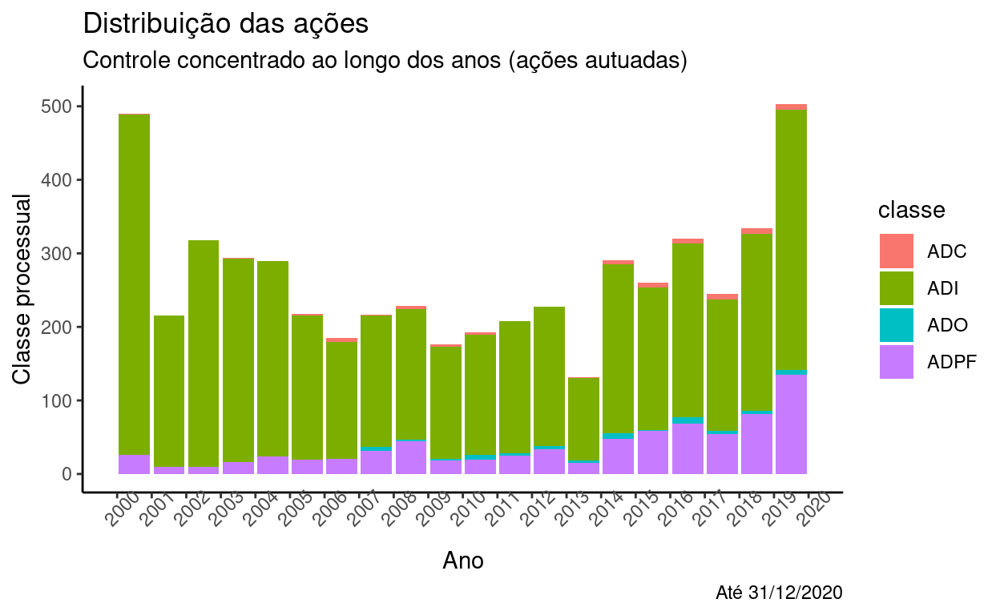
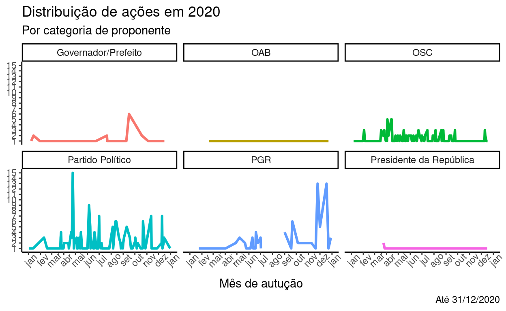
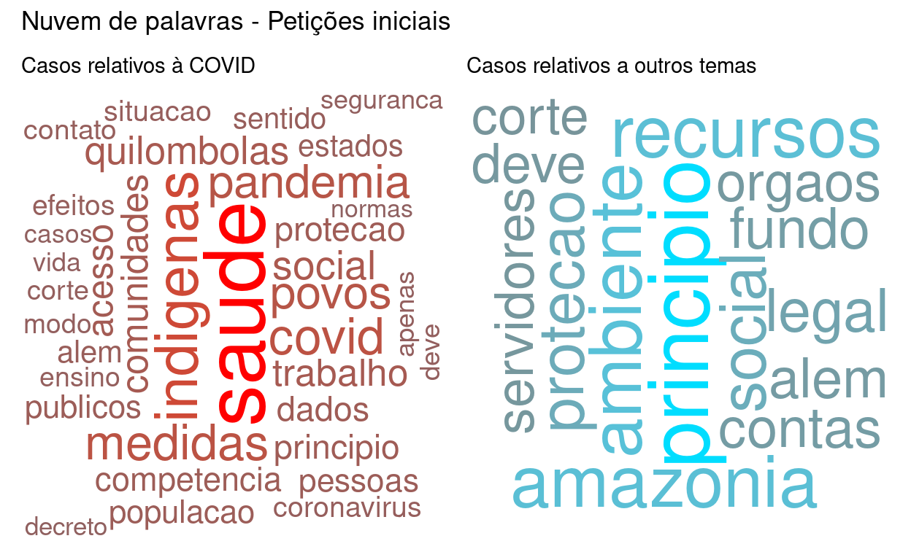
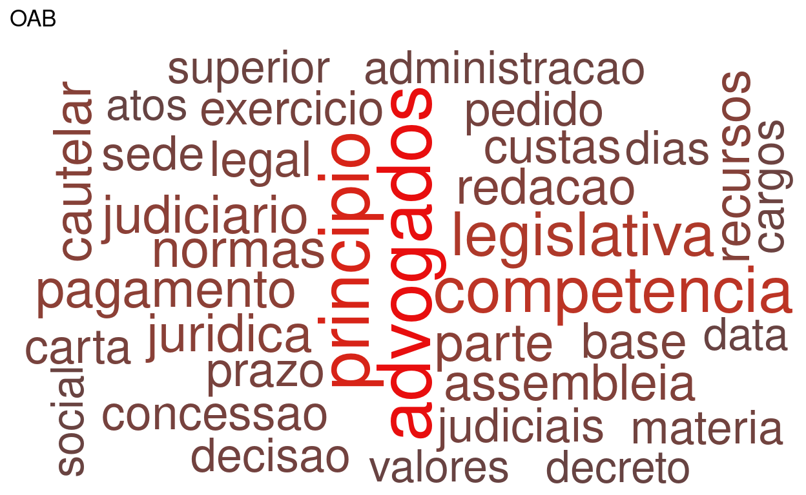
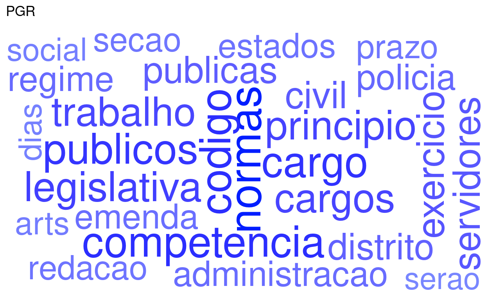
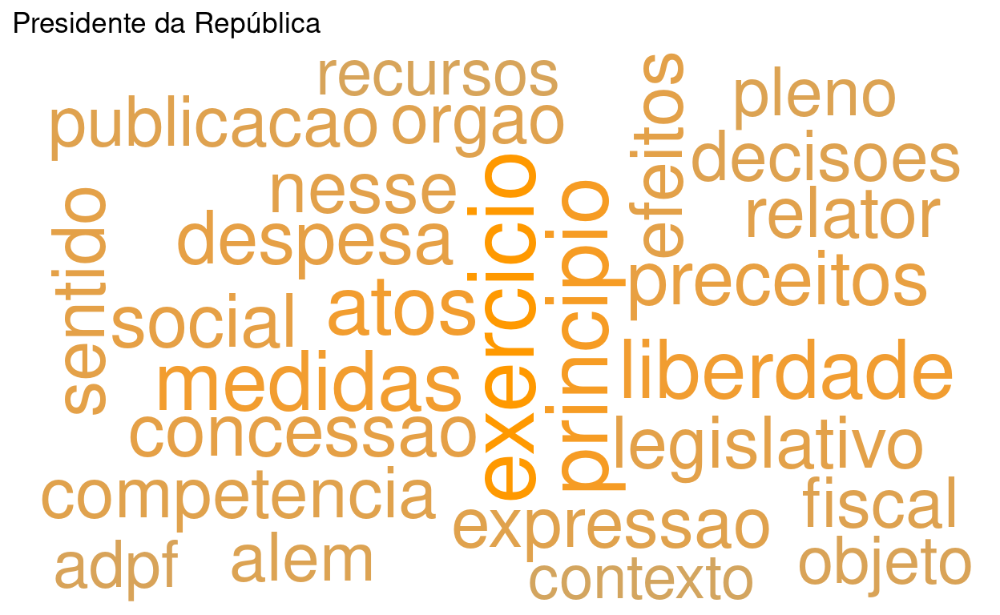

<div class="layout-chunk" data-layout="l-body">


</div>


# Introdução

No presente texto pretendo apresentar brevemente o resultado de uma análise feita das ações de controle concentrado de constitucionalidade distribuídas ao [**Supremo Tribunal Federal**](https://portal.stf.jus.br/) até o fatídico ano de 2020. Como sabemos, a sua atuação (e omissão...) causa o grande impacto social, político e econômico em nossa sociedade.

A análise ocorreu no contexto de elaboração de trabalho final do curso de "Web scraping" da [Curso-R](https://curso-r.com/) e nela pude aplicar alguns conceitos apresentados pelo [Prof. José Jesus](https://github.com/jjesusfilho) em seu curso de [Jurimetria aplicada](https://jurimetria.consudata.com.br/): a ideia foi desenvolver ferramentas para raspar dados do Supremo Tribunal Federal (STF) e fazer algumas análises exploratórias preliminares e incipientes em cima destes dados.

Adaptada para esse importante blog, procurei dar enfoque nos resultados que permita algumas reflexões sobre os efeitos da pandemia no perfil de temas submetidos à Corte e como foi a atuação das partes legitimadas ao longo de 2020.

### Delimitação do tema

Como mencionado, analisaremos exclusivamente as ações de **controle concentrado de constitucionalidade**. Isso é, as classes processuais relativas a:

-   [Ação Direta de Inconstitucionalidade (ADI)](https://pt.wikipedia.org/wiki/A%C3%A7%C3%A3o_direta_de_inconstitucionalidade),
-   [Ação Declaratória de Constitucionalidade (ADC)](https://pt.wikipedia.org/wiki/A%C3%A7%C3%A3o_declarat%C3%B3ria_de_constitucionalidade),
-   [Ação Declaratória de Inconstitucionalidade por Omissão (ADO)](https://pt.wikipedia.org/wiki/A%C3%A7%C3%A3o_direta_de_inconstitucionalidade_por_omiss%C3%A3o) e
-   [Arguição de Descumprimento de Preceito Fundamental (ADPF)](https://pt.wikipedia.org/wiki/Argui%C3%A7%C3%A3o_de_descumprimento_de_preceito_fundamental).

Essas classes processuais representam a atividade mais tradicional e típica de um Tribunal Constitucional em sua concepção clássica. Faz sentido, então, prestigiar e analisar a atuação do STF sob esse aspecto. (Não se ignore que o Supremo Tribunal Federal brasileiro tem competências que vão muito além disso, mas isso é papo para outro projeto...).

Ainda, é possível verificar nessas ações como se dão **conflitos relevantes** não apenas entre sociedade civil e poder público mas também entre os Poderes Legislativo e Executivo entre si. Também, evidencia a uma das mais relevantes faces da atuação da Procuradoria-Geral da República.

Durante a **pandemia**, também, essas ações têm sido especialmente importantes para definição de esferas de responsabilidade (vide [ADPF 722](https://portal.stf.jus.br/processos/detalhe.asp?incidente=5967354)), a discussão sobre o plano de vacinação ([ADPF 754](https://portal.stf.jus.br/processos/detalhe.asp?incidente=6034102) e [ADPF 756](https://portal.stf.jus.br/processos/detalhe.asp?incidente=6035593)), a proteção a grupos indígenas e quilombolas, etc.

A ideia foi mapear aspectos como quantidade de ações por tipo/ano, quais os principais litigantes dessas ações (considerando-se os poucos legitimados para tanto), quais os principais temas dessas ações, as palavras-chave mais utilizadas nas petições iniciais, etc.

Com os dados ora obtidos espera-se poder realizar todas essas análises (e várias outras) e contribuir para que a comunidade também possa se debruçar e refletir sobre essas questões.

### Dados utilizados: utilidade e pertinência de *web scraping*

Justifica-se a utilidade tendo-se em vista a importância (*crescente?*) do STF no cotidiano, não só das pessoas em carreiras jurídicas mas também da academia e das cidadãs e cidadãos comuns.

Por outro lado, não existe API disponibilizada pelo Tribunal que permita o acesso automatizado e, embora seja louvável a disponibilização de uma listagem de todo o acervo da Corte, a informações como partes, andamentos e as peças processuais não se encontram disponíveis. Daí ser necessário, no caso, realizar a raspagem nas páginas do Tribunal.

Trata-se de serviço público (cujo acesso à justiça é, inclusive, previsto na Constituição Federal) que, a despeito de sua importância, ainda é um *ilustre desconhecido*...

(E, sabemos, o juridiquês em nada ajuda: torço para que por meio da ciência de dados seja possível melhor compreender e melhor explicar o que faz o STF.)

Para tanto, foi aplicada a técnica do web scraping tal qual (muito bem) ensinada pela Curso-R.

## Produtos da raspagem

Para os fins desse trabalho, foram selecionadas todas as ações **autuadas** a partir de 2000 (primeiro ano disponibilizado na listagem do STF) até 31/12/2020. Foram salvos dados sobre as ações em si (direto do STF), os respectivos números de incidente, as partes, os andamentos, e a petição inicial.

Uma explicação mais detalhada das estratégias utilizadas bem como [o acesso integral aos códigos e dados obtidos encontra-se disponível no repositório do projeto no GitHub](https://github.com/rfdornelles/ControledoControle).

# Algumas Análises


Sem qualquer pretensão de esgotar o tema, apresentamos aqui algumas análises exploratórias apenas para ilustrar o potencial do tema e mostrar a beleza que é o mundo jurídico (especialmente quando a ele se olha pela lente dos dados).

## Distribuição das ações ao longo dos últimos anos

O primeiro aspecto que podemos observar é a **quantidade** de ações de controle concentrado de constitucionalidade ao longo dos anos. Abaixo, sem fazer distinção de qual categoria, vamos ver como se deu essa distribuição:

<div class="layout-chunk" data-layout="l-body">
<!-- -->

</div>


Aqui não estamos preocupados com o "saldo" de ações, ou seja, o gráfico acima *não é afetado pela produtividade do Tribunal* mas indica **como variou** a "procura" pela sua tutela constitucional ao longo do período.

E chama muito a atenção a **tendência acentuada no aumento ao longo dos últimos anos**, em especial a partir de 2019. Uma hipótese para esse aumento é o cenário de *crise institucional* presente no país desde a eleição do atual Presidente da República.

Como já noticiado, é uma característica de seu governo o excesso de Decretos editados, muitas vezes indo além dos limites legais. [Já noticiou o UOL](https://noticias.uol.com.br/ultimas-noticias/agencia-estado/2019/05/18/30-medidas-do-governo-ja-sao-alvo-de-acoes-no-stf.htm) que, antes de terminado o primeiro semestre de 2019, já havia mais de 30 medidas questionadas no STF. Alguns veículos, [como o Estadão](https://politica.estadao.com.br/noticias/geral,sem-articulacao-oposicao-investe-em-acoes-no-stf-contra-bolsonaro,70003019596), apontam uma espécie de estratégia da oposição de ir mais frequentemente ao Supremo contra atos da Presidência, sobretudo face um estado de tensão entre os Poderes.

<div class="layout-chunk" data-layout="l-body">
<!-- -->

</div>


Como podemos verificar, se olharmos apenas os atos questionados que são de competência federal, efetivamente há um crescimento na proporção de atos infra-legais (aí incluídos os Decretos, exclusivos do Presidente da República).

Outra explicação, agravada pelo contexto acima descrito, é a **pandemia de COVID-19** que enfrentamos nesse momento. Veja-se que o ano de 2020 é recordista em ações constitucionais propostas.

## Evolução nas classes processuais

Um outro aspecto interessante é observar *quais* os instrumentos vêm sendo mais utilizados dentre os 4 normalmente disponíveis no âmbito do controle de constitucionalidade.

Veremos abaixo a evolução de cada uma das classes ao longo dos últimos anos:

<div class="layout-chunk" data-layout="l-body">
<!-- -->

</div>


Percebe-se, naturalmente, uma prevalência da ADI, que se mantem constante, bem como uma baixa utilização da ADC e da ADO, que foram melhor regulamentadas ao longo do início dos anos 2000. Chama a atenção, contudo, como evoluiu - sobretudo nos últimos anos - a utilização da ADPF.

Isso é curioso justamente por ser uma característica dessa ação a subsidiariedade. Ou seja, ela deveria ser residual em seu cabimento. Algumas hipóteses que podem explicar esse crescimento são uma maior criatividade dos proponentes, que vêm se ancorando em teses como a do "*estado de coisas inconstitucional*" a exemplo do utilizado nas ADPFs [347](http://portal.stf.jus.br/processos/detalhe.asp?incidente=4783560), [635](http://portal.stf.jus.br/processos/detalhe.asp?incidente=5816502), [709](http://portal.stf.jus.br/processos/detalhe.asp?incidente=5952986) e [760](http://portal.stf.jus.br/processos/detalhe.asp?incidente=6049993).

## Atividade dos proponentes

Sabemos que as ações de controle concentrado possuem um rol estreito de legitimados à sua propositura e que é previsto no [artigo 103 da Constituição Federal](http://www.planalto.gov.br/ccivil_03/constituicao/constituicao.htm#art103). Basicamente, são esses:

-   Presidente da República e Governadores,
-   Poder Legislativo (Câmara dos Deputados, Senado, Assembleias Legislativas e Distrital),
-   Procuradoria-Geral da República,
-   Conselho Federal da OAB,
-   Partidos políticos com representantes no Congresso Nacional,
-   Confederações sindicais ou entidades de classe de âmbito nacional.

Como se vê, basicamente são membros do **Executivo** (Presidente/Governadores), do **Legislativo** e o chefe do **Ministério Público**. Ao lado deles, os **partidos políticos**, a representação da **Advocacia** e alguns **poucos representantes da sociedade civil organizada** (como os sindicatos e as entidades de classe *nacionais*). Há, portanto, uma grande primazia de órgãos/autoridades públicas e grandes "conglomerados" da sociedade civil que detém essa legitimidade.

Podemos observar, então, como ao longo dos últimos anos tem sido o comportamento desses proponentes:

<div class="layout-chunk" data-layout="l-body">
<!-- -->

</div>


Um outro ponto de vista interessante é observar não apenas o quanto cada classe de legitimado levou de ações ao STF em cada ano, mas também ver qual a esfera de competência do ato questionado. Isto é, se as ações eram relativas a atos federais ou subnacionais.

<div class="layout-chunk" data-layout="l-body">
<!-- -->

</div>


Chama bastante atenção o fato de a Procuradoria-Geral da República aparentemente ter dedicado bastante ênfase nos atos de Estados e Municípios em detrimento dos atos federais.

#### *Em 2020: Atuação dos proponentes ao longo do ano*

Pensando no momento peculiar em que vivemos, um aspecto interessante a observar é como se deu a atuação dos proponentes ao longo desse ano. Vejamos:

<div class="layout-chunk" data-layout="l-body">
<!-- -->

</div>


Podemos ver que a atuação dos Estados e DF (via **Governadores**) se deu de forma mais intensa no início do ano, enquanto a **OAB** atuou de forma mais ativa nos primeiros meses da pandemia.

As organizações da **sociedade civil** e os **partidos** tiveram atuação intensa durante todo o ano, com picos nas fases iniciais da pandemia.

A **Presidência** da República, quando agiu, foi apenas no meio do ano. A **PGR**, por sua vez, teve atuação mais destacada no inicio da pandemia e mais recentemente, a partir de novembro.

#### Atuação da OSC e Partidos

Embora quase residual em termos de competência para atuação, as organizações da sociedade civil (OSC), compreendendo sindicatos, confederações, etc têm tido **atuação expressiva** e de grande importância nos últimos anos. Da mesma forma, os partidos políticos têm se mostrado bastante combativos no âmbito do STF.

Uma nota importante é que, ao contrário dessas associações, os Partidos políticos possuem a chamada "*legitimidade universal*" e, por isso, em tese podem apresentar ações em qualquer tema enquanto as OSCs apenas nos temas que dizem respeito direto aos seus associados.

Veremos algumas dessas entidades que têm litigado perante o Supremo Tribunal Federal.

##### *Quais partidos políticos*

Abaixo lista de quais partidos mais apresentaram ações. Um grande destaque para os Partidos tradicionalmente tidos como de esquerda.

<div class="layout-chunk" data-layout="l-body">

|nome                                         |  n|
|:--------------------------------------------|--:|
|PARTIDO SOCIALISTA BRASILEIRO PSB            | 88|
|PARTIDO DEMOCRATICO TRABALHISTA PDT          | 87|
|PARTIDO SOCIALISMO E LIBERDADE PSOL          | 86|
|PARTIDO SOCIAL LIBERAL PSL                   | 80|
|PARTIDO DA SOCIAL DEMOCRACIA BRASILEIRA PSDB | 73|
|PARTIDO DOS TRABALHADORES                    | 67|
|REDE SUSTENTABILIDADE                        | 66|
|PARTIDO DEMOCRATICO TRABALHISTA              | 52|
|SOLIDARIEDADE                                | 48|
|PARTIDO TRABALHISTA BRASILEIRO PTB           | 40|

</div>


##### *Quais associações, sindicatos, etc*

Aqui as associações que mais apresentaram ações de controle concentrado no STF. Destaque para associações ligadas às carreiras jurídicas.

<div class="layout-chunk" data-layout="l-body">

|nome                                                              |   n|
|:-----------------------------------------------------------------|---:|
|ASSOCIACAO DOS MAGISTRADOS BRASILEIROS AMB                        | 102|
|CONFEDERACAO NACIONAL DA INDUSTRIA                                |  72|
|ASSOCIACAO NACIONAL DOS MEMBROS DO MINISTERIO PUBLICO CONAMP      |  63|
|CONFEDERACAO NACIONAL DO COMERCIO DE BENS SERVICOS E TURISMO CNC  |  48|
|ASSOCIACAO NACIONAL DAS OPERADORAS CELULARES ACEL                 |  45|
|CONFEDERACAO BRASILEIRA DE TRABALHADORES POLICIAIS CIVIS COBRAPOL |  43|
|CONFEDERACAO NACIONAL DO COMERCIO CNC                             |  43|
|CONFEDERACAO DOS SERVIDORES PUBLICOS DO BRASIL CSPB               |  41|
|ASSOCIACAO DOS NOTARIOS E REGISTRADORES DO BRASIL ANOREGBR        |  39|
|ASSOCIACAO NACIONAL DOS MAGISTRADOS ESTADUAIS ANAMAGES            |  37|

</div>


## O Supremo e a Pandemia

Sabemos que uma das razões que mostram um pico de casos em 2020 são as implicações em todos os níveis que a pandemia de COVID-19 nos trouxe.

Dúvidas sobre os limites federativos, questionamento de atos legislativos ou executivos, omissão do Governo Federal, etc foram algumas das muitas questões levadas à Corte.

Veremos a seguir a proporção de ações relativas à pandemia em relação aos demais temas ao longo dos meses de janeiro até o fim de novembro de 2020:

<div class="layout-chunk" data-layout="l-body">
<!-- -->

</div>


Vemos que, efetivamente, a partir de março esse foi um dos grandes temas que chegaram até a Corte, evidenciando sua importância inclusive no âmbito jurídico e político.

Nos meses de maio e julho, inclusive, essas ações relacionadas à pandemia foram mais frequentes do que os outros temas reunidos.

### Os legitimados e a COVID

Vamos observar, brevemente, quais foram os legitimados que mais trouxeram o tema para a Corte:

<div class="layout-chunk" data-layout="l-body">


</div>


Se relacionando de alguma maneira com a tendência de serem os protagonistas em número de ações, também quanto à COVID os partidos e as OSC foram recordistas de ações.

### Vocabulário das ações

Por fim, encerrando o projeto, foi feita uma incipiente e exploratória análise das palavras mais comuns nas ações relacionadas a COVID e as que se dão em outros temas.

Trata-se, muito mais, de um mínimo produto viável para verificar os termos mais frequentes com cada tema e, naturalmente, não é possível concluir quase nada. Divide-se esse intento com a comunidade na esperança de feedbacks e sugestões de como aprimorar essa análise no futuro.

<div class="layout-chunk" data-layout="l-body">


</div>


<div class="layout-chunk" data-layout="l-body">
<!-- -->

</div>


Vemos que nas ações relativas ao COVID-19 aparece, - além de "saúde" - termos como **indígenas**, **quilombolas**, **povos**, **dados**, **proteção**, **efeitos**, etc, que podem sugerir que a tutela requerida ao Supremo é no sentido de buscar proteção para as consequências do contexto, tendo em mente também grupos vulnerabilizados.

De outro lado, nos casos relativos a outros temas, vemos expressões como **trabalho**, **Amazônia**, **decreto**, **ambiente**, e **recursos**. Provavelmente temas da agenda ambiental, sobre aspectos trabalhistas e financeiros foram levados ao Tribunal ao longo desse ano.

É também possível observar como variam as palavras mais usadas conforme a categoria do proponente. Foram separadas as palavras mais usadas por cada uma delas e plotadas as nuvens abaixo.

Podemos formular algumas hipóteses sobre a atuação de cada um desses grupos?

<div class="layout-chunk" data-layout="l-body">
<!-- --><!-- --><!-- --><!-- --><!-- --><!-- -->

</div>


Provavelmente nada muito contundente por enquanto, mas pode ser interessante aplicar a esses dados técnicas mais aguçadas de mineração de texto.

A título especulativo, destacaria que parece interessante o fato de **partidos políticos** terem destacados termos como *saúde*, *segurança*, *infraestrutura* e *eleitoral*. Lembrando do falado acima, a legitimidade universal sugere que esse grupo leva à Corte temas diversos.

De outro lado, as **organizações da sociedade civil** - nas quais, como vimos, se destacam as entidades de classe de servidores públicos - têm entre os destaques os termos *competência*, *servidores*, *regime*, *cargo*, *concessão*, e outros sugestivos de matéria precipuamente de direito administrativo. Estariam essas entidades levando ao STF primordialmente temas relativos a direitos e deveres de suas categorias?

A **Ordem dos Advogados do Brasil** em destaque para termos como *advogados*, *princípio*, *pagamento*, *recursos*, *custas*, *valores* e *competênci*a, possivelmente relacionados a questões tributárias, de processo e exercício da atividade da advocacia.

A **PGR** traz com frequência termos como *código, normas*, *competência, administração*, *cargos* e outras expressões também bastante relacionadas ao direito público (embora o termo *civil* também seja bastante destacado).

As palavras referentes à **Presidência da República** são bem pouco conclusivas, pois traz expressões como *ADPF, princípio*, *relator*, *preceitos*, *expressão* que são muito inerentes à retórica jurídica: ou seja, são expressões esperadas em qualquer tipo de ação constitucional, sendo difícil dizer a que argumentos de mérito podem estar relacionados. Contudo, há destaque grande para as expressões *exercício* e *liberdade*. O que poderá significar?

Por fim, as expressões destacadas para **Governadores** indicam grande vínculo a matérias administrativas: *assembleia* e *legislativa* pode sugerir que a maior parte das ações digam respeito a normas Estaduais (aprovadas pela "Assembleia Legislativa"). Curiosamente, se nota dois nomes próprios: Jose e Silva, que provavelmente dizem respeito ao jurista [José Afonso da Silva](https://pt.wikipedia.org/wiki/Jos%C3%A9_Afonso_da_Silva) - uma referência no âmbito do direito constitucional brasileiro.

## Próximos passos

Mais do que tirar grandes conclusões - o que seria leviano face a complexidade do tema - procuramos levantar discussões que possam ser úteis ao direito e à jurimetria.

Contudo, há muito trabalho a ser feito para desvendar um pouco mais o comportamento de nossas instituições e sua interação com a esfera jurídica.

O que se pode inferir, a princípio, é que há uma diferença muito grande na atuação entre os grupos legitimados e que houve, de fato, uma grande provocação do Supremo ao longo de 2020 para atuar com questões relativas à pandemia. O quadro político atual demonstra, então, a relevância de termos olhos atentos para essa Corte.

Uma série de temas e questões ainda podem (e devem) ser exploradas, sobretudo se aplicadas técnicas de processamento de linguagem natural (NPL). Como exemplo:

-   Análise aprofundada dos termos mais característicos de cada proponente
-   Identificação das teses mais utilizadas
-   Análise da atuação de outros sujeitos processuais como os *amicus curiae*
-   Comparação do tempo de tramitação entre as ações, a fim de verificar o que o Tribunal tem dado maior atenção
-   Impacto das sessões virtuais assíncronas (o "Plenário Virtual") na tramitação das ações de controle concentrado
-   etc

Mão à obra?
```{.r .distill-force-highlighting-css}
```
